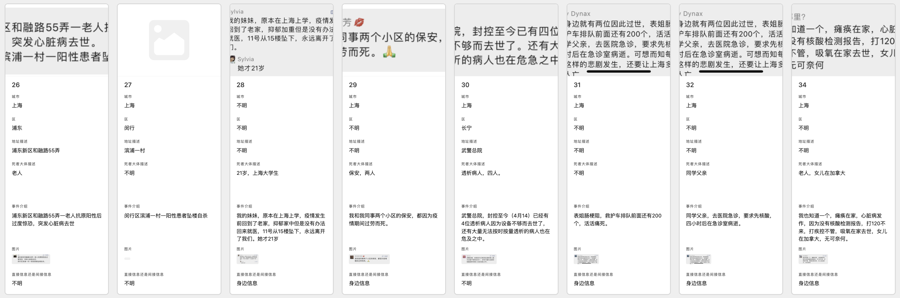

# 润学

> 润学全球官方指定GITHUB，整理润学宗旨、纲领、理论和各类润之实例。
> 本Repo的核心宗旨，即是在于解决并回答**为什么润，润去哪里，怎么润**三大问题；并成为新中国人的核心宗教，核心信念。
> 中国人的润将会持续至少100年，直到2122年为止。而本目录，也将会持续100年，直到山无棱、天地合，才敢与润绝。

[](https://t.me/RunOutForLife)
[](https://t.co/TmLbFbNkUy)

## 更新日志 （2022-4-14）：

<details> <summary> <a href="润学方法论/飞跃手册/README.md"> 添加北邮和中科大的飞跃手册 </a> </summary>   

</details>

<details> <summary> <a href="新冠疫情相关/上海疫情逝者名单.md"> 芬兰留学移民优缺点 </a> </summary>

> > 以下内容搬运自 Plants 在一亩三分地发表的文章  [芬兰居留政策变化，留学芬兰将成为润欧洲优良途径？](https://www.1point3acres.com/bbs/thread-884628-1-1.html)
> 
> 英语新闻刚出来，出自芬兰国家电台，相当于芬兰的BBC，芬兰居民要为它的运营交税 https://yle.fi/news/3-12405326 
>     
> 新闻意思就是芬兰政府决定把外国学生以前需要每年续签的学生居留卡B改成一次性给连续居留卡A，毕业后直接给两年找工作时间。第一次申请居留卡时需要有一年生活的存款证明（之后就不用出示了）。毕业后可以先去别的地方，5年内都可以回来再申请两年找工的居留卡，这个找工作居留卡拿到就可以直接开始工作的，在它到期前再申请换成其他居留（时间够了可以换永居，语言过了可以申芬兰护照）。要说cutting bureaucracy，芬兰是世界楷模没跑了。
> 这意味着什么呢？先看申请芬兰护照需要什么。
> 
> 芬兰的移民法：连续持有A居留5年（有芬兰籍配偶只要四年但两人必须已经同居三年），通过芬兰语或瑞典语3级即B1水平考试，有生活来源（可以是工作，也可以是当家庭主男、主妇），没有犯罪纪录。
> 芬兰移民局官网 https://migri.fi/en/citizenship-application
> 
> #### 也就是说，只要读书四年，之后毕业找到工作或者找到配偶，考过语言，最多等一年立刻就可以拿到芬兰护照。有了欧盟护照以后就可以去欧洲其他国家自由找工作啦！
> 
> 有人会问，那我只拿芬兰永居或欧盟永居以后就去其他国家不行吗？这样就免得要考芬兰语或瑞典语了。
> 
> 答案是目前欧洲每个国家对欧盟永居的诠释都不一样，大多数国家还是不认其他国家的永居的，有些会要求先找到本地工作再申请本地居留身份，才能把欧盟永居续下来。所以拿到欧盟护照才是一劳永逸。再说了，在芬兰拿欧盟永居只省了一个语言考试，又不节省时间。
> 也有人会问，那我就直接留在芬兰就好了，为什么还要先拿芬兰护照然后润欧洲呢？
> 
> 答案是，因为楼主是芬黑【划掉，因为楼主懂芬兰语，看得明白芬兰的法律和工会运作。
> 
> 准确答案是，因为芬兰雇主和工会都仍然是非常排外的，一旦经营状态不好，外国人通常是第一个被裁的。对于非程序员来说，很多职业难以在芬兰找到下一份工作，几个月不工作就会被芬兰政府强迫去幼儿园做护工，超市摆架等没人想做的工作……
>    
> + 芬兰最好的几所大学毕业的中国学生，很多非程序员的硕士毕业拿着2600欧一个月税前的基本工资，疫情前靠出差补贴税前总收入能过3000欧，每隔几年被裁，运气好的找到下一份工作前只失业几个月，但有不少华人白领快40岁了失业以后再也没有找到过白领工作的。
> + 程序员毕业在芬兰首都有望拿到3000欧以上一个月，厉害的能拿到4000欧。芬兰小城市2000多欧的都能见到。大多数芬兰程序员终生也没有能超过一个月6000欧税前。程序员一样会被裁员，只是由于需求量大，一个月内就能找到新工作。
> + 美企大厂在芬兰只有微软，本土高工资大厂只有一个游戏公司Supercell。这两家给的钱过100k比较多。
> 
> 芬兰的优点：
> 
> - LGBTQ友好社会
> - 产假，生孩子给补助，优秀的免费基础教育，本地人免费上大学
> - WLB极佳，就是下班以后外面太冷，宅家没事可做
> - 土著男帅女靓，华人无论男女都挽着个芬兰帅哥配偶
> - 移民政策稳定，20年来一直都在进步，从来没有退步，直接打脸邻国瑞典翻来覆去的政策
> - 对华人和对中国态度比较友好
> 
> 芬兰除了职场太低端，还有其他的缺点：
> 
> - 芬兰语很难，学了以后离开芬兰就没啥用
> - 气候是地狱级的，冬天9个月，夏天3个月，冬天最冷的时候还很黑
> - 医疗系统排队很长，水平也比德国差
> - 父母不能移民，这个算是欧洲通病（实际上德国可以，但钱要够）
> - 土著极度社恐，你在Grindr上约来的芬兰帅哥可以跟你滚一个周末不讲超过三句话
> 
> 想润的人请权衡利弊，根据自身情况和期望的生活作出判断和调整，不要一条路走到黑。去芬兰留学的目的就是高速拿护照，好往欧洲其他国家润走。如果目的是留学毕业马上就回国，或者工作几年就回国，那芬兰并不算很好的选择，毕竟工资实在是太低了，学校排名也一般般。
> 

</details>

<details> <summary> <a href="润学方法论/各国选择/美国/王探长谈为什么来了就是美国人.md"> 北美王探长：拿EB1, EB2, L1比你想象的要简单 </a> </summary>

> 来源：北美王探长，腾讯短视频 
> 
> 我今天分享大家移民美国到底有多容易，为什么来了就是美国人，很有可能看完这个视频之后你会重新审视和规划自己的人生。
>
> 许多人以为移民美国的人，要么是一路上披荆斩棘的学霸们，要么呢是豪掷百万美金的土豪们，这两个都对，但其实这两条路线都是移民美国的，非常曲折的弯路，耗时时间久，而且要走很多的独木桥。
>
> 其实移民美国有非常多的选择，今天我就跟大家解密移民美国到底有哪些捷径
>
> 首先我们聊**EB1杰出人才签证**，杰出人才签证可能是所有移民美国的签证里鄙视链最顶端的存在。因为首先它既不需要雇主的支持，你根本就不用在美国先找到工作；再次你申请了以后，你可以加急，可以在14天之内就拿到结果，你是否能办好绿卡。更牛逼的是，他这个签证连排期都没有，如果批准通过过你就可以直接走流程去拿绿卡
>
> 而且你做这个事情的时候人根本不需要在美国，你在国内在什么其他地方都可以，但是即使这么牛逼烘烘的签证，他的要求并没有很多人想象的那么高
>
> 很多人听到这个签证都被吓坏了，以为只有得诺贝尔奖的人，得奥斯卡的人，得奥运会冠军的人，才能去申请这样的杰出人才。其实美国移民局的规定并不是，那么的苛刻，其实如果你已经发表了几篇文章，有几百引用的一个博士，很有可能其实你已经符合EB1杰出人才的要求了，只是你还不知道而已
>
> 如果你是一个设计师，或者说是做MARKETING，做广告的，你获得了一些国家级别或者国际级别的奖项很可能你也已经符合要求了
>
> 如果你是运动员如果你是演员，如果你是一些做的比较出色的企业家，其实你也很可能已经达到这个要求
>
> 如果你是专业协会的会员，或者说你是专业协会的评审，如果你的薪资明显高于类似的其他人，很有可能你也符合要求了
>
> 美国移民局对杰出人才是有10条要求，但是很多人以为你一定要符合全部10条要求，其实事实上你只要满足10条里的3条即可
>
> 很多人了解了杰出人才EB1签证以后，突然发现自己跟美国绿卡这么近，然后可能会发现自己可能拿不出非常硬的三个点，可能有一个或者点两个稍微弱一点，这样的话他们其实还有另外一条路可以选择，那就是**EB2的国家利益豁免签证**，这个签证其实跟EB1的总体的要求是差不多的，也是在10条标准中选3个出来，但是每一个的评判标准都低很多，对于很多人来说完全是可以去够的一个签证（比如硕士发文章只有个位数引用都可以办）
>
> 而且对于这样一个签证他几乎继承了EB1的所有优点，唯一的一个缺点就是现在有排期，你申请了EB2的国家利益豁免签证之后，可能需要等3年，所以你需要提早申请，这样的话你的排期才能排在前面。而且这个EB2的国家利益豁免是可以和杰出人才EB1一起申请的，可以达到双保险的一个作用
>
> 上面讲的两个签证之前对很多人来说都是可望而不可求的签证，可能听完我讲完之后会突然发现离你特别的近，下面我来分享一下很多人也可以去尝试的**L1**签证。
>
> 很多人对L1签证有很大误解，他们总以为L1是跨国公司，世界500强或者很牛逼的公司才能申请的签证，很多人他们去微软中国或者去谷歌办公室，就是为了有一个机会拿到L1签证来美国的分公司，其实这只是L1签证的冰山一角。
>
> 因为L1签证的要求其实很简单，首先L1签证需要一家公司，这家公司只需要成立运行了2年即可；第二个条件就是你要在这家公司工作了一年以上的时间，如果你这个公司在美国开分公司的话，你就可以办L1签证，而且美国这个分公司不需要是一个已经成立很久而且有运营情况的一个公司，你完全可以以一个中国公司在美国开办分公司，一个新公司的形式给自己办L1签证。
> 
> L1签证分为两种，**L1A**和**L1B**。L1A是公司高管和骨干办理的；L1B是给技术人才办理的。其实门槛都非常的低
>
> L1工作签证和普通的H1B工作签证最大的不同是，他不需要抽签。你随时可以在美国办新公司随时可以给自己办，不需要走30%的抽签。其次一个好处是一旦你拿到了L1签证，如果你的美国分公司运转良好，运转一年之后你就可以去办理杰出人才**EB1C**跨国公司高管的这么一个签证，这也是一个可以14天加速办理的EB1类型签证，这样的公司其实不仅限于跨境公司，其实所有的公司都可以，哪怕你就是一个微商哪怕你就是一个普通的公司，只要你有一个说得过去的理由，去美国开分公司都可以办理。
>
> 上面说到的EB1A,EB2国家利益豁免（NIW）,EB1C和L1A,L1B离我们并不遥远，可是他们可能在移民中介的嘴里就变成非常困难，他们会帮你排除万难。
>
> 其实这样的签证完全没有你想象的那么困难
</details>

<details> <summary> <a href="新冠疫情相关/上海疫情逝者名单.md"> 上海疫情逝者名单 </a> </summary>

> ## 截图
> 
> 
> 
> 
> 
> 
> 
> 
> 
> 
> 
> 
> 
> 
> 
> 
> 
> 
> 
> ## Airtable
> 
> 链接： https://airtable.com/shrQw3CYR9N14a4iw/tblTv0f9KVySJACSN 

</details>

<details> <summary> <a href="润学实例/计算机/硕士秋招SDE找工时间线总结.md"> 硕士秋招SDE找工时间线总结 </a> </summary>

> 
> # 硕士秋招SDE找工时间线总结
> 
> ## 原文链接在此： [原文链接](https://github.com/yiyangiliu/US-MS-CS-Student-Find-A-Job/blob/master/README.md)
> 
> ## 1. 找实习/工作常识
> 
> *“The people who fail to plan is planning to fail.” - Benjamin Franklin*
> 
> 一般公司7月份到12月是秋招时间，7月岗位内推大规模放出，内推/网申后一周/一月排面试，什么时候结束看面试进度。
> 
> > <b>引用一下地里的帖子</b>：https://www.1point3acres.com/bbs/thread-523163-1-1.html 
> >
> >说说我还有印象的几个公司18年秋招初期的情况。
> >
> >7月初fb的new grad职位放出，七月底地里已经有大量内推new grad的帖子，同时已经有同学去onsite完拿到offer。
> >
> >7月20号左右vmware propel（专门给new grad的职位）放出，9月开始发新oa的数量和hr联系效率急速下降。
> >
> >g家new grad职位也是在七月底放出来的。8月中旬开始起地里开始出现大量new grad面经。
> >
> >亚麻8月8号放出new grad职位，记得很清楚，当天晚上地里大量内推贴，8.30号亚麻发出第一批oa，deadline是9月15号左右。
> >
> >当然也不是说你11月开始找就找不到，能早就早。不管是在实习还是干嘛，消息灵通点并且能随时投入战斗就行了。
> >
> >> <details><summary><b>我的补充</b>：19年大约在<b>8月</b>放出New Grad岗位</summary>
> >>
> >>
> >>请自行搜索"New Grad" + "内推" + "岗位 开放" 等关键词 + "site:1point3acres.com"，必要时使用google的search tools来restrict time.
> >>
> >> **Vmware**: 19年7月底 https://www.1point3acres.com/bbs/thread-540378-1-1.html
> >>
> >> 
> >>
> >> **Uber**: 19年9月初 https://www.1point3acres.com/bbs/thread-547399-1-1.html
> >>
> >> 
> >>
> >> **Lyft**: 19年8月末 https://www.1point3acres.com/bbs/thread-545351-1-1.html
> >>
> >>
> >>
> >> **GG**: 19年8月末 https://www.1point3acres.com/bbs/thread-545594-1-1.html
> >>
> >> 
> >>
> >> **Airbnb**: 19年8月末 https://www.1point3acres.com/bbs/thread-545761-1-1.html
> >>
> >> 
> >>
> >>**FB**: 19年7月末 https://www.1point3acres.com/bbs/thread-539903-1-1.html
> >>
> >> 
> >>
> >>PS: 此大佬在18年也发过一个fb招聘的帖子，下面的补充内容从8-3延续到10-22，能看到**随着时间的发展秋招的实时进度**，非常精彩！: https://www.1point3acres.com/bbs/thread-434677-1-1.html
> >>
> >> **FB** update: 2019年7月8号就已经开始了 https://www.1point3acres.com/bbs/thread-535937-1-1.html
> >>
> >> 
> >>
> >> **Amazon**: 19年8月初/中旬 https://www.1point3acres.com/bbs/thread-542625-1-1.html
> >>
> >>  </details>
> > 
> >> <details> <summary><b>另外一位用户的补充</b>：https://www.1point3acres.com/bbs/thread-631642-1-1.html </summary>
> >>
> >>
> >> 给你一个去年（2019年）我找工作的data point：
> >>
> >> dropbox是去年八月初开的 -> 我一开就内推了，9月底才拿到oa 那个时候已经几乎招满了
> >>
> >> airbnb是去年八月底开的 -> 同一开就内推，三个月之后据信
> >>
> >> pinterest是去年八月底开的 -> 同一开就内推，至今没有据信
> >>
> >> google是去年八月底开的 -> 同一开就内推，9月底oa
> >>
> >>不是刷地理，地理没有第一手的求职信息。打开Google job search的alert 和领英的job alert，设置关键词 new graduate/ recent grad sde，都是学cs的人了。。这些都是基本操作把。。。
> >>
> >> </details>
> >>
> > 
> >> <details> <summary><b>Linkedin朋友真实经历</b>（入学第一个暑假在amazon intern）</summary>
> >>
> >>
> >> 1. 开始刷题的时间：
> >>
> >> * 开始刷题： 我是转专业的，所以开始的比较早，大概**3月份**开始刷，刷得比较慢，到找到实习刷了300+题吧。
> >>
> >> * 注：这里的`三月份`结合语境看应该是秋招前的三月份，也就是暑期实习前**一年零二个月**的`三月份`
> >>
> >> 2. 开始找内推/网申的时间：
> >>
> >> * 申请基本上是投的越早越好，大家都是职位一放出就投，基本上**8月份**就开始。
> >>
> >> 3. 结束面试的时间：
> >>
> >> * 结束面试这个说不准的，我是春招才找到的实习
> >>
> >> 
> >>
> >
> 
> 此时找的实习是一年以后的实习。比如我想在**22年5-8月**实习，那么就要提前差不多一年**21年7月底**linkedin上四处加人/地里求内推
> 
> 而找实习是有面试要求的，开始刷leetcode可能要更早，大约在**5月**就可以准备了。
> 
> **意味着**：你1月份申请美国大学，4月份拿到offer，5月份开始刷题，7月中旬你本科大学毕业，**大学毕业的时候就是你可以开始找北美科技公司员工内推的时候**。真实。
> 
> 那些刚刚Master入学9/10月份就拿到明年intern offer的同学就是这么干的。
> 
> **北美hr认知度排序**: 美国知名企业实习 ＞≈ 美国有名企业实习 ＞≈ 中国/印度/.../新加坡知名企业实习 ＞＞ 学校RA/TA
> 
>   ## 2. Timeline：以21fall，2年项目为例
> 
> *“不要说那么多理论，我就想看例子” - audience*
> 
> 
> ### 21年
> 
> * 8月 - 12月 上课
> 
> ### 22年
> 
> * 1月 - 5月 上课
> 
> * 5月 - 8月 **intern**
> 
> * 8月 - 12月 上课
> 
> ### 23年
> 
> * 1月 - 5月 上课
> 
> * 5月后 毕业 **full-time**
> 
> 注：~~详细时间可以参考校历
> https://academics.usc.edu/calendar/academic-calendar-2021-2022/ ，不同学校有不同规定。~~
> 
> 经同学提醒，Viteribi graduate student的academic calendar在这里：https://viterbigrad.usc.edu/ 
> ```
> 一次实习，一次全职，好像很完美。
> 但是这个过程是不完整的，
> 只有工作，没有体现出找工作的过程
> 参考价值不高。
> ```
> 
> ## 3. 添加找工作过程的 Timeline：以21fall，两年项目为例
> 
> ### 21年
> 
> * *5月 刷题*
> 
> * *8月 投简历，拿面试，拿明年暑期实习（21年秋招）*
> 
> * 8月 - 12月 上课
> 
> ### 22年
> 
> * 1月 - 5月 上课
> 
> * 5月 - 8月 **intern**
> 
> * *8月 投简历，拿面试，拿明年暑期全职（22年秋招）*
> 
> * 8月 - 12月 上课
> 
> ### 23年
> 
> * 1月 - 5月 上课
> 
> * 5月后 毕业 **full-time**
> 
> ### **总结**：
> 
> 记住黄金准则：**“赶秋招”**
> 
> 找工作这件事是 **极度季节性(extremely seasonal)** 的.
> 
> 错过了某个特定的事件节点，那么即使再努力也没有用。
> 
> 所以即使来美不打算找工作，或者没想好找不找工作，我也建议你**对找工作的时间节点了然于胸**，这也是本文写作的目的。
> 
> 因为什么都不了解的话某时候突然想开始找工作了，那时候很很很很（省略n个很）有可能**已经晚了**。
> 
> ### **情景分析**：
> 
> 假设A是一个CS大校（cmu/ucsd/usc/neu）的刚入学的学生，开学后很朴素地想**先上一学期课**体验体验美国生活，找工作什么的以后再说。11月份A突然发现同学在朋友圈晒出了intern offer，然后A怦然心动，开始着手找工作，搜集找工信息+刷题，但是因为没有规划过，还没刷过leetcode几道题。
> 
> A这种情况大概率是很难找到工作的，不论到了11月份大公司已经**经过3个月招人**还有多少坑位，就算面试的准备，刷找工作最低最低（省略n个最低）限度的，150道leetcode题，一天5道都需要1个月。这个时候零基础开始已经**有点晚了**。
> 
> 如果A看过这篇文章，那么A可能就不会做出找工作的决定了。这就是这篇文章存在的意义：可能不能给**做什么**的动力，但是能给**不做什么**的原因。
> 
> ```
> 今年的covid19是一个极端的例子可以说明“极度季节性”：
> 
> 往年秋招后知后觉地错过了还可以安慰自己“还有春招，不过是难度大点，职位少点”
> 
> 今年春招 2020年2、3月，所有公司都freeze hiring，今年暑期实习的人全部是去年秋招上岸的。
> 
> 如果去年秋招没上岸，那么自己再努力，刷题再多再熟练，head count没有了就是没有了。
> ```
> 
> 
> ## 4. 添加找工作过程的 Timeline：以21spring，两年项目为例
> 
> ### 21年
> 
> * *1月 开始投简历，面国内5月开始的暑期实习*
> 
> * 1月 - 5月 上课
> 
> * 5月 - 8月 **中国intern**
> 
> > 注：此时intern因为没上满**1学年**的课，不能使用**CPT**，不能在美国实习，只能找中国实习
> 
> 
> * 8月
>     
>     * *投简历，拿面试，拿明年暑期实习（21年秋招）*
>          
>     * *投简历，拿面试，拿明年毕业后全职（21年秋招）*
> 
> > 也就是最理想情况下，你要在这段时间内**找两份工**
> >
> > 此时也可以只找一份工，只找明年5-8月实习而不找明年12月后全职，或者只找明年12月后全职而不找5-8月实习，只需要承担相应的风险，见下
> 
> * 8月 - 12月 上课
> 
> 
> 
> ### 22年
> 
> * 1月 - 5月 上课
> 
> * 5月 - 8月 **intern**
> 
> > 此时可以用**CPT**在美国intern（每周20小时以上的工作）
> >
> > 注意：如果你去年选择找全职而不找实习，那么这时你就没有实习了，所以**你在美国的整个过程都没有用到CPT**，这可能是一种浪费。
> 
> * *8月 找全职（optional）（22年秋招）*
> 
> > 注意：如果你去年选择找实习而不找全职，那么这时你就没有全职了，所以，你需要**参加22年秋招**并且**一定**要找到全职工作，否则你可能陷入**毕业没有工作**的尴尬。
> 
> * 8月 - 12月 上课
> 
> * 12月后 毕业 **full-time**
> 
> > 注意：如果你去年选择找实习而不找全职，并且，你8月-12月**参加了22年秋招**并且**没有**找到全职工作，那么你就陷入了**毕业没有工作**的尴尬。如果毕业后90天的缓冲期没有找到工作，你将会被**强制离开美国**。你如果不想，那就重新申请一个ms维持f1身份。还有一种半非法的可以留在美国的方式，大家应该知道是什么，我就不公开提及了。
> 
> 
> 
> ## 5. 找工作情况每年都在变
> 
> *“Remember the Golden Rule: Those who have the gold make the rules.” - American Proverb*


</details>

<details> <summary> <a href="润学方法论/飞跃手册/README.md"> 各个大学飞跃手册 </a> </summary>

> - 2020届东南大学飞跃计划 [东南大学飞跃计划](https://www.yuque.com/2020seufly/guide)
> 
> - 南方科技大学飞跃手册 [南方科技大学飞跃计划](https://sustech-application.com/#/?id=%e5%8d%97%e6%96%b9%e7%a7%91%e6%8a%80%e5%a4%a7%e5%ad%a6%e9%a3%9e%e8%b7%83%e6%89%8b%e5%86%8c)
> 
> - 上海交通大学生存手册 [上海交通大学飞跃计划](https://survivesjtu.gitbook.io/survivesjtumanual/)
> 
> - 华科EE系飞跃计划 [华科EE系飞跃计划](https://hongyili.net/attaches/%E5%8D%8E%E4%B8%AD%E5%A4%A7%E7%94%B5%E6%B0%94%E9%A3%9E%E8%B7%83%E6%89%8B%E5%86%8C.pdf)
> 
> - 华科光电飞跃计划 [华科光电飞跃计划](https://hust-feiyue.github.io/2020_feiyue.pdf)
> 
> - 浙江大学电气学院飞跃计划 [浙江大学电气学院飞跃手册](http://ee.zju.edu.cn/_s575/51847/list.psp)

</details>

历史更新：

<details> <summary> <a href="润学实例/计算机/去美国当程序员V2.5.0.md"> 冷锋吴京：如何去美国当程序员 </a> </summary>

> 开个坑，慢慢填，大家有问题可以评论区留言。
> 
> # 前言
> 写本文的初衷，是因为我从决定留学到找工作，过去这几年来一直受到网上的许多朋友的鼓励和支持。有许多网友无私的分享他们的托福考试经验、申请经验、转专业学习的经验、美国大公司的面试经验等。现在我也把这条路走通了，在硅谷当上了一名程序员，所以也希望能结合自己的经历写一篇文章，不能保证100%正确。
> 
> 本人不实名、不建群、不是中介、不约炮、不在知乎上交线下的朋友、不靠知乎赚钱，上知乎纯粹找乐子。本文仅供参考，你的人生请你自己负责。
> 
> # 如何给自己树立Run的自信
> 对于Run，很大的一个问题就是自信心的建立，Run去丑国了，我到底能不能找到程序员的工作，我到底能找到一个什么样的工作？
> 
> 如果需要一个很普适性的回答，那我说：
> 
> 高考成绩能考上全省前20%，大学能正常过英语4、6级的人，只要肯努力，是完全可以在国外找到一份程序员的工作的。
> 
> 不要小看这前20%，在很多高考大省，前20%最多也就是个二本的学历。
> 
> 我当年树立自己自信的方法很简单，就是找本科和我差不多条件的校友，或者差不多学校的校友，看学长学姐们毕业的前景。这个时候最简单的方法就是打开LinkedIn，搜索毕业校友们所在的公司。但是请注意，还有很多人没有注册过LinkedIn或者LinkedIn匿名了，所以应该在此数据的基础上乘以1.5倍。
> 
> 我就不用清北华五C9这种学校了，下面举简单的几个例子：
> 
> ## 普通985，华中科技大学：
> 作为中流985高校，华科在美国的校友有8400+人，Google有260个校友之多。FAANG加起来恐怕有2到3千人。
> 
> 
> ## 普通211，南京理工大学：
> 作为一个普通211，南京理工大学美国校友有1400+人。几大著名大厂都有为数不少的校友在工作。
> 
> 
> ## 双非一本，上海海事大学：
> 作为双飞一本，上海海事在美国的校友还是有700+人，可以看到亚马逊、微软、Facebook都有上海海事大学的校友。
> 
> 
> 总的来说，树立好run的自信，要相信run没有自己想象的那么难，总是可以成功的。
> 
> 为什么要去留学读硕士
> 解释一下下面两个名词：
> 
> OPT: 选择性实习训练（英语：Optional Practical Training）是就读于美国高等院校（本科或研究生）、持有F-1签证的国际学生的一种工作许可，美国公民及移民服务局允许学生以学生身份在其学业相关专业工作1年的时间。有美国学位的都有12个月OPT，STEM（科学、技术、工程、数学相关专业）专业、公司e-verify，可延期到36个月。
> H1B：H-1B签证是美国签发给从事专业技术类工作的人士的签证，属于非移民签证，是美国最主要的工作签证类别。 只有雇主才能给员工办。自从2012年以后，美国经济好、工作容易找，H1B需要通过抽签才有，学历高者得到概率更高，STEM专业因为OPT有36个月，所以有多次抽签机会，拿不到的概率非常低。已申请绿卡的H1b，满6年后可以延期一年或者三年，可以无限次延期，不存在6年必须离境的规定。但是H1B一旦失业后，不能在2个月内找到下家则基本需要离境。持有H1B签证在不同公司间可以跳槽，不需要占用新名额，transfer后随时开始工作。
> 所以留学的目的很简单，一是拿到一个美国的学位，二就是通过这个学位让你获得36个月的OPT可以合法在美国就业，有了OPT以后，美国大公司才愿意雇佣你，并帮你抽H1B、办绿卡进行一系列的流程。
> 
> 美国大学很多，对于这种以就业、而并非科研为导向的硕士项目，发放录取通知书都还挺慷慨的。毕竟国际学生能给学校带来大量收入。并且硕士项目只需一年至两年，即使单位学分的收费再高，由于学制有限，总费用也并非高到国内普通家庭难以承担。
> 
> 留学读硕士的花费大概多少钱
> 以下是本人的花费：
> 
> 英语学习：新东方学托福 2400RMB + 2次托福考试 4000RMB + 新东方学GRE 3000RMB + 3次GRE考试6000RMB = 16000 RMB。
> 
> 中介及申请费用：当时找了中介，花费5W RMB，非常不推荐，还有一些学校的申请费用，每所学校大概几十到100美金不等，总计算为55000 RMB。
> 
> 留学学费及生活费：在洛杉矶生活成本很高，个人留学2年的学费+生活费大概花费了65W RMB左右，其中包括了花费1W美元买了辆二手凯美瑞
> 
> # 如何准备英语考试（托福、GRE）
> 我没考过雅思，只考过托福和GRE，强烈建议所有想Run的同学，无论你有没有机会，先做一次托福考试，网上有很多托福题库，说再多要不要run，还不如来做一遍题目。
> 
> ### 如何准备托福，知乎有很多介绍:
> https://www.zhihu.com/question/27244993
> 
> 说我觉得的重点：
> 
> 考托福就2个最重要的，背单词 + 练习听力。
> 
> 背单词很简单，你单词都不懂怎么做下去，所以花时间刻苦背单词就好，应该问题不大。
> 
> 练习听力，因为托福听力、口语、作文都和听力有关，所以可想而知听力在托福里面多重要。
> 
> 练习听力最好的一个方法，就是听写。具体就是你把托福的听力材料找来，一句一句听写，如果觉得很难听不懂，先从0.5倍速开始，然后慢慢加速，如果最终你能1.5倍速完成托福听力的听写，那你已经出师了。
> 
> 托福考试就是一个过线考试，也就是过了学校的分数线就OK了。
> 
> 说到GRE，GRE不是国内的高考，也不是国内的考研，GRE在申请过程中的作用的锦上添花，而绝非雪中送碳。如果你本科学校不好，本科GPA不高，没有什么出彩的，那你往死里刷GRE成绩也没有用。
> 
> ### 如何准备 GRE 考试？
> https://www.zhihu.com/question/19767285
> 
> # 本科期间还需要做什么
> 相比托福和GRE，本科期间最最最最最重要的：
> 
> * 保持一个好成绩
> * 尽量找实习
> * 如果是转专业的同学请先自学一些计算机课程并开始刷题
> * 
> 一定一定要好好学习，学习成绩比托福成绩和GRE成绩重要无数倍！
> 在准备留学申请中，个人认为拿到一个好的学校的录取决定条件如下：
> 
> * 本科学校排名：很明显，清北华五，985等高校肯定更容易拿到好学校的Offer。
> * 本科成绩：不用说了，本科GPA越高越好，比如USC这所学校就只看成绩，GPA3.5以下基本没有戏。
> * 托福/GRE：当然是越高越好，但是这两个英语成绩没有1、2重要，最近几年很多学校甚至已经不要GRE分数了。
> * 论文/项目/竞赛：这种东西有肯定是最好的，但是除非你有顶级期刊的顶级论文，不然对申请没有特别大的帮助。作为转专业的，我个人没有发表过任何论文也没有参加过任何项目，数学建模美赛拿过Honorable mention。
> * 推荐信：如果你能拿到超级大牛的推荐信，否则推荐信基本上就是走个流程过场。
> * 只有学习成绩还不够，必须要找实习
>   北美不像中国就业只看学校，很多中国留学生去了以后埋头苦学，从大一到研究生毕业，简历上除了成绩，空空如也。
> 
> 一份好的实习，能帮助你在白纸简历的研究生同学中脱颖而出。
> 
> 举个例子，当年我同一个研究生学校的同学，我们绩点和课程项目都一样，但是他大三大四都有在国内的阿里实习，所以他研一上学期在找美国的暑假实习的时候，直接拿到了亚马逊、Google和Facebook的实习面试。
> 
> 通过美国的暑假实习经历，我同学的简历上有2份阿里实习经历+1份美国大厂实习经历，在找全职工作基本上不用担心面试过不了。
> 
> 自学计算机课程及刷题
> 知乎上有很多人分享了计算机自学的心得，在这我就不过多提及了。包括CS61B等很著名的课程，尽量看英文原版，提前适应英语教学。
> 
> 刷题，那就是去做Leetcode，既然想在美国找工作，那就切换成英文版开始做。
> 
> 如何选校及定位
> 个人非常不建议找中介。你都决定要出国了，如果这一点信息收集能力都没有，那还是算了。
> 
> 首先就是去各个学校的官网找项目，举个例子，因为NEU非常火，我们就去NEU官网看一下转专业CS Align的项目：
> 
> 官网上详细的列出了这个项目要修一些什么必修课和选修课，并且也列出了毕业要求：
> 
> 36-44 total semester hours required
> 
> Minimum 3.000 GPA required
> 
> 美帝大学的官网基本上制作的还是有水平的，每个项目基本上介绍都很全。
> 
> 说到定位自己，具体的办法有好几种，比如去一亩三分地论坛上看往年录取的结果。我个人还喜欢另一个方法，就是去LinkedIn上找自己本科的学长，还有自己想去上的硕士学校的学长。
> 
> 还是用我最喜欢的例子，华中科技大学 + 南加大，一个稍微好一点的985做题家组合：
> 
> 
> 根据Linkedin筛选了以后，我可以看到这个组合第一页给了我好多Google/Amazon/Facebook的员工，所以你需要做的，就是去LinkedIn上面勾搭以下学长，看看他们以往的成绩能申请上一个什么样的学校。
> 
> 美帝申请比考研的好处就是一次可以申请多个学校，再决定去不去。当年我申请了8所学校，拿到了4所录取。从以我个人能力要冲刺的UCLA/CMU，到保底的Top 100以后的学校，总有一所学校会录取你的。
> 
> 评论区请不要再问我你二本三本大专能不能润了，都能润，没什么不能润的。关键是，你有没有好好学习？有没有下定决心去润？
> 
> # Run到美帝 & 最大化利用Master的2年时间
> 恭喜你拿到了offer入学，现在要做的就是充分利用好硕士的一年半到两年时间，抓紧找工作。
> 
> 硕士期间保持一个好GPA
> 努力学习即可。和国内的唯一的区别是教学语言变为英文。此阶段除了专业课，还需迅速提高英语听说能力，为求职面试做准备。
> 
> 刷Leetcode
> 继续花时间刷题，毕竟面试是做Leetcode，可以和同学之间互相用英语进行Mock Interview，来提升自己的英语水平和讲题水平。
> 
> 研一利用CPT找实习
> 课程实习训练（英语：Curricular Practical Training, CPT）是美国给予持有F-1签证、就读于高等院校的国际学生的临时就业许可。通过CPT你可以暑假进行实习。
> 
> 为什么叫你大四本科的时候就要开始刷Leetcode呢，就是因为研究生一入学的9月和10月份，你就要为第一年暑假的实习做准备，所以如果你本科有好好练习英语 + 刷Leetcode，你那个时候已经比同龄的同学优秀很多了，这个时候如果你能拿到实习面试，你就比同龄人强很多了。
> 
> 研二利用OPT找全职工作
> 对于STEM理工科毕业的学生，可以合法使用OPT在美国工作三年。
> 
> 第一个坑：OPT 的政策可能有变（问题不大，最近最大的政策改变就是申请费用上涨了）。
> 
> 第二个坑：能否在 OPT 规定的期限内找到工作，这对于大多数人来说是最难的点。职位空缺的数量取决于经济大环境，如果赶上金融危机，比如疫情等因素，恐怕会有困难。但是有一说一，我见过凡是铁了心要留在美国工作的，通过小公司，ICC，外包Contractor等就业方式，最后都留了下来。
> 
> # 如何找到自己的第一份工作
> 找工作，最重要的是实力 + 运气，当然，在绝对的实力面前，运气都是起辅助作用。
> 
> 找工作的组成分成两部，拿到面试 + 通过面试，两者相辅相成，缺一不可。很多应届生有一个误区，一直刷题刷题刷题，但是自己的简历实在不怎么样，就算把题做过几千遍几万遍，拿不到面试又有什么用呢？
> 
> 拿到面试
> 应届生，拿到面试其实往往是比较难的，尤其美国不像国内看学校排名看得很厉害，且美国真正校招的公司大部分都是FLAG大厂。所以作为一个应届生，最重要的就是把自己的简历弄得好看，弄得与众不同。尤其是CMU、USC、NEU这类招计算机学生超级多的学校，每年有几百个计算机的学生，如果你只有一个这些学校的学位，简历方面烂得一塌糊涂，那就真的没办法了。
> 
> 提高自己简历的方法有很多种，下面举几个例子：
> 
> GPA 4.0：别听别人说成绩不重要，能力重要这样的鬼话。在你没有其他出彩的地方的时候，成绩就是最重要的。
> 
> 大厂实习：一段大厂实习在简历上很加分，找不到FAANG的实习也要尽量找小公司的实习。
> 
> 除了学校本身的课程Project以外的项目：美国有很多在线Mooc学习平台，建议你继续在Udacity、Udemy和Coursera上课，并把一些Project写在你的简历中充实一下。
> 
> 先去小公司（或者外包公司），再跳槽去大公司：很多学生思维的人钻牛角尖，非FAANG/FLAG不去，然后直到毕业几个月都没有找到工作，一直刷题刷题刷题，最后浪费了很多时间。其实在美国找工作，很看过去工作经历的。我本人也是通过了一年ICC的经历然后拿到了Amazon、Google等大公司的面试，加上前期硕士期间刷题比较不错，就直接通过了大厂面试。
> 
> 通过面试
> 没什么好说的，对于找一个以找General Software Engineer工作为目标的人来说，就是刷题。
> 
> 虽然Leetcode已经到了2000多题的规模，但是肯定个人经历有限。我个人的建议是Leetcode前600题刷透，大部分公司基本上考的也是原题。实在做不出来背题就好。
> 
> 可以购买一下《Cracking the Coding Interview》这本书，里面归纳总结得相当不错。但是除此之外还是要刷题。
> 
> 当然，亚马逊为首的公司除了刷题以外还会问很多Behavior Question，类似国内的HR面试环节，比如说举一个例子“你不同意经理的时候你会怎么做？”，“Deadline来了但是你工作还没有做完怎么办？”之类的问题。这种问题我觉得不难，就好好把英语口语练好，同时面试之前想几个以前自己工作中的例子，写下来然后背就好了。
> 
> # 工作几年的收获
> 我工作第一年在印度外包公司（ICC）的年薪只有6W美金，没有年终奖。
> 
> 第二年跳槽去了硅谷一家大厂，拿到了E3/L3的级别（和应届生一样的级别），年薪变成了16万美元（12万美元的底薪+3万美元股票+1万美元年终奖）。第三年半的时候升级到了L4/E4。
> 
> 今年工作四年半了以后，跳槽去了一家比较不错的独角兽，还是L4/E4的级别，年薪算上股票（还未上市，按估值）大概在35万美金左右。
> 
> 我只是一个很平凡的普通人，硕士毕业工作4年半的等级也就是普通的L4/E4。很多我的同龄人已经升到L5/E5（Senior）级别，也有一部分人开始当经理（L6/E6），手下开始带人。
> 
> 我也不是那么爱卷的人，对自己的成就总体来说还是满意的。一步一个脚印慢慢来，个人觉得工作几年薪资待遇和工作内容我都很满意。重要的是，这三份工作基本上每周的工作时间都是35到40小时，基本没有遇到加班的情况（有时候有，一年不超过5天）。
> 
> # 如果家里没有钱读硕士怎么Run？
> 如果家里不太能够支持硕士留学，那还有一些方法跑路。以下信息主要收集自各大网站和周围一些人的经历，不保证信息100%的完全准确。
> 
> * 直接投公司的海外分部。据我所知，Google、微软、Facebook这样的企业每年会在国内的清北这种级别的学校进行海外分部校招。社招部分，Google、微软、亚马逊会直接从国内招加拿大的岗位，Facebook会招新加坡的岗位。还有一些公司，比如shopee的母公司SE也常年会在国内招新加坡的岗位。缺点就是这些招聘都是不定期的。
> * 出国读博。读博基本上都是学校包所有的学费，根据你做TA或者RA，好像UCLA的博士一个月生活费是1800到3000美金左右，我自己没有读过博士，对该信息不太确定。
> * 入职大公司的国内分部再转海外组。加入微软、Google、亚马逊等国内有分部的外企，再通过外企的内部面试，transfer到你想去的国家所对应的组，一般这些外企内部都专门设立签证/移民部分，会和专业的移民律师就行合作，所以基本上个人不用担心身份问题。但是缺点是内部转组使用的是L1签证，无法跳槽。
> 

</details>

<details> <summary> <a href="润学方法论/各国选择/美国/没抽到H1B怎么办.md"> 美国如果没抽到H1B怎么办 </a> </summary>

> # I. DAY-1 CPT
> > 请直接前往 https://zhuanlan.zhihu.com/p/363493093 阅读，原文非常详细。在此做几点摘抄以供快速预览。
> ## 1. 什么是 DAY-1 CPT ?
> Day-1 CPT 指的是一些项目允许学生在开学第一天就使用CPT工作。
> 
> 大多数学校在第一学期或第一学年是不允许学生参加 CPT 的。部分学校允许学生第一年可以在校内打工，课程注册一年后才能在校外打工。但是如果课程要求学生必须在开学的时候就需要立即开始实习，则学生可以申请在入学第一天就开始实习（Day-1 CPT）。
> 
> 关于全职 CPT 或 Day-1 CPT的合法性，移民局是支持全职 CPT 的，因为学校可以自行制定 CPT 的政策，包括开学第一年是否允许校内/校外 CPT 实习，是否允许全职、兼职 CPT 实习，都是每个学校自行制定的政策，移民局没权干涉。
> 
> Day-1 CPT 不仅适用没有抽到 H1B 的留学生，理论上也可以使得海外有工作经验的人跳过留学直接落地美国工作，但后者风险更多。
> 
> ## 2. DAY-1 CPT 的风险
> Day-1 CPT 通常不会影响 H1b 的批准。但通过 Day-1 CPT 方式工作的学生抽中 H1b 之后，USCIS 有可能会要求补件 RFE（Request for Evidence） 来说明学生维持了合法的学生身份。这个可以咨询公司移民律师，一般移民律师都会比较有经验。
> 
> 比如一个学生完成了一个 STEM major 的研究生专业，用完了 3 年 OPT；如果这个学生再注册一个提供 Day-1 CPT 的研究生专业，在抽中 H1b 后移民局有可能要求补件证明第二个 Master 是出勤上课了的而不是100% on-line 的项目。
> 
> 学校一般都会通过一封信来说明这个学生注册 CPT 课程的原因，是因为学校规定 CPT 的课程实习，是完成这个硕士项目不可或缺的组成部分，而且学校要求学生从上课第一天就开始 CPT 课程实习（重点强调 CPT 是学校的要求，而不是学生的选择）。
> 
> 学校提供这封说明信，学生成绩单，到校出勤记录及其他支持性材料之后，USCIS 基本都会认可这种说法。但 USCIS 也有可能拒件，并拒绝申请人境内身份转换的申请，要求学生出境签H1b。
> 
> 需要注意的是，如果有一个硕士学位的学生，再读一个更高级别的博士学位，USCIS 一般不会就 Day-1 CPT 方面要求补件。
> 
> ## 3. DAY-1 CPT 的申请流程
> 1. 提交申请前，学生需要有一个offer letter
> 2. 学生需要提前注册 CPT 课程并提交申请，需要提交 CPT 申请表，Offer Letter 以及学校和雇主签订的 CPT Agreement
> 3. 等待学校批准CPT，领取新的 I-20。注意需要等待 CPT 生效日期后再开始工作
> 4. 每个学期结束前，查收学校邮件，按时提前提交申请 renew下一学期的 CPT 
>

</details>

<details> <summary> <a href="张维为陈平曹丰泽等知名言论收集/海专精算比我懂更比你懂.jpg"> 海专精算比我懂更比你懂 </a> </summary>

> 

</details>

<details> <summary> <a href="润学实例/计算机/浙大本科美国三本弗罗里达数据工程师.md"> 出国经历之：浙大本科美国三本弗罗里达数据工程师 </a> </summary>

> 勃勃的经历或许难以效仿，本人（普通人）的经历可供参考。
> 
> 第一步：国内本科
> 
> 第二步：大二考语言
> 
> 第三步：大三考语言
> 
> 第四步：大四申请学校，家境优渥选贵的，名气大的，家境普通选州立
> 
> 第五步：润
> 
> 第六步：美国研究生学习第一年，适应环境，精进技术，寻找实习，拿到ssn（ssn可以通过实习，学校打工，学校餐馆打工等等取得，虽然ssn对你的移民之路没有任何帮助，但相信我，拿到ssn的一刻一种归属感便油然而生。）
> 
> 第七步：准备研究生毕业，投简历找全职，疯狂投，明确找工作是个概率问题，概率不变，增加实验次数必然会得到增加命中概率
> 
> 第八步：工作一年，抽h1，商量绿卡
> 
> 第九步：工作，抽h1，办绿卡 
> 
> 第九步半：抽h1不顺利怎么办：婚姻绿卡，Day 1 CPT，外派等来年继续抽签。本人较倾向于选择Day 1 CPT，这里有关于Day 1　CPT的一切：https://www.1point3acres.com/bbs/forum-434-1.html
>   （除了婚绿，其他所有方法目标只有一个，来年继续抽签，直到抽中为止。广大润友有一句话，想要留美，什么方法都有，必定可以留下来。用你精进的技术打动你的领导吧！）
> 
> 第十步：精进技术，跳槽，拿绿卡，买房，结婚生子，后院种树。
> 
> 基本到后院种树这个水平，我们可以宣告：润，已经成功了！你，从此就站起来了！你，从此就可以躺下去了！
> 
> 作为一个家境较差，天赋一般，毫无背景，毫无人脉的普通人，目前走到第九步，亲身证明上述过程毫无难度，只有去做和不去做的区别。去做了，就能做到，就能润。
> 
> 
> >我是金猪Ethan，欢迎大家关注我的
> >
> >知乎账号：https://www.zhihu.com/people/goldenpigethanhu1
> >
> >推特账号: @EthanHu95747418
> >
> >小红书账号：293391047
> >
> >快手账号：853361966
> >
> >一起学习，一起成长，一起润。
>

</details>

## 阅读大纲：

请从阅读 [润学纲领](润学纲领.md) 开始, 或者查看 [润学感悟](润学感悟)
- 关于**为什么润**的理论部分会被分类整理到 [哲学概念](哲学概念)
- 关于**润哪里**，可以移步 [润学方法论/各国选择](润学方法论/各国选择)
    - 美国签证顺序和常见问题：[润学方法论/各国选择/美国](润学方法论/各国选择/美国)
- 关于**怎么润**，请参考全球润友自身的经历 [润学实例](润学实例)：
最后，茶余饭后，博君一笑，可以访问 [咱们赢麻了知名言论合集](张维为陈平曹丰泽等知名言论收集)

## 鸣谢

[](https://github.com/The-Run-Philosophy-Organization/run/graphs/contributors)

## 协议

<a rel="license" href="http://creativecommons.org/licenses/by/4.0/"></a><br />本作品采用<a rel="license" href="http://creativecommons.org/licenses/by/4.0/">知识共享署名 4.0 国际许可协议</a>进行许可。
