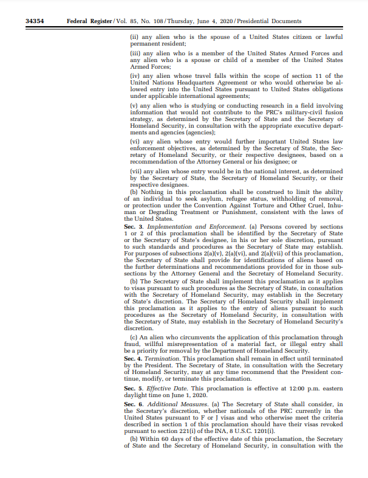

# 简介

## 美国第10043号总统令

- 2020年6月3日，美国前总统特朗普签署了第10043号总统令，以国家安全为名，禁止特定学生和学者获得F/J 签证。名义上，这份总统令限制帮助实施军民融合计划的实体；但实际上，它扼杀的却是大量无辜学生的求学之路。

- 首先，禁令对实施军民融合计划的实体定义不明。禁令本身没有指明“实施或帮助实施军民融合计划”的实体清单，而是要求国土安全部做出进一步的解释。而实际操作上，签证官错误地将这些“机构”认定为特定的几所理工科学校。这些理工科学校，包括北京航空航天大学、北京理工大学、哈尔滨工业大学、哈尔滨工程大学、西北工业大学、南京航空航天大学、南京理工大学、北京邮电大学及其附属的独立院校等，承担的各种科研和项目与中国其他顶尖的高校并无二致。

- 其次，禁令毫无根据地扩大了影响范围，并有进一步扩大的趋势。依据总统令的禁止范围 ("who either receives funding from or who currently is employed by, studies at, or conducts research at or on behalf of, or has been employed by, studied at, or conducted research at or on behalf of")，任何在被认定为实施过军民融合计划的机构“工作，或者学习过”，“在此机构或代表此机构研究过”的学生和学者均无法获得赴美从事本科以上的研究或学习的签证。在实际面签中，所有在这些学校有过学习经历或是受国家留学基金委(CSC)资助的同学，若是想要赴美学习STEM(科学，技术，工程，数学)专业，无论本硕博，无论已经毕业工作多少年，都会被一刀切地拒签。并且由于美国学校对于STEM专业的定义十分宽泛，已经有多位本以为是攻读商科甚至艺术类专业的同学被10043拒签。

- 10043wiki请点击[这里](https://en.wikipedia.org/wiki/Proclamation_10043)
- 许多受影响学生自发成立了一个组织抵抗10043禁令，具体进展请点击[这里](https://www.10043.org/)
- 10043pdf文件[Proclamation_10043](Proclamation_10043.pdf)

## 针对10043学校学生的润美方法

---

### 方法一 加拿大曲线救国（成功几率最大最可靠）

- 先申请加拿大CS的硕士或博士（单纯为了润不建议读博士），毕业后拿枫叶卡同时进一个互联网公司，之后拿L1工签南下去美国，美国的互联网大厂基本都在加拿大有分部，所以机会不少，但工资相对低一些，但也比缅甸生活的舒服。
- 加拿大拿卡相对美国容易得多，第一种常见的方法是走[EE](https://www.canada.ca/en/immigration-refugees-citizenship/services/immigrate-canada/express-entry.html)（Express Entry）通道，[打分制](https://www.cic.gc.ca/english/immigrate/skilled/crs-tool.asp)，包括年龄，学历，雅思成绩等等，到达这个门槛就可以获得省提名，近几年的最低门槛是450-470左右。
- 第二种方法是申请BC省（不列颠哥伦比亚省）学校的硕士或者，毕业后可以直接拿到省提名，拿到省提名大概半年后就可以拿到枫叶卡。学校名单点击[这里](https://www.welcomebc.ca/Immigrate-to-B-C/documents/BC-PNP-IPG-EEBC-IPG-Eligible-Programs-of-Study.aspx)。
- 加拿大读硕士大概一年半左右，总共需要约20-30wRMB。
- 10043首选加拿大，因为加拿大承接了美国大部分公司的分公司，据我所知温哥华微软和亚马逊一直在常年招人。现在亚马逊这么缺人，加拿大L4开出的总包也有160k加币了，虽然是比美国低一点，但是升职上去了有250k加币也不低了啊。而且相比美国，加拿大枫叶卡获取难度极低，等于白送。加拿大的妹子又多，温哥华中餐又好，比你去湾区卷不是好很多吗？

---

### 方法二 找外企工作transfer去美国

- 卷进国内外企，如微软，Amazon，Google，内部转岗去美国，难度较大，不够可靠。
- 直接面外国大厂，例如新加坡、欧洲或者加拿大的Amazon，Google等（美国本土基本没机会）。如果有能力或者有一定工作经验，可以打磨好自己的LinkedIn，去找猎头聊天或者等猎头找你，约面试，面试过了之后拿L1签证去新加坡、欧洲或加拿大，最后再润去美国。
- 适用于有一定工作经验且英语好的人，也有点运气成分在里面。

---

### 方法三 新加坡、欧洲曲线救国

- 类似于去加拿大读书，也可以去欧洲或者新加坡读书拿身份，再润去美国，但这些国家的移民政策的相对于加拿大来说条件太多，例如新加坡可能需要5年才能拿到卡，欧洲也差不多，时间成本太高，不太建议。

---

**如果各位有任何其他内容补充或者好方法分享，请提交PR，大家互帮互助一起润出去！:yum::heart:**
