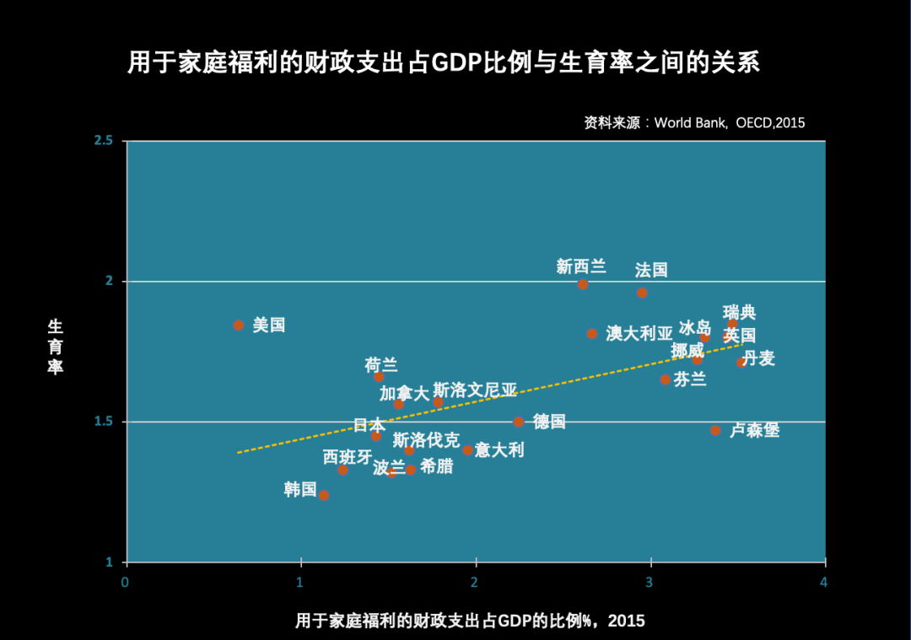
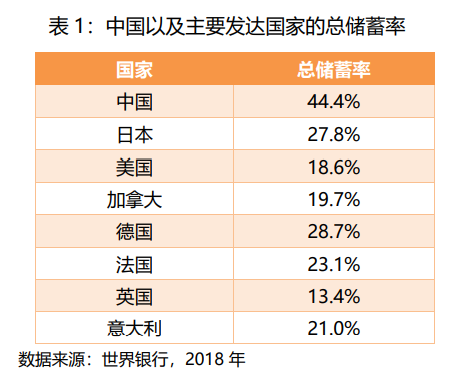

# 梁建章、黄文政等“专家”对人口问题的应对之策

建议生1个孩子奖励100万，可以是现金、所得税和社保减免、房价补贴等多种形式

[原文地址](http://www.ccg.org.cn/archives/63544) [Archive备份](https://archive.ph/iirtT)

第七次人口普查数据已经揭晓，我们对数据保持关注。目前已知的是，在“十四五”期间（2021-2025年），我国的育龄妇女数量还会继续减少，平均每年减少400多万至500多万人。如果不能显著提高生育率，那么“十四五”期间我国的出生人口将会继续下降，人口形势十分严峻。扣除二孩的堆积效应，近几年中国的生育率只有1.1左右，差不多只有更替水平的一半。这个生育水平接近世界最低水平，比日本和南欧国家等典型的低生育率国家还要低很多。显然，仅仅全面放开生育还远远达不到理想的更替生育水平，所以如何鼓励生育，应当会成为社会关注的话题。但有很多学者悲观地认为，中国年轻人的生育意愿已经是世界最低，放开和鼓励生育都没有用了，甚至有人说民族的衰亡已经注定。我却并不这么看，尽管鼓励生育是个世界难题，但是只要我们有决心，依旧可以有所作为。当然，鼓励生育是一项综合工程，包括很多社会政策的改革，其中就包括复杂的教育和房地产政策改革等等。这些政策改革的推出和落实需要时间，短期见效比较快的措施，是给出真金白银的财政支持，来直接补贴多孩家庭。

世界上也有鼓励生育成功的例子，例如北欧国家，他们在家庭和育儿方面有比较好的福利政策。比如瑞典和丹麦，支持家庭的财政支出占GDP的3%到4%。那么，中国需要花多少钱才能把生育率提升到更替水平呢？我做了一个生育率和家庭补贴的相关分析，如下图所示：

从图中可以看出，用于家庭福利的财政支出越多，生育率越高。每提高相当于1%GDP的支出用于家庭补贴，就会使生育率提高大约0.1个孩子。
按照以上分析：如果中国需要把生育率从现在的1.1提高到日本1.3-1.4的水平，需要花费GDP的2%，
            如果中国需要把生育率从现在的1.1提高到发达国家平均1.6的水平，需要花费GDP的5%，
            提高到更替水平2.1，需要花费GDP的 10%。

为什么中国鼓励生育需要花比其他国家更多的钱呢？因为中国的自然生育率太低了，只有1.1，比日本和欧洲低0.3到0.5个孩子.
为什么中国的生育率比其他发达国家还要低很多？这是因为中国的养育成本包括房价和教育成本相对于家庭收入都是世界上最高的.而房价和教育成本要降下来，需要教育政策和土地政策的彻底改革，短期很难实现.

在现有养育成本不变的情况下，鼓励生育必须采取比其他国家高得多的财政支持力度，才能达到同样的效果.其他国家对家庭的补贴可能占3-4%的GDP就够了，中国和韩国这样的世界最低生育率国家，需要把GDP的10%用于家庭补贴，才能把生育率提升到更替水平.如果要想提高到发达国家的平均水平，也需要GDP的5%.

2020年中国的GDP总量是100万亿元，GDP的10%，也就是说每年要花10万亿的财政支出，如果按照中国每年需要多生1000万的小孩来计算，每个小孩需要给予差不多100万元的奖励.当然这种奖励可以是现金、所得税和社保减免，房价补贴等多种形式，为了便于分析，我们不妨就假设成折合现金，来看看其合理性、公平性和可行性.

- 一是合理性：生一个娃给100万，乍一听似乎是太多了，但是你如果真的和年轻夫妇讨论这个问题，就会知道其实一点也不多，因为在大城市，抚养一个小孩从出生到大学毕业的直接费用，远远不止这个数字.而且这个数字未来会随着房价和教育成本的上升而上升.所以100万基本上只是能劝说大多数夫妇多生一个孩子的平均数，而50万差不多只能说服一半的人多生一个孩子.

- 二是公平性：有人说这个不公平，这么多钱是来自于全民的税收，那么对于单身或者丁克家庭是否不公平？其实长期而言还是公平的，因为小孩未来对整个社会的税收和社保的贡献，会惠及所有人，其中也包括不生小孩的人.可以说，税收制度和养老金制度实际是生小孩的人补贴了不生小孩的人，补贴生小孩的人只是纠正了这种不公平.那么每个小孩未来会给社会带来多大贡献呢？按照一个人一生的收入是600万来计算，如果按照20%的综合税率来估算就是120万.一个普通人一生对国家财政和社保的贡献肯定超过100万，所以即使拿出100万给每个孩子，也并不有失社会公平.

- 三是可行性：有人会说GDP的10%，中国负担得起吗?我说完全可以负担.中国是世界上最有负担能力的国家，因为中国有远远高于其他国家的储蓄率和投资率, 在经济学上储蓄率和投资率是一样的.中国的储蓄率在2007年至2010年一度高于50%，这在人类历史上空前绝后，现在虽然有所降低，也有44%的储蓄率.我们比较中国以及主要发达国家的总储蓄率，见表1，可以看出中国的总储蓄率比其他国家高了10多个至30多个百分点，可以说中国人是世界上最愿意为未来投资的.那么高的投资率都投到哪里去了呢？投到了各种固定资产如基建、厂房、房子等等.中国城市化和制造业的蓬勃发展，部分就得益于非常高的投资率.未来中国的基建和工厂的建设需求趋于饱和，所以完全有能力从超额的用于固定资产的投资，拿出10个百分点来，即10万亿，投资给未来的小孩.

当然100万是个平均数字，实际可以向二孩和多孩倾斜，也可以根据当地的生活成本浮动，形式上可以是现金、购房补贴、所得税或者社保减免。还有可以补贴企业的产假成本和幼托教育等。购房补贴可以是补贴的主要方式之一，其好处是还可以有平抑房价的作用。现在制约育龄夫妇生育孩子的一个重要原因是高房价，在大城市，地价普遍占到房价一半以上。如果多孩家庭买房可免除土地价格，那么购买价格就会降到原来的一半以下，这将大大减轻多孩家庭的买房负担。这个办法的好处是政府无需拿出真金白银，只要在低生育率地区多给些用地指标，扩大土地供应就可以了。这样，只要对奖励多孩家庭的优惠房源增加相应的供地指标，就基本不影响地方政府的土地收入。还有，部分多孩家庭新增的购房需求，被新增的土地指标所消化，还有助于平抑整体房价。中国的大城市并不缺地，大家其实可以算一算，即便所有中国人都住上别墅，也就用到1%-2%的国土面积。中国既然不缺地，中国的造房子和基础设施的效率又是世界最高，房价就不应该成为养不起孩子的理由。

现在是鼓励生育的好时机，因为中国现在的人口老龄化还不严重，如果错过当前的鼓励生育时机，未来人口老龄化加剧，储蓄率下降，养老负担加重，财政上就会捉襟见肘，届时就拿不出这么多钱鼓励生育，那就会真正陷入低生育率陷阱而不能自拔。

总结：面对低生育率，中国非常有必要重金奖励，2%的GDP能够提升到日本的生育率水平，5%的GDP能够提升到发达国家的平均水平，如果想要提高到更替水平则需要10%的GDP。这不仅是合理和公平的，而且是负担得起的，至少现在是负担得起的。长期来看，对孩子补贴的本质，是对于本国人力资源的未来进行投资。相对于当下普遍“产能过剩”的中国经济来说，投资于人力资源恰恰是回报最高的选择。只要我们下决心彻底解决抚养小孩的成本问题，我还是谨慎乐观的，因为毕竟人的天性是喜欢孩子的。本篇文章中，我们论述了中国鼓励生育所需要的财政投入力度，当然，鼓励生育是个复杂的政策工程，除了财政支持，中国人在教育上的人力、财力浪费尤为巨大，应该改革现有的高考制度，解决“教育内卷化”问题，为年轻人的生育压力松绑。
