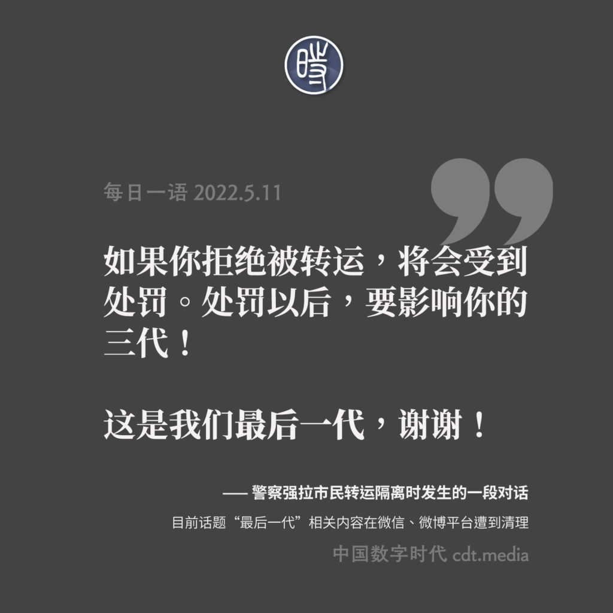

# 我们是最后一代

事情经过：5月11日，一段防疫人员试图强行拉“密接”市民去隔离的视频及其对话在中文互联网上热传。视频中的男性市民援引法律称防疫人员无权强行拉“密接”人员去隔离，并拒绝被转运。一名身穿印有“警察”字样白色防护服的人员威胁称：“如果你拒绝被转运，将会受到治安处罚。处罚以后，要影响你的三代！”这位市民回说：“这是我们最后一代，谢谢！”

[视频链接](https://www.youtube.com/watch?v=fLJHfMGtdJQ)

## 网民评论截图

## 相关创作

## 参考

- [中国数字时代 【CDTV】防疫人员：“处罚了以后，要影响你的三代！” 市民：“这是我们最后一代，谢谢！”](https://chinadigitaltimes.net/chinese/681166.html)

- [中国数字时代 【网络民议】你的统治到我结束，你给的苦难到我为止](https://chinadigitaltimes.net/chinese/681204.html)

- [中国数字时代 【图说天朝】“这是我们最后一代，谢谢！”](https://chinadigitaltimes.net/chinese/681367.html)
