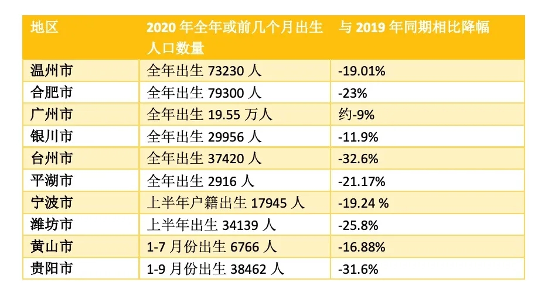

# 黄文政论人口问题

关于人口问题，在这里希望分享我个人心目中中国人口问题专家第一人，黄文政的一些研究成果。

黄文政，全球化智库（CCG）特邀高级研究员，上海交通大学系统工程硕士和约翰霍普金斯大学生物统计学博士，人口学者，“人口与未来”网站联合创始人。

黄先生是一位优秀的统计学，数据分析方向的研究学者，对于人口问题有非常独特的见解，是中国最早一批对计划生育提出反对意见的学者之一。他的研究成果多以详尽的数据为基础，用数据说话。

黄先生许多结论和看法对我来说犹如醍醐灌顶，比如对人口红利的解释，并不是简单的说，人口越多，劳动力旺盛，经济越好，这是广义的人口红利。从学术上来讲，或是狭义的人口红利，是降低出生率之后，
父母双方可以从抚养下一代的工作中解放出来，参与劳动，生产，创造，消费等活动促进经济。又比如对人口对国力的影响，通常来讲２０个人对比１０个人的力量对比是２：１，但２０个人中出现天赋异禀的，
具有领导能力的将才的概率也更高，而这样的人才对整个群体的带动作用可以导致２０个人对１０个人的力量对比可以放大到１００：１０，甚至２００：１０，从２倍的力量差距，到２０倍的力量差距。
这也很好理解，两军对峙，１０人打１０人，优秀的将领可以通过训练，战术等将１０人的力量训练成２０人的战斗力，那么两军力量对比就变成２：１。由此得出的结论很直接，未来国家竞争的关键就在于
人口基数。２０亿人出一个诺贝尔奖的概率必然比１０亿人高。

接下来，就搬运一下黄先生[对于中国不断走低的人口出生率的看法](http://www.ccg.org.cn/archives/62226) [Archive备份](https://web.archive.org/web/20210428052231/http://www.ccg.org.cn/archives/62226)

核心观点：**2020年出生人口虽然是近几十年来最少的一年，但却很可能是未来几十年内出生人口最多的一年（除非未来大力鼓励生育并且取得奇迹性的效果）。
中国未来每年出生人口再也不可能超过1400万，而是在向1000万以下急速滑去。如果无法大幅提升生育率，这种下滑将不会见底。
中国已经掉入低生育率陷阱，很重要的原因是中国的住房成本和教育成本过于高昂，导致育龄夫妇的生育意愿普遍低迷。**

各地最新人口数据预示低生育率危机

2021年1月18日，国家统计局举行国民经济运行情况新闻发布会。在过去几年，国家统计局在这种发布会上，除了公布上一年的GDP数据、粮食产量、就业数据、居民收入等数据以外，也公布上一年的出生人口数据。但这一次有所不同，国家统计局并没有在这个发布会上公布2020年出生人口数据。对此，国家统计局局长宁吉喆在发布会上解释说：“人口普查是十年一次，第六次人口普查也是在11月份进行的，于第二年4月份公布。2020年人口普查的结果也将在4月份向全社会公布，今天提供不了数据，请理解。”

虽然国家统计局今年推迟公布2020年出生人口数据，但一些地区已公布2020年全年或前几个月的出生人口数据。下面是一些地区已公布的2020年全年出生人口数据：

- 其一，根据温州市健康妇幼指导中心发布的数据，2020年度温州地区58家助产机构住院分娩活产数73230，比2019年同期减少19.01%。分户籍来看，其中产妇为温州户籍的活产数48357，比2019年同期减少19.47%；产妇为非温州户籍的活产数24873，比2019年同期减少18.1%。分孩次来看，一孩共34763，占比47.47%，较2019年同期减少15.87%。二孩共38467，占比52.53%，较2019年同期减少21.65%。
我们认为，上述的“二孩共38467，占比52.53%”应该是包括了二孩及二孩以上，因为把上述的一孩占比和二孩占比加起来就是100%。

- 其二，根据合肥市新闻办发布的数据，2020年统计年度合肥市出生人口7.93万人，人口出生率10.03‰。而根据合肥市统计局发布的数据，2019年合肥的出生人口是10.3万人，出生率12.65‰。这意味着，合肥市2020年出生人口比2019年下降了约23%。

- 其三，2021年1月24日《广州日报》报道，广州市2020年活产数为19.55万，较2017年下降了近10万。《广州日报》没有给出广州市2019年活产数的具体数字，但给出了一张显示广州市2012-2019年活产数变化的示意图，从图中可以看出2019年广州市活产数在21万至22万之间，取其中间值为21.5万，这意味着，广州市2020年活产数比2019年下降了约9%。

- 其四，根据2021年1月8日“银川发布”公众号的报道，据统计，2018年银川新生儿数量为29956人，2019年银川新生儿数量为27753人，到2020年，银川新生儿数量相较前两年明显下降，为24452人。可见，银川市2020年出生人口比2019年下降了11.9%。

- 其五，根据2021年1月13日《台州晚报》的报道：2020年台州市出生37420人，其中，新生男宝宝19722名，新生女宝宝17698名。而根据台州市统计局的数据，2019年台州市出生5.55万人。可见，台州市2020年出生人口比2019年下降了32.6%。

- 其六，根据2021年1月13日平湖市本地媒体“乐享平湖”的报道，2020年平湖市出生2916人，比2019年出生的3699人下降了21.17%。
下面再看看一些地区已公布的2020年前几个月的出生人口数据：
  - 2020年上半年，浙江省宁波市户籍人口共出生17945人（含补报768人），同比减少4275人，同比下降19.24%。
  - 2020年上半年，山东省潍坊市出生34139人，其中一孩12779人，二孩19354人。2019年1-6月，潍坊市出生46009人，2020年和2019年同期相比下降25.8%。
  - 2020年1-7月份，安徽省黄山市出生人口6766人，同比减少1374人，减少比例达16.88%。
  - 2020年1-9月份，贵州省贵阳市出生38462人，比2019年1-9月份出生的56215人减少了31.6%。

我们把上述数据整理成表1，可以看出，上述地区2020年全年或前几个月的出生人口数据（或活产数据）与2019年同期相比，下降幅度在9%至32.6%之间。

尽管我们不能将上述地区的出生人口降幅推演为全国的全年降幅，但我们结合二孩堆积减弱、育龄妇女人数减少等因素认为，2020年全国出生人口比2019年有较大幅度下降已经没有悬念，出生人口塌陷之狼真的来了。

二孩堆积减弱，是因为从2016年实施全面二孩政策以来，到2020年已经是第五年。育龄妇女人数减少，是因为年轻一代的人口数量大幅减少。根据2010年人口普查数据，80后、90后、00后的存活人口分别为2.19亿、1.88亿、1.47亿。而根据国家统计局数据，80后、90后、00后的出生人口分别为2.23亿、2.1亿、1.63亿，均有明显降幅。

2020年出生人口创下新低，并非中国独有，日本、韩国、俄罗斯等国的出生人口也纷纷创下新低，中国香港和台湾地区的人口也在2020年首次进入负增长。

考虑到未来中国育龄妇女人数继续下降，而未来中国人的生育意愿更可能继续走低，我们可以说，2020年出生人口虽然是近几十年来最少的一年，但却很可能是未来几十年内出生人口最多的一年（除非未来大力鼓励生育并且取得奇迹性的效果）。中国未来每年出生人口再也不可能超过1400万，而是在向1000万以下急速滑去。如果无法大幅提升生育率，这种下滑将不会见底。

中国已经掉入低生育率陷阱，很重要的原因是中国的住房成本和教育成本过于高昂，导致育龄夫妇的生育意愿普遍低迷。比如，根据《2019年全国50城房价收入比报告》的数据，深圳房价收入比是35.2，也就是说，对于深圳的普通家庭来说，不吃不喝，平均需要35.2年才能买得起一套房子。上海、北京的房价收入比分别为25.1和23.9。高房价极大地压抑了城市夫妇的生育意愿。

要扭转低生育率趋势，首先就要转变生育政策。当务之急是全面放开并在自主生育的前提下大力鼓励生育，也就是在住房成本、养育成本和教育等方面切实降低普通家庭的养育负担。

要减轻育儿家庭的住房成本，可对多孩家庭买房实行免地价的政策。在大城市，地价普遍占到房价一半以上。如果多孩家庭买房可免除土地价格，那么购买价格就会降到原来的一半以下，这将大大减轻多孩家庭的买房负担。具体实施上，可以对已经有多孩的家庭买房直接降价，也就是地方政府将相应地价部分从卖地收入中免除，对于买房以后多生的家庭则可以退还地税部分。免除标准可以视生育率情况灵活调整。

目前生育率普遍高于中国的欧洲国家，将GDP的1%-5%用于补贴家庭；数据表明，家庭补助占GDP高1%，生育率大约高0.1左右。中国目前老龄化负担还不是特别重，所以还有财力扶助生育、由于不同地区和人群之间存在很大的收入差距，建议对高收入家庭通过孩子人头抵税的方式减免个人所得税，对收入较低家庭，则直接发放育儿补贴。这些减税和补贴措施，是对于本国人力资源的长期投资。对于目前产能过剩的中国经济来说，投资于人力资源恰恰是回报最高的一种选择。

在教育方面，建议缩短学制，把中小学12年压缩为10年，其中小学5年，初高中5年。将幼儿园乃至托儿服务纳入义务教育，由政府直接或牵头兴办大量免费或价格低廉的托儿机构。让父亲和母亲享受相同的产假，则可降低母亲育孩负担并缓解工作性别歧视。还应取消各地非户籍人口的入学限制，只要是中国公民就可以在居住城市获得义务教育，让外来人口真正留在城市生活，并让他们的孩子方便地就近入托、入园、入学。各地教育资源的规划和配置应以维持常住人口可持续的孩子数量为基准。

十九届五中全会明确提出“增强生育政策包容性”之后，最近，全国人大常委会法工委主任沈春耀在十三届全国人大常委会第二十五次会议上做《关于2020年备案审查工作情况的报告》，其中一项工作是，要求各地对人口与计划生育领域相关法规、规章、规范性文件进行全面清理。我们期待中国人口政策将尽快实现从限制生育向鼓励生育的根本转变。
