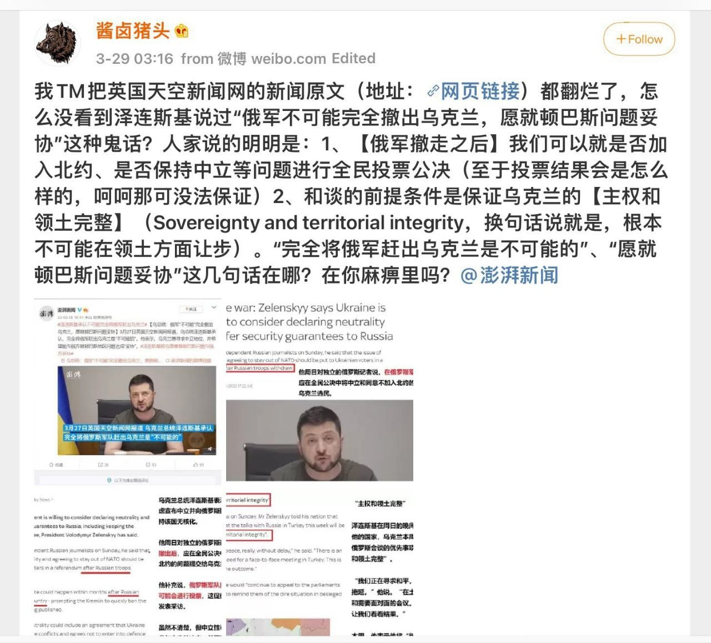
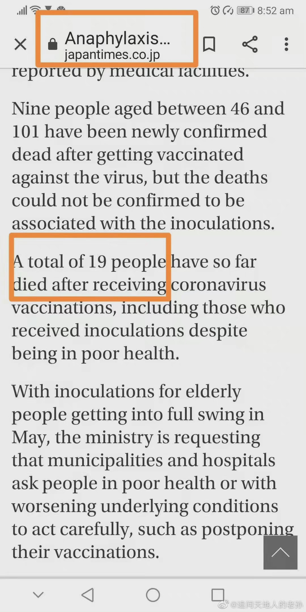
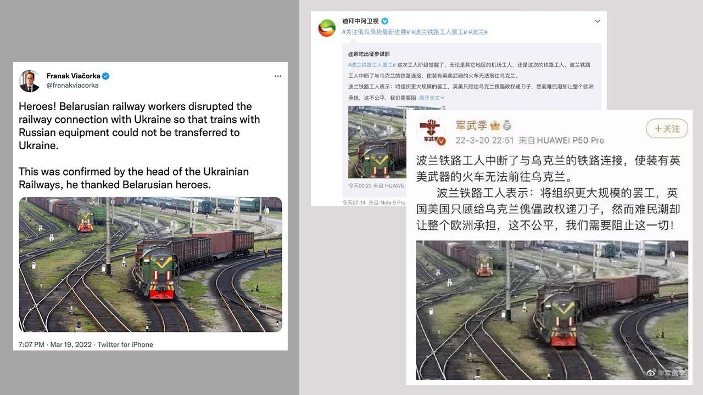
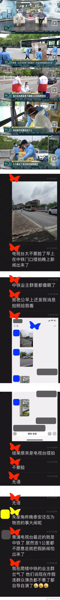
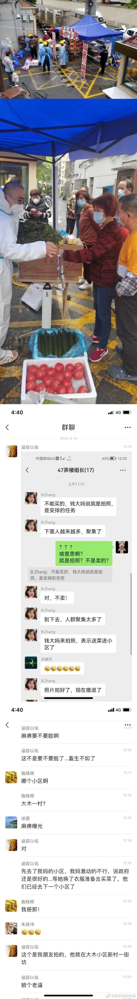
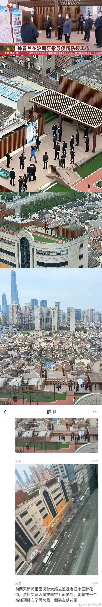
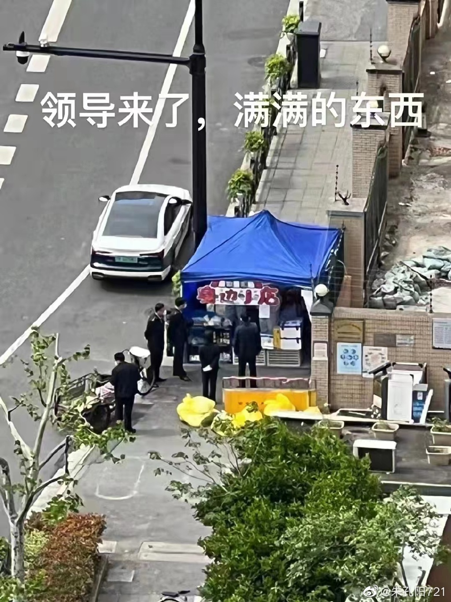
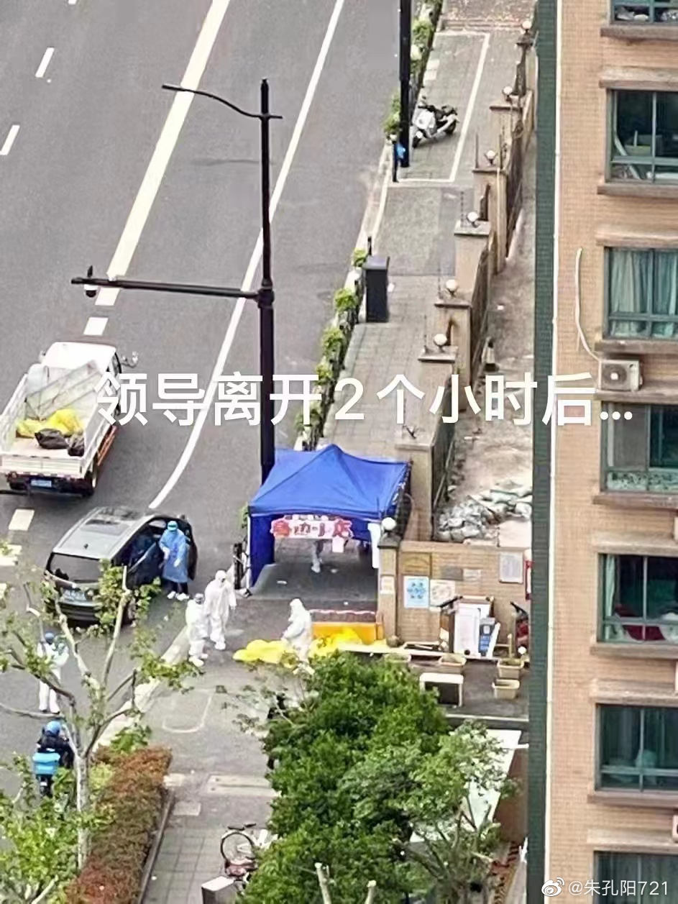
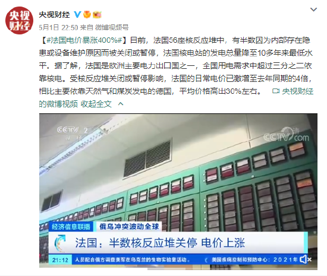
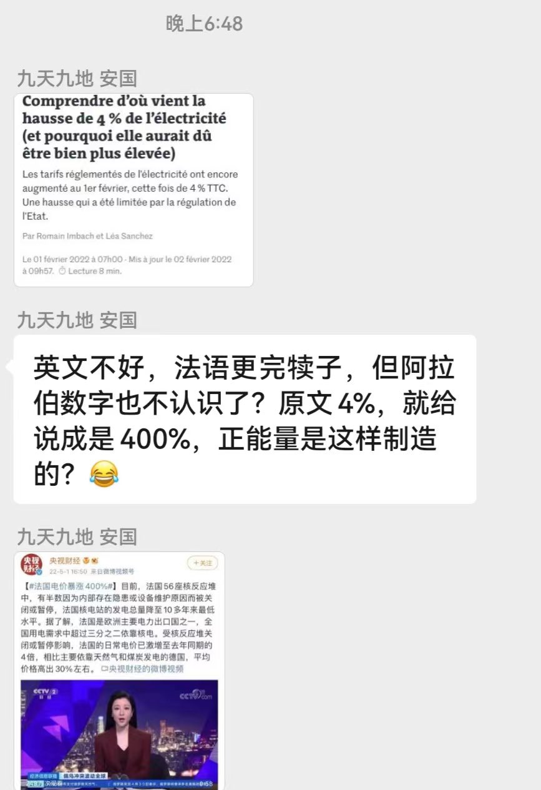

# Fake News

## 新华社

[知乎回答](https://www.zhihu.com/question/519022911/answer/2400699271) [Archive备份](https://archive.ph/01BRG)

## 澎湃新闻

### 俄乌战争相关

[澎湃报道：乌总统：俄军“不可能”完全撤出乌克兰，愿就顿巴斯问题妥协(引用英国天空新闻网的报道)](https://www.thepaper.cn/newsDetail_forward_17337758) [Archive备份](https://archive.ph/lPPSU)

[英国天空新闻网原文](https://news.sky.com/story/ukraine-war-zelenskyy-says-ukraine-is-willing-to-consider-declaring-neutrality-and-offer-security-guarantees-to-russia-12576688) [Archive备份](https://archive.ph/W6Tas)

### 新型冠状病毒疫苗死亡人数

[澎湃报道：震惊！超190人接种后死亡，知名疫苗出事了！](https://www.thepaper.cn/newsDetail_forward_13099160)

## 其他媒体

## CCTV

### 奥密克戎毒株

[CCTV原文链接](https://content-static.cctvnews.cctv.com/snow-book/index.html?item_id=1495693181517178915) [Archive备份](https://archive.ph/R2zSs)

[WHO原文链接](https://www.who.int/publications/m/item/weekly-epidemiological-update-on-covid-19---12-april-2022)

[OnHERWAY｜央视报道引发争议，那WHO究竟说了什么？](https://mp.weixin.qq.com/s/f9NoMVEtXqQzs2EdO7_a7A) [CDT备份链接](https://chinadigitaltimes.net/chinese/679464.html)

### 上海疫情新闻

### 法国电价涨幅

[法国媒体报道链接](https://www.lemonde.fr/les-decodeurs/article/2022/02/01/comprendre-d-ou-vient-la-hausse-de-4-de-l-electricite-et-pourquoi-elle-aurait-du-etre-bien-plus-elevee_6111808_4355770.html) [Archive备份](https://archive.ph/oqlPL)

## 凤凰新闻

[美国CDC：猴痘可通过空气传播，类似新冠病毒](https://news.ifeng.com/c/8GfyZCOu84O) [Archive备份](https://archive.ph/FGtYp)

[CDC原文链接](https://www.cdc.gov/poxvirus/monkeypox/transmission.html)

## 观察者网

[泽连斯基：俄已控制乌近1/5领土，乌方已损失3万多士兵](https://www.guancha.cn/internation/2022_06_03_642680.shtml)

[Speech by the President of Ukraine in the Chamber of Deputies of Luxembourg](https://www.president.gov.ua/en/news/promova-prezidenta-ukrayini-v-palati-deputativ-lyuksemburgu-75533)

>尽管目前各方统计数据不一，但是得出的结论普遍都是俄军伤亡人数大于乌克兰军队的伤亡人数

## 相关阅读

- [中国数字时代 【立此存照】这是翻译目的论运用到极致的体现？](https://chinadigitaltimes.net/chinese/678518.html)
