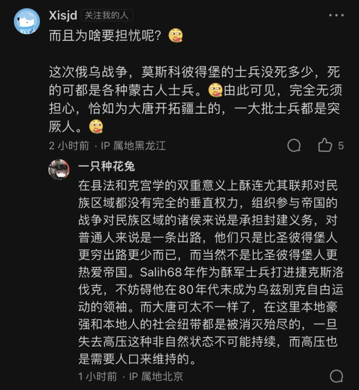

# 谈谈冰糖移民

[Archive备份](https://archive.ph/vNI02)

冰糖从2016年前后开始大量招揽内地移民，具体政策大致是这样的：一家三口落户团场，其中一个人可以拿职工身份+40亩地+7.5万左右的补贴，六口人落户（即如果家里有四个孩子）的话夫妻二人就都能拿到职工身份了。房子免费住3年，3年之后仍要按市场价格购买，大部分团场大概是1-2k一平。要求是内地户口+35岁以下+主体族。冰糖大概很不相信这些人的生育能力，一定得是带孩子的一家三口才能拿到这40亩地，没孩子？对不起，夫妻两人没孩子的话就只能去工业团踩缝纫机了，拿不到职工身份，补贴少得多，目前的行情大概一人只有一万多元。

40亩地是冰糖能建立起来的最大吸引力，这些带着孩子奔着职工身份和40亩地去的移民，显然也是冰糖最需要、也最有可能长期留下的人口。冰糖近两年开始“取消五统一”，即分给你的这片地你自主经营自负盈亏，想种什么种什么，上哪买种子化肥农机自己说了算。也就是冰糖让出一部分过去垄断的利润给农户。但是凭什么你在陕北老家种七八亩烂地，到这种40亩宝贵的河谷绿洲我还要给你优惠和贷款，天下当然没有免费的午餐。这些土地的承包者在官方定性中叫做“土地、职工、民兵三位一体”，职工身份田=法定民兵义务田。种这种地一要参与各种维吻傜役，比如消耗大量时间的各种军训、外出备勤、值班站岗等等，二是必须从土地收益中拿出一部分来缴社保，一线职工（即冰糖农民）的社保申报完成率是近几年团场的重要kpi。理论上社保是给几十年后的你自己缴的，但实际上就是替中央财政来填一部分冰糖社保的巨坑。冰糖农民交社保和你交社保可不一样，你交养老保险是公司交大部分你交小部分，但冰团经过2018年的土地确权改革后，单位部分（19%，2019年后降到16%）与个人部分（8%）全部由职工本人承担。种地的一线职工自负盈亏，也不存在从工资中扣除，因此这是很重的一笔负担。

需要注意的是，给你的这40亩地是可以流转出去的，但流转并不能够将你从你的封建义务中解放出来。2018年《职工身份地经营权流转管理办法》出台，里面有句话叫做“职工身份地经营权流转应当坚持流转规模与集聚人口的政策导向相协调的原则，防止片面追求大规模经营的倾向”，即我的一切政策是为了让你老老实实扎根边疆改变当地人口结构的，不是为了方便谁搞规模化大田种植发财的，否则要搞大田种植我冰糖自己的农企就搞了，哪里轮的到你？《办法》规定流转只能流转给本团场内的其他职工，受让总面积不能超过自己身份地的3倍，导致实践中的流转最多也就是一家人种两三家人的地。另外，流转不影响你的民兵义务，把土地流转出去，然后回老家或者回内地打工也是不行的，你最多是去本团场的工业园踩缝纫机，维稳傜役和养老金摊派你是逃不掉的。你把土地流转给张三种，连队叫你打军体拳的时候你能让张三替你么？不能，因为张三同样也在队列里打军体拳。连队打军体拳你不来，那么好，冰糖来去自由，只是你的职工身份和土地都要被收回了；这对于那些举家迁徙的内地贫农是不可接受的，因为这时候你可能连原籍的土地都没有了。换句话说，除了维吻傜役和社保摊派之外，你种了冰糖的地住了冰糖的房子，那么就要背负一项隐形的义务，就是作为一个人头的存在以实现冰糖下发给你的团场的“人口增加任务”。为什么冰糖要把人口增加任务下发到你的团场？因为冰糖的使命是改变人口结构以实现长治久安，这是它有资格向上转嫁财政压力的根源所在。所以说一个破产的陕北农民去冰糖种地，那他就成为了帝国-冰糖-团场-佃农封建义务链条中的一环，你想走是没那么容易的。这种意义上冰糖农民相比中国地主的佃农，更像有明确封建义务的欧洲佃农/农奴。需要注意的是，这个“土地、职工、民兵三位一体”，或者说带有明确封建义务的佃农制度，并不是冰糖在改开后的常态，而是当代左公时期的新发明，冰糖自称是2019年实现了“三位一体基本制度常态化、规范化”，完全是与近几年的团场改革互为配套措施的。

土地确权为什么要和维吻傜役挂钩，设想中使用暴力的对象是谁，这个很好理解；但至于为什么土地确权要跟这么重的社保摊派挂钩，因为冰糖养老金实在亏空太严重了。说到这里就得插一句冰糖养老金的背景了。老龄化+劳动力外流+大家都不想交，结果就是层层向上转移财政压力，团转移到师，师转移到冰糖，冰糖转移到中央财政，最终中央财政负担了冰糖六成以上（2019年为60.92%）的养老基金收入，比例和总额都在逐年增加。2009年中央财政只需要出38个亿，2019年则是194个亿才能补上冰糖养老金的亏空。这194个亿也不是全部，中央财政还要为团场的单位缴费部分提供补助（因为一线职工说白了就是一群农民，缴费压力太大），这部分额外补助会算在征缴收入而不是财政补助收入里。此外，冰糖养老基金一样参与全国跨省调剂，从吴闽粤养老金的剩余中再拿一部分，2020年是11个亿。2010s这一波退休潮的人口要到未来20-30年后才会自然死亡，短期内这是个无底大坑。在现在的移民政策刺激下冰糖基本养老保险的池子每年都能新增几万参保者，然而还是赶不上老旗人退休和涨价的速度（至少到2019年中央财政掏钱的比例还是一年比一年大，19年后的数据目前未知）。一个封闭的农庄经济内是不适合搞旁氏结构的养老金的，因为绿洲土地和水一共就那么多，土地有多大盘子就是多大，这几年已经增加两百多万亩的灌溉面积了，那等二十年后现在这批佃农老了怎么办呢？（当然要是往好处想，这个账想赖掉还是很容易的，你看1912年后大清财政还需要发愁上哪找钱养满城旗人吗？不需要了）

养老金的分配本身就很能反应冰糖内部的阶级次序。大家都在冰糖城镇职工养老保险这个池子里，然而现在的情况，团场职工个人要负担24%，机关事业编则个人则只负担4%，结果我一辈子在塔里木边缘土里刨食领2k退休金，你在石河子坐了一辈子办公室领5k退休金，凭什么呢，而且你直接从工资里扣就是了，我种地又没有工资可拿。于是很多种地的职工不愿意交或者真的拿不出这个钱来，就想办法不交或者只按最低基数交。这就是为什么交社保被上升到民兵义务的高度，实际上成为了职工身份田的租佃费用。所以南疆团场当然没法对标美国西部或者什么曹学意义上的非洲，职工本质上只是冰团的终身佃农。这种阶级关系的存在使得人口流出成为必然，一个团场职工的儿子当然不会把留在团场里种地作为优先选择，因为他继承的不过是份租佃合同而已，如果有机会他就会像帝国内地的农二代一样脱离土地；这些人居住在荒凉的帝国边缘，地区中心是异族人的城市，他们脱离土地的冲动往往比内地农二代更强大，在2017年广招移民之前冰糖的职工人数确实是在下跌的。机关事业编这个阶层的子女会固守他们父辈的位置，如果不能留在内地，那就瓜分掉本地的财政供养岗位。至于领导的孩子那当然是会去北京上海成都的。

归根结底冰糖人是依赖于体制而存在的，这和本地人不一样，和一样去西部拓殖的红脖子也不一样。本地人依赖他们的社区存在，红脖子依赖他们的土地存在，这才是有生命力的人口。而冰糖仅仅是在经济结构上依赖那些强占来的土地，具体的人则是完全超然于土地之外的体制化的人。这个体制的背后是一个巨大的国家网络，那么很自然，我要是有本事调到内地去，不仅工资更高而且没有这些稳吻摊派的bullshit，那我为什么不去呢？回忆一下，即是在改开之前，大家也都是前方百计追求从边疆调到东部的，在改开的情况下冰糖的体制身份就更加丧失吸引力了，如果我一个冰糖二代大学毕业在内地自己找工作过的更好，那我要你的冰糖身份有屁用。而冰糖（推而广之全田）能对抗这种潮流的工具少得可怜，无非是去增加他能给出的体制红利，比如体制内更快的上升通道——同样是当老师这边让你职称升的更快、更多的财政补助等等——比如各种补助金养老金你在其他省可能发不出来，但我冰糖努力给你发出来，这当然不是因为冰糖有钱，而是冰糖更有向上转嫁财政压力的资格（许多补助事项上冰糖都是全国独一份的最高一档，比如带病退伍的补助的中央财政补贴，冰糖是全国最高且唯一的每人每月700快，山西东北这些财政困难的地方也只有420；每年养老金的上调部分中央财政也给冰糖100%cover）。冰糖自身的财政是谈不上崩不崩溃的，他一个狱务是第一大支出的建制，存在自然就是要花钱的，但无限依赖上级财政援助导致的后果就是本地超高的物价和更加凋敝的自发经济秩序，恶性循环之下就是现在这个局面，知乎上一大堆大学毕业生讨论要不要去田里，结果所有要去的都是去吃财政供养的，考不上公务员或者事业编谁跟你扎根边疆。然而你无限依赖上级财政，上级财政当然也希望你自己（在实现拓殖使命的同时）开源节流，18年的团场改革直接把团场的机关事业编砍掉一大半，机关财政供养人员13008名减少到5461名，事业单位23521名减少到6951名。换句话说，就算你觉得冰糖的体制身份有吸引力，不好意思，地主家也没有余粮。

所以21世纪的局面就是这样，早期拓殖者的后代想去内地，内地的不想过来，过来几个吧一看全tm是内地编考不上退而求其次跑这来吃财政供养的，然而我财政又没能力供养那么多人。本地人倒是无所谓，什么你说内地人不来定居了？天底下还有这样的好事？物价低了，冰糖萎缩了，本地小资本有喘口气的空间了，黑大衣少了连心情都舒畅了。但这样下去没法“改善人口结构”啊，也就是一方面砍机关事业编，一方面又要完成兵团下发的人口增加任务，改开恶果下也没法一次性抓8000个免费湖南人了，怎么办呢？没有财政供养的余粮那就只能靠土地建立吸引力了，发扬中世纪封建庄园佃农制的先进经验，团场综合配套改革+靠40亩地招佃农移民；用官方的话说，“利用、盘活团场现有土地资源，放宽招工政策，扩大招录外来青壮年充实农牧业一线职工队伍“。这样的大背景下，愿意来团场的都是些什么人可想而知——内地贫困省份最没有出路的那些农民。虽然没有整体的统计，但我们可以靠一些零散的数据形成一个大概认知。举个例子，四师党校论文中披露的36团情况。36团从2017年开始引进内地主体族劳动力，2018年引进劳动力844人，来源为”宁夏，甘肃，青海的贫困山村“，”多是生活比较贫困人员，引进后缺乏基本的生活开销资金“，”844人中只有13人为高中及以上学历者，高中以下学历占比约达98%“。没有高中学历其实是一个相当委婉的统计口径，这些人大部分可能连小学都没读完，2017年36团场20-59岁人口平均受教育年限还有10.69年，差不多读到会考的水平，经过2018年的人口引进口后平均数被直接拉到了7.82年；请注意这些人还都是35岁以下的年轻人。官方文件里常常会说什么“坚持引人、引智和引资相结合，重点吸引大中专毕业生、外来人才和有条件的其他人员落户团场”，然而我们最好祈祷这句话不会实现，内地得是到了什么样的光景，才能让大中专毕业生像小学没毕业的西北农民一样走投无路呢？

那么这些人来了多少呢？不好意思，不清楚，只能估算。冰糖的人口增长有三个统计口径，总人口、户籍人口、职工人数。假设现在一家三口从陕北来到某团场种地，爸爸妈妈孩子，一家三口都落户了，只有爸爸一个人可以拿到职工身份，同时他发现团场的工业园在招工，就把陕北老家单身的弟弟带过来踩缝纫机了，然后把老妈也接过来同住了。那么在这个案例中，冰糖人口增加了5，户籍人口增加了3，职工数增加了1。在实际中，以2017年为例（2017年后冰糖公报不再公布职工人数），在这一年里总人口增加了17.12万人，户籍人口增加了9.63万人，职工增加了3.79万人；总人口和职工的比例是4.5比1，非常符合实际情况（比如石河子团场2020年就是新增4.4万人，新增1万职工）。总之，从2015年末到2021年末，冰糖在每年的自然增长人口都只有几千人的情况下，总人口增加了71.95万人。按比例估算，就是16万职工，16万个带孩子的移民家庭。

那要安置这么多人，当然就要新建扩建据点，如同俄国人在哈萨克北部做的那样。政策上反映为冰糖的团场综合配套改革，或者简单来说，团改镇。2015年的时候冰糖一共只有6个建制镇，2018年的时候也就只有11个，到2021年已经暴涨到63个了。建镇的本质就是赋予地方财权，虽然叫“镇”，但团镇其实有大量的县级行政权限。回顾一下冰糖的历史，1999年冰糖才有了第一个镇（石河子总场/北泉镇），第一次实行场镇合一，目的就是为了进行分税制试点，2005年开始让北泉镇自己留下一部分税收用于城市建设。现在也是这样，建镇就是为了财力下沉、财权下放，现在团场自己可以保留全部的非税收入和部分税收/土地出让金，这样团场就有钱搞城建以接纳更多拓殖人口了——一个典型的操作：给新移民拎包入住的房子只能免费住3年，3年之后按市场价购买，这样至少当初发的安家补贴钱就通过土地财政被回笼了。以前和目前的状况是，因为团场无非是一些人口老龄化的过时的几万人的农业拓殖据点，它只能跟师里要钱，师里说我的农企都快跌到退市了我能有什么钱呢，于是跟冰糖要，那冰糖本级的财政状况是最大支出修监狱，收入连养监狱都不够，最终花的当然就是吴粤富庶之地的钱了。冰糖逐级向上转移财政压力的程度相当夸张，拿二师（铁门关）举例，二师2019年一年非税收入1.95亿，税收返还1.33亿（意味着辖区全口径税收也就2个多亿），师市国企上缴利润0.5亿；结果光补助团场就要支出18.89亿，一般公共预算支出总计91.29亿；师市本级政府性基金收入3.5亿，支出19.9亿。个位数的收入，三位数的支出，你说怎么办？那当然是只能花吴粤的钱了。所以领导们现在寄希望于财权下放到团场后，团场能建城市建产业园，把雪球滚起来，如同奥伦堡一样从哥萨克的草原堡垒线变身有造血能力的经济城市。

未来会如何？不管站在任何立场上做设想，从团场到城市都显然是至少一代人的事情。靠土地招揽移民的问题在于，土地和水是有上限的，你本身就是沙漠边缘的绿洲耕地了，2021年相比2017年的总灌溉面积已经多了两百万亩了，到没有多余土地的那一天，要靠什么说服内地的破产农民来南疆而不是去吴粤讨生活呢？前几年每个团都在招人，今年我了解到的状况是招人的团已经很少了，名额也不多。在农业之外各团场计划中的发展模式是大同小异的，无非是引进低端制造业，但企业为什么要到一个离包邮区5000公里的产业园建厂，尤其是在旁边就有更廉价、管得更严的劳动力的情况下？那当然是看中冰糖能够提供的补贴了。从远景上来说，如果不永久倒退回能够随便抓8000湖南人的时代，那这场宏伟的社会工程是否能持续下去，只取决于吴粤的钱粮是否能够一直支撑它，或者这些移民人口是否能够形成一个有足够生育力、财政供养人口比例足够低的社区。目前来看，这些早已失去儒家信仰并且被冰糖进一步体制化的、拥有（至少是认为自己拥有）社会福利的佃农是只生一个好的虔诚信徒，2021年冰糖的出生率是历史最低点的4.44‰，自然增长率仅0.83‰，远远无法达到世代更替水平——而且这些仅有的佃农后代但凡有一点跻身社会精英的可能，他们就一定会回流内地或者至少去乌市这样的中心城市。但本地人不会拿内地作为退路，如果你做不到在所有时间把所有人都关在工厂宿舍里，那他们的社区就不可能凋零。 此消彼长的后果是，这些新建的种族隔离区域（招移民的标准就是非主体不要）无法形成可持续的自发经济秩序，而那些贫穷的本地人口则会溢出。这样的事情其实已经在这里发生过许多遍了，这些隔离据点如果不沦为鬼城，那一定会如同清国的迪化满城、民国的迪化汉城或90年代的阿克苏那样迎来民族边界的解体。这个过程是以体面还是不体面，和平还是非和平的方式发生呢——那就要看到时这些据点背后是否还有一个强大的祖国了。

ps. 一点常识 [@Xisjd](https://www.zhihu.com/people/zhang-qi-deng)

