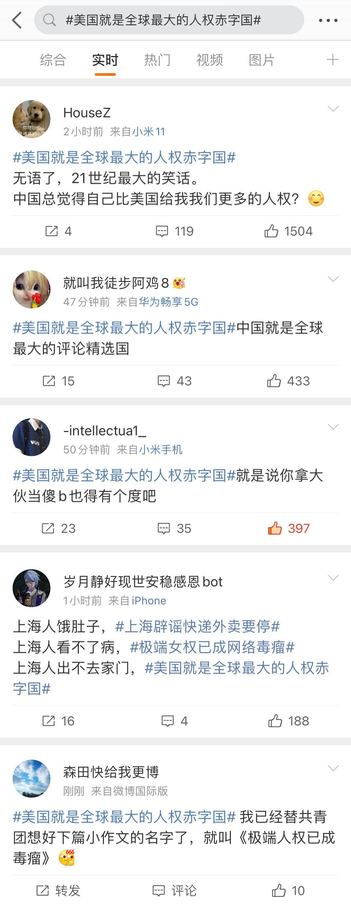
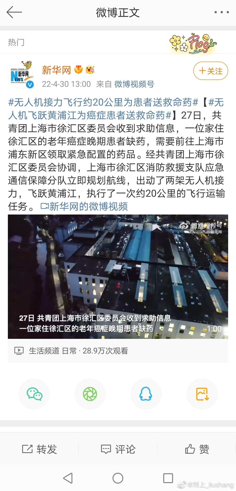
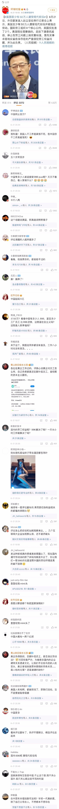

# 翻车合集

## 美国是全球最大的人权赤字国

## 俄乌冲突爆发谁在大发战争横财

## 无人机飞跃黄浦江为癌症患者送救命药

[新闻链接](https://k.sina.com.cn/article_1567403105_5d6cac6104000yn7s.html)

[微信公众号：大江白鹭｜只有脑残才会被感动](https://mp.weixin.qq.com/s/xcUsaGUGzsjssWQxOjsLzA) [CDT备份链接](https://chinadigitaltimes.net/chinese/680683.html)

## 美国至少有50万人遭受现代奴役

