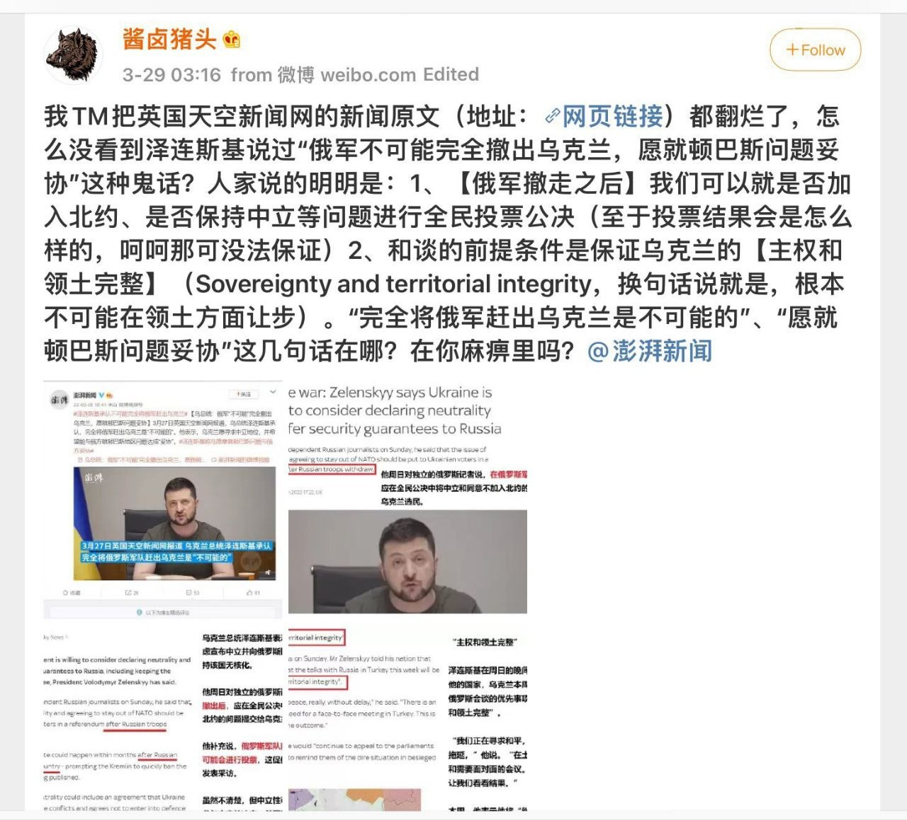
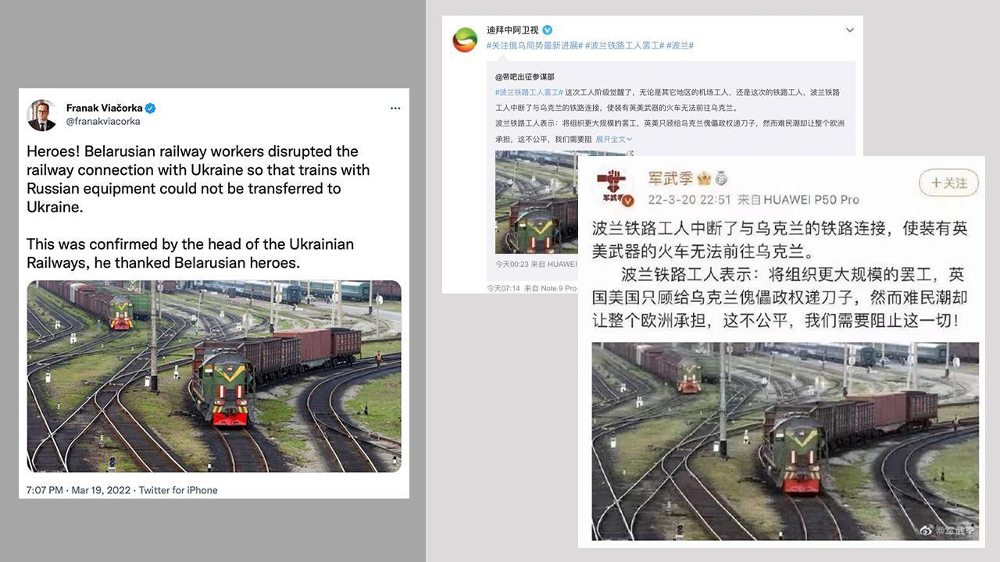
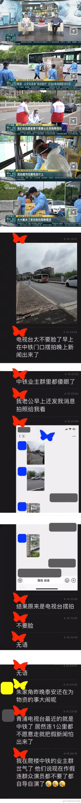
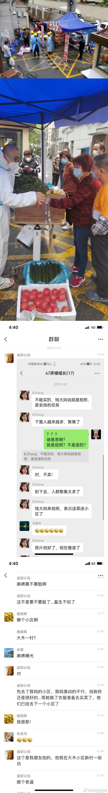
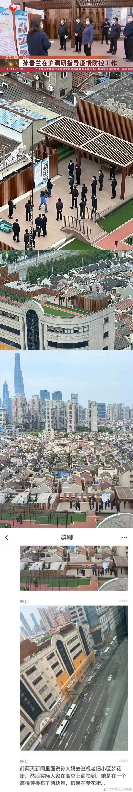
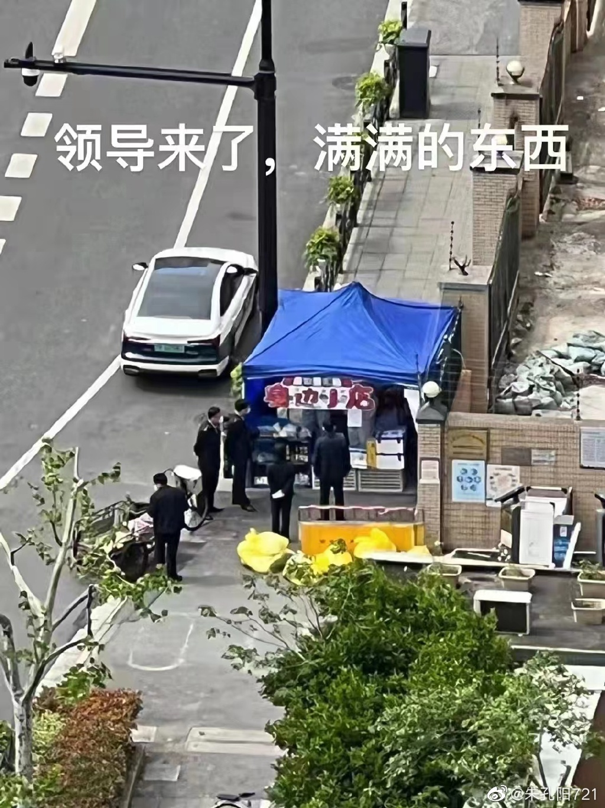
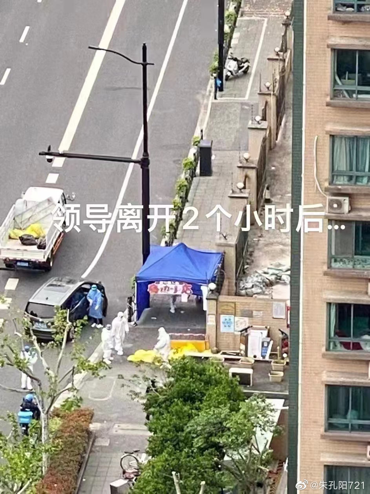

# Fake News

## 新华社

[知乎回答](https://www.zhihu.com/question/519022911/answer/2400699271) [Archive备份](https://archive.ph/01BRG)

## 澎湃新闻

[澎湃报道：乌总统：俄军“不可能”完全撤出乌克兰，愿就顿巴斯问题妥协(引用英国天空新闻网的报道)](https://www.thepaper.cn/newsDetail_forward_17337758) [Archive备份](https://web.archive.org/web/20220401150606/https://www.thepaper.cn/newsDetail_forward_17337758)

[英国天空新闻网原文](https://archive.ph/W6Tas)

## 其他媒体

## CCTV

### 奥密克戎毒株

[原文链接](https://archive.ph/R2zSs)

[WHO原文链接](https://www.who.int/publications/m/item/weekly-epidemiological-update-on-covid-19---12-april-2022)

### 上海疫情新闻

