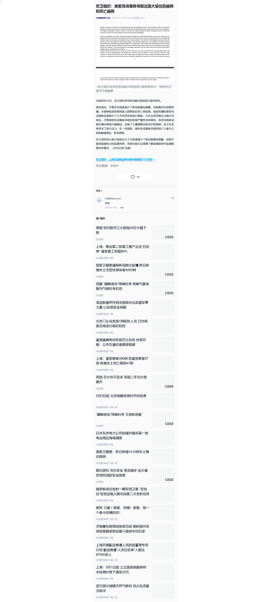

## 新华社 
[知乎回答](https://www.zhihu.com/question/519022911/answer/2400699271) [Archive备份](https://archive.ph/01BRG)

## CCTV

### 上海疫情新闻

### 奥密克戎毒株
[原文链接](https://content-static.cctvnews.cctv.com/snow-book/index.html?item_id=1495693181517178915)

[WHO原文链接](https://www.who.int/publications/m/item/weekly-epidemiological-update-on-covid-19---12-april-2022)

## 其他媒体

