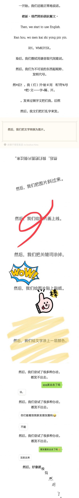
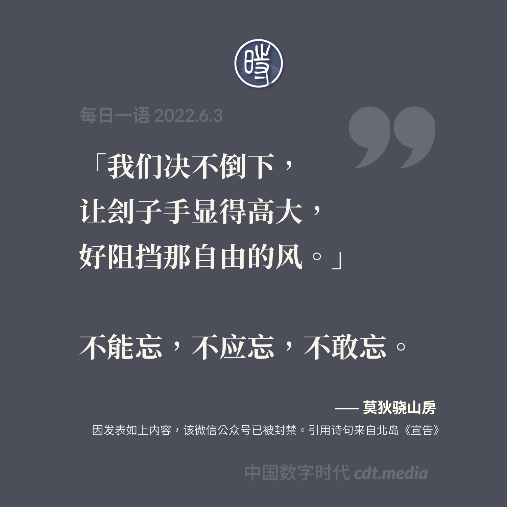
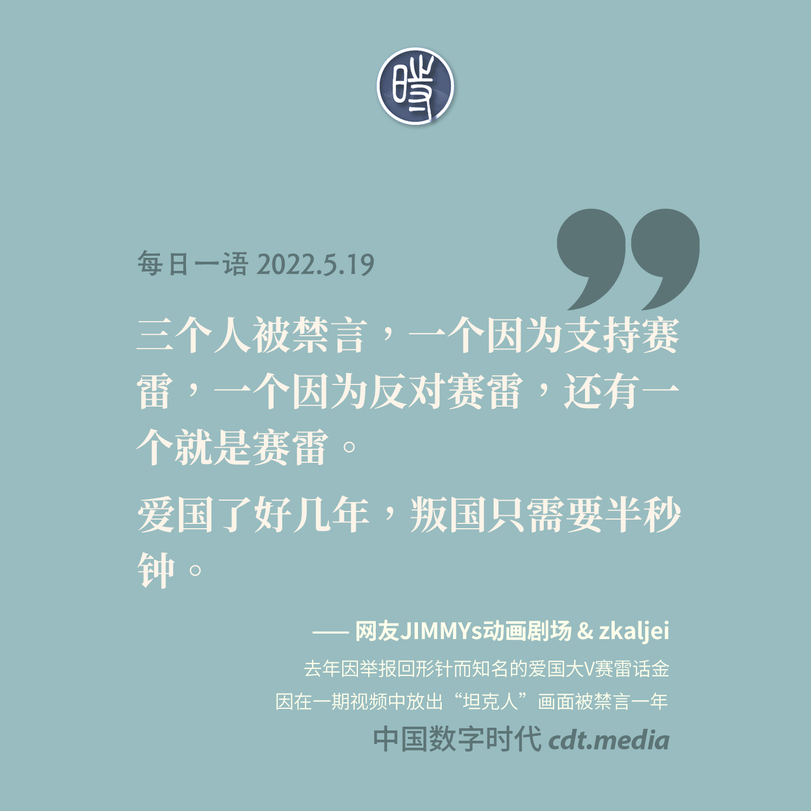
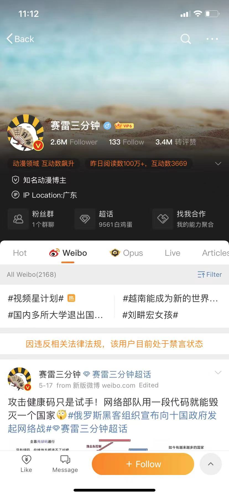

# 审查

乔治·奥威尔在《1984》中说过：“谁控制过去，谁就控制未来;谁控制现在，谁就控制过去。”

审查(Censorship)是精神，思想和文化领域的暴力形式。

一位推特用户[@untsop](https://twitter.com/untsop/status/1075203376608993280)这样说：“审查是向表达者实施的[恐怖主义](https://zh.wikipedia.org/zh-cn/恐怖主义)，它的目的不是删帖，而是宣扬恐惧，让表达者寒蝉若惊。”

在信息社会，信息和符号的生产和流通已经成为控制生产、工作和消费的关键，谁控制了信息网络，谁就控制了社会权力。法国社会学家[皮耶·布迪厄](https://zh.wikipedia.org/zh-cn/皮耶·布迪厄)在1999年也写道：“符号权力是建构现实的权力，是朝向建构认知秩序的权力。”

专制社会的统治者垄断一切权力，包括信息和符号权力在内，专制统治者对言论，示威，结社，宗教信仰等公民权利和政治权利一律予以压制和剥夺。网络审查是政治集权专制对社会控制机制整体的一个部分，这种控制既是透过法律，行政规定，资源分配等传统权力关系的配置实行，也通过网络和信息传播技术使用，以及在精神和文化领域透过对信息和符号系统支配和暴力的形式实现。

## 中国在审查方面做了什么

### 六四事件

简中互联网最敏感的话题应该是[六四事件](https://zh.wikipedia.org/zh-cn/六四事件)

相关阅读
>[歪脑｜生于六四后的人如何讨论六四： 这是不是我们记得六四的最后一代？](https://www.wainao.me/wainao-reads/last-generation-remembering-june-fourth-06032022)

### 赛雷三分钟

>[赛雷三分钟](https://zh.wikipedia.org/zh-cn/赛雷_(自媒体))在5月3号的更新视频中出现了一秒[坦克人](https://zh.wikipedia.org/zh-cn/坦克人)的照片，随后赛雷三分钟的账号被[全网封禁](https://chinadigitaltimes.net/chinese/681643.html)
>
>
>
> 

### 李佳琦

>[中国数字时代 【立此存照】李佳琦悖论：你必须了解所有政治禁区才能不触碰政治禁区](https://chinadigitaltimes.net/chinese/682665.html)
>
>

## 审查所造成的影响

[在中国，你没有言论自由，更没有创作自由。](https://www.youtube.com/watch?v=FNq_QYFa7s4) [CDTV](https://chinadigitaltimes.net/chinese/680591.html)

### Gitee

[知乎 崔庆才｜为Gitee感到惋惜，但在这个环境下，真的是“实属无奈”了](https://chinadigitaltimes.net/chinese/681657.html)

### 中文已经死了

[王左中右｜中文大约的确已经死了](https://mp.weixin.qq.com/s/GZKMemoSIDtKBKOI6orVsQ) [Archive备份](https://archive.ph/Ga8Lw) [CDT备份](https://chinadigitaltimes.net/chinese/681744.html)

[【404文库】莫狄骁山房｜中文就算死了，你也没找对死因](https://chinadigitaltimes.net/chinese/681809.html)

[中国数字时代 【网络民议】中文死了……吗？](https://chinadigitaltimes.net/chinese/681800.html)

[我知道的是我不知道｜中文不是死了，是被统一了](https://mp.weixin.qq.com/s/CK0QNwuUTAbtWmUy-37h8A) [Archive备份](https://archive.ph/UGg6Y)

[坏话｜家人们咱就是说，中文确实是S了，我真的会谢](https://mp.weixin.qq.com/s/9Ql0EaDMgjr1NbsBdwsZRg) [Archive备份](https://archive.ph/IWcra)

[中式没品笑话百科｜口口口口口口口口口口](https://mp.weixin.qq.com/s/Yl5TZ83pFGLZoEKyzv7C6g) [Archive备份](https://archive.ph/LuuND)

## [网剧许可证](https://news.cctv.com/2022/05/17/ARTIlod8IJS6QRIoCDLpJDrz220517.shtml)

>央视专家评价“网剧许可证”：因为我们推出审查制度了，所以今后一定能催生优秀作品的出现！

## 对抗审查

### NFT

[华尔街日报 NFT在中国有了新用途：在疫情中对抗审查](https://cn.wsj.com/articles/nft在中国有了新用途-在疫情中对抗审查-11653306611) [【CDT综述】NFT在中国成为了一种对抗网络审查的新方式](https://chinadigitaltimes.net/chinese/681884.html)

## 推荐阅读

[王洪喆 互聯網的內容審查與網絡亞文化](https://web.archive.org/web/20140210233543/https://www.cuhk.edu.hk/ics/21c/issue/articles/119_0908064.pdf) [CDT备份](https://chinadigitaltimes.net/space/王洪喆：从“草泥马”事件看中国互联网的内容审查、网络文本抵抗与网民亚文化)

[读者来函：端点星的自我放逐之旅](https://matters.news/@ngocncat/42146-读者来函-端点星的自我放逐之旅-bafyreihncqhk3lavhdlsd35v6mcaw3umqzpmofs4y6bzn6hazzxk64nyie)

[湛庐文化｜无法被404的内容](https://mp.weixin.qq.com/s/R2GOkV6wc_8TVpCNIW_zug) [Archive备份](https://archive.ph/2aeqc) [CDT备份链接](https://chinadigitaltimes.net/chinese/680820.html)
