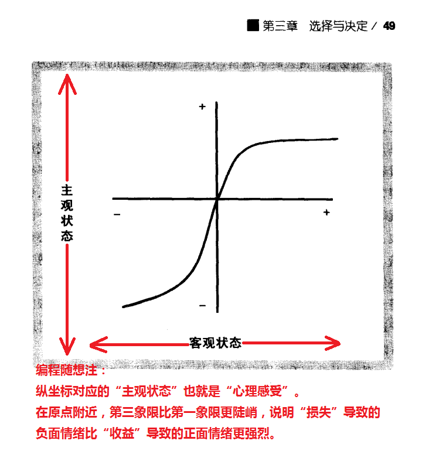

# 思维的误区：从“沉没成本谬误”到“损失厌恶情结

**作者 编程随想 [思维的误区：从“沉没成本谬误”到“损失厌恶情结](https://program-think.blogspot.com/2014/06/sunk-cost-fallacy-and-loss-aversion.html)**

本来在琢磨另一篇博文，其中涉及到“沉没成本”的概念。转念一想，改为写一篇关于“沉没成本谬误”的博文，也算是继续普及心理素质。

## 啥是“沉没成本”？

 　“沉没成本”（sunk cost）是一个经济领域的概念，指的是已经付出并且【不可能】收回的成本。
 　比如你花钱买了某个商品，并且是不允许退货的。那么你已经花掉的钱就属于“沉没成本”。

## 啥是“沉没成本谬误”？

 　“沉没成本谬误”，洋文叫做“sunk cost  fallacy”。刚才说了，“沉没成本”是【不】可挽回滴。因此，一个足够理性的人，不会拿“沉没成本”作为对未来决策的参考依据。但实际上，绝大部分人都是很感性的，所以这些很感性的人在作决策的时候，会受到之前的沉没成本的影响，并作出不那么理智的决策。

## “沉没成本谬误”举例

 　为了加深列位看官的印象，再来举几个例子。

### 炒股的例子

 　比如咱天朝的股市在北京奥运那年猛跌，（截至俺写本文时）已经跌去一半都不止。很多股民从6000点就一直套牢到现在。
  
 　当大盘跌到5000点的时候，他们想，这可能是短期的阶段性调整，于是没有止损；大盘到4000点的时候，很多人想，5000点都没有割肉，这时候割肉岂不是很傻，于是又忍着......然后就一直等到如今2000点。你说悲催吧？

### 恋人的例子

 　比如有一对恋人已经谈10年，性格等诸多方面还是合不来。继续谈下去，短期内也看不到改善的希望。如果双方都够理智的话，应该当机立断分手。但是两人都觉得，如果分手了，之前谈了那么多年，岂不是白费了？于是就继续拖下去，青春年华就这样耗在里面了。

### 排队的例子

 　假设你去吃饭，你选中那家餐厅人多，需要排队叫号。然后你拿了一个号等着。但是等了30分钟还是没轮到你。这时候你饥饿难耐，而且边上有另一个同样档次的店已经空出来了。这时候你是选择继续在这家等（继续挨饿），还是选择去边上的另一家店就餐（无需再等）？
 　大多数人会选择继续等。他们的理由是：刚才已经等了30分钟；如果中途放弃，刚才30分钟岂不是白等了？

### 度假的例子

 　俺估计，很多读者都属于上述三个例子之一，所以某些读者会为自己作一些辩解。下面再举最后一个例子，也是一个特别傻的例子——傻到让你无可辩驳。

 　某个心理学家作了一个实验，设想了如下一个场景：

>假设你很喜欢度假。半年前，你花2万元买了一个度假的全套服务（不可退款）。前几天你又看到另一个【更好的】度假项目，只要1万元，然后你又买了（同样是不可退款）。等你买了第二个之后，才发现这两项目的时间是冲突的（你只能去其中一个），而这两个项目都不可转让（必须你本人去）。这时候你会选择去哪一个？

　　针对很多人作了上述这个测试，大部分人选择去2万元那个（也就是【较差的】那个）。为啥明明有更好的，却选择去差的那个捏？这不是很傻逼吗？根本原因在于，很多人不愿意看到这2万元白花了——“沉没成本”误导了你的决策。

## “沉没成本谬误”的心理成因

 　为啥会有“沉没成本谬误”捏？俺总结了如下几个心理学层面的原因。

### 一致性原理

 　俺博客中已经不止一次提到“一致性原理”了。早在5年前的那篇《[光环效应引发的认知误区](https://program-think.blogspot.com/2009/05/halo-effect.html)》，里面就提到了这个原理。考虑到某些读者比较健忘，再来唠叨一次。

  一致性原理说的是：人在心理上总是企图保持各种一致性（这里所说的一致性包括心理上的不同维度和层面）

  再回到“沉没成本”的话题。不论是前面提到的“炒股”还是“恋人”和“排队”的例子，你稍微思考一下，都能感觉到【一致性原则】在起作用。

  如果你想更深入地了解“一致性原理”的相关话题，可以看《[影响力](https://docs.google.com/document/d/1PmNGkvoqtPWPwV63h5KMiQQWgGU-Mo3Zf4aFzX16om4/)》
这本书（本博客上已经第 N 次提到此书了，[俺的网盘](https://github.com/programthink/books)有此书的多种电子版）。

### 侥幸心理

 　这个因素其实比较好理解。

 　比如在“恋人的例子”，两人都怀着某种侥幸心理，以为再相处一段时间，关系就能够改善。为啥说这是侥幸心理捏？因为如果10年都无法改善，那么今后发生改善的机会是很小的（“性格”这种东西，往往是年龄越大，可塑性越差）。

 　比如在“炒股的例子”，很多被高位套牢的股民，就是心怀侥幸，以为很快就能等来大盘反弹（可惜5-6年都没反弹）。

### 【损失憎恶】心理

 　不过前面提到的“一致性原理”和“侥幸心理”都不是最关键滴。导致“沉没成本谬误”的【最关键因素】是“损失憎恶心理”。
 　很多人光看字面上的意思，以为自己已经明白啥是“损失憎恶”。其实未必哦。如果你光从字面上理解，那么你的理解多半是肤浅的，【未】切中要害。因为这个效应包含了一些可能令你意想不到的东西。
 　考虑到这个效应比较重要，又是本博客第一次提及，俺需要多花点口水，所以在下面单独开几个章节来聊。

## 先看几个小测试

 　为了让大伙儿更好地理解“损失厌恶”这个心理学效应，咱们来做几个小测试。

### 测试1

 　如下两个方案让你选，你会选哪个？

>方案A(保守方案)：
>铁定赚1000元
>
>方案B(激进方案)：
>有 50% 的可能性会赚到2000元，另有 50% 的可能性没有赚到钱

  经过心理学实验的测试，大部分人选“方案A”。

### 测试2

 　如下两个方案让你选，你会选哪个？

>方案A(保守方案)：
>铁定损失1000元
>
>方案B(激进方案)：
>有 50% 的可能性会损失2000元，另有 50% 的可能性没有任何损失

  经过心理学测试，大部分人选“方案B”。

### 问题

 　如果你稍微懂点概率，应该明白：不论是第1个测试还是第2个测试，作为候选的两个方案，从概率学的角度讲是【等价】滴。
 　那为啥大部分人在第1个测试中采用保守策略，但却在第2个测试中改用激进策略？心理学上的“损失憎恶情结”可以回答这个问题。

## 什么是“损失憎恶/损失规避”情结？

 　“损失憎恶”也叫“损失厌恶”或“损失规避”，洋文叫做“loss aversion”，英文维基百科的页面在“[这里](https://en.wikipedia.org/wiki/Loss_aversion)”。
 　
  前面说过了，千万不要只从字面上理解这个概念。因为即使是傻子也明白，人都是偏好收益，讨厌损失的。如果只是包含这么肤浅的含义，它就不会成为心理学领域的重要概念了。
 　这个概念的关键点在于：**损失产生的消极情绪【远远超过】收益产生的积极情绪**。

  在第一个测试中，你面临的2个选择都不涉及损失，这时候大多数人会选择保守策略——这个很容易解释。
  在之前的博文《[为啥俺要写这个博客——动机的自我分析](https://program-think.blogspot.com/2013/04/why-write-blog.html)》中，
提到了马斯洛的“需求层次理论”（洋文叫“hierarchy of needs”维基百科的词条在“[这里](https://zh.wikipedia.org/wiki/需求层次理论)”）。

  在该理论中，“安全性需求”仅次于“生理需求”。也就是说，在不威胁到生理需求的前提下，大部分人都优先考虑“安全性需求”。选择“保守策略”（不用冒风险）自然是符合“安全性需求”的。

  但是在第二个测试中，为啥大多数人反而选择“冒险策略”？因为第二个测试的“A方案”，其损失是必然发生的。
  面对这种【必然性】的损失，内心的“损失憎恶情结”就起作用啦。大多数人为了规避这种“必然性的损失”，宁可冒险赌一把。

## 你知道“对损失的厌恶”有多强烈吗？

 　要了解“对损失的厌恶”强烈到何种程度，再来看第三个测试。
 　如下两个方案让你选，你会选哪个？

>方案A：
>铁定损失800元
>  
>方案B：
>有 50% 的可能性会损失2000元，另有 50% 的可能性没有任何损失

　 稍微有点概率常识的同学，肯定意识到“方案B”（等价于损失1000元）明显比“方案A”【更差】。但是经过心理学测试，大部分被测试的人还是选“方案B”。

   那么，收益要达到多大的比例，才能抵消对损失的厌恶情绪捏？这个比例肯定是因人而异滴。通常越理性的人，这个比例越接近1；反之则越大。

  俺曾经在一本心理学的书籍中看到说，“对损失的厌恶”最多的情况下会2倍于“对收益的满足”。也就是说，如果某人的“损失憎恶情结”特别强烈，那么潜在收益要达到损失的2倍，他/她才会觉得两者是相当的。对应到“测试3”，需要把“方案A”中“铁定损失的金额”调整为500，那么这些人才会觉得这两个方案是差不多的。

 　下面这张图片摘自《[无从选择——为何多即是少](https://docs.google.com/document/d/1jJA46kpraXr252iQEWXmxGyQpUd4yju8qcHu7kR38z4/)》（注：[俺的网盘](https://github.com/programthink/books)上有此书的中英文电子版）。

  在上图中，请注意在原点附近的曲线——第三象限比第一象限要陡峭，这个“陡峭”就体现出——“损失产生的消极情绪【超过】收益产生的积极情绪”。
  某些比较善于思考的同学会问：为啥在远离原点的地方，曲线又变平缓了？这其实涉及到另一个心理学的话题——“边际效用递减”。
  为了避免篇幅过长（以照顾某些【阅读障碍】的同学），等俺以后有空的话，再单独写一篇博文聊“边际效用递减”这个话题。

## 如何用“损失憎恶情结”进行误导、忽悠和洗脑？

 　“损失憎恶情结”已经在很多领域（尤其是营销领域）被广泛使用了。俺稍微举几个例子。

### 买车的例子

 　如今买私家车的同学越来越多啦。买车的过程中有一个环节是选择你要的附属品（比如内置音箱、等等），每选择一种附属品都要支付额外的费用。国外的心理学家做过一个相关的测试，他们采用两种方式让买车的人选择附属品。

>选择方式1：
>在一个表格中列出所有的附属品，让买家把【不要】的附属品【划掉】。
>
>选择方式2：
>在一个表格中列出所有的附属品，让买家把【想要】的附属品【打勾】。

  对于比较理性的人而言，这两种方式应该是等价的。但是实际测试下来，对于“方式1”，买家购买了【更多】的附属品。

  为啥会这样捏？“方式1”的这种做法，会让买家在潜意识里面感觉那些附属品已经是汽车的一部分，“划掉某个选项”更像是某种“损失”。对损失的厌恶会让买家去掉比较少的选项（相对于“方式2”而言）。

### 售楼处的例子

 　很多售楼小姐都会用一个诈术——忽悠说该楼盘已经卖得差不多了，只剩下少数几套。某些买家被这样一忽悠，就会匆忙下订金。这个招数能奏效，原因之一依然是“损失憎恶情结”。在这个例子中，买家害怕的是【购买机会的损失】。

  如果你对周围的环境稍微留意一下，你会发现：很多行业的营销人员，都擅长制造“机会即将失去”的紧张气氛。而且这招屡试不爽。

## 结尾

  篇幅已经挺长了，今天先聊到这里。对这个话题有兴趣的同学，可以在博客留言中分享你的心得。比如在日常生活中，你是否也碰到过“沉没成本谬误”和“损失憎恶情结”。
  
  另外，俺留一个思考题：你自己想想看，朝廷的官方宣传中，是否也采用了本文提及的“沉没成本谬误”和“损失憎恶情结”？

**俺博客上，和本文相关的帖子（需翻墙）**：

[思维的误区：忽视沉默的大多数](https://program-think.blogspot.com/2010/07/silent-proof.html)

[读书笔记：《反脆弱——从不确定性中获益》](https://program-think.blogspot.com/2018/12/Book-Review-Antifragile-Things-That-Gain-from-Disorder.html)

[批判性思维扫盲：学会区分“事实”与“观点”](https://program-think.blogspot.com/2013/05/difference-between-fact-and-opinion.html)

[“心智模式”系列：你是如何看待【成败】的？——兼谈【有效归因】](https://program-think.blogspot.com/2010/04/how-to-attribute-success-failure.html)

[“心智模式”系列：如何面对【逆境】？——兼谈“斯托克代尔悖论”](https://program-think.blogspot.com/2012/01/stockdale-paradox.html)

[不要成为“粉丝”——谈谈“偶像崇拜”的成因和危害](https://program-think.blogspot.com/2014/05/fans-and-idolatry.html)

[光环效应引发的认知误区](https://program-think.blogspot.com/2009/05/halo-effect.html)
