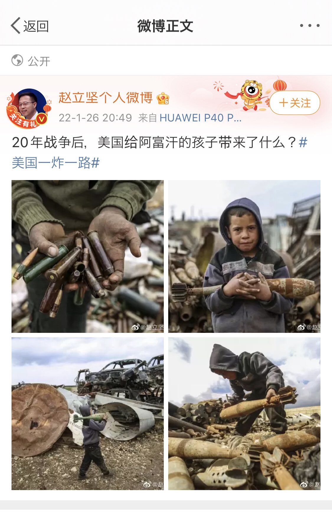
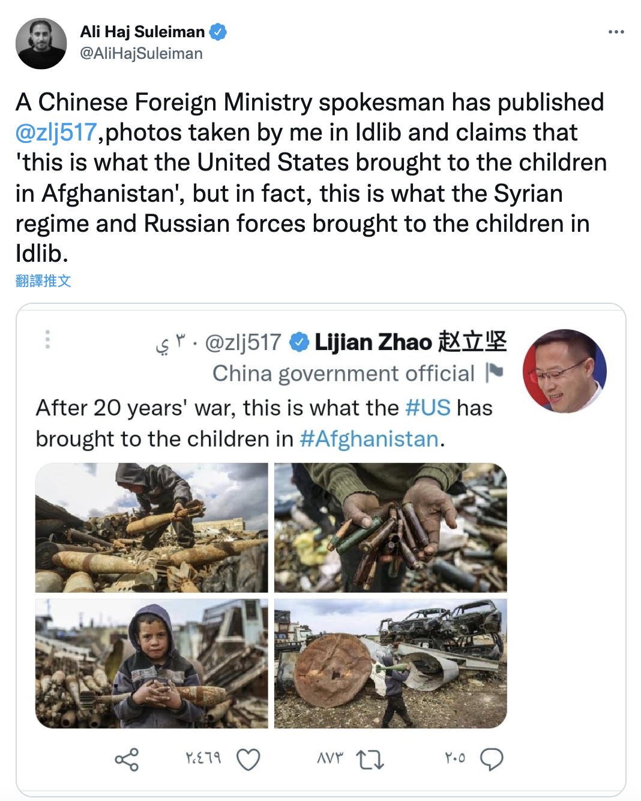
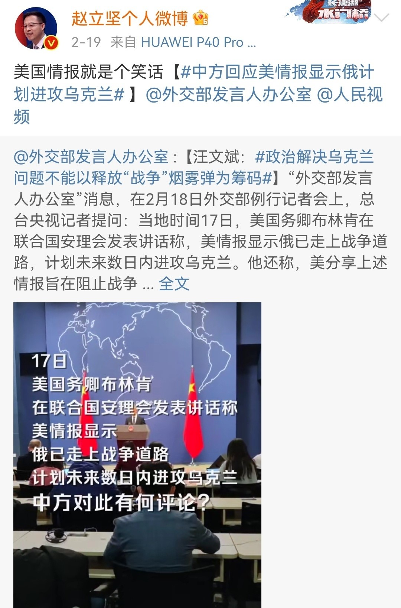
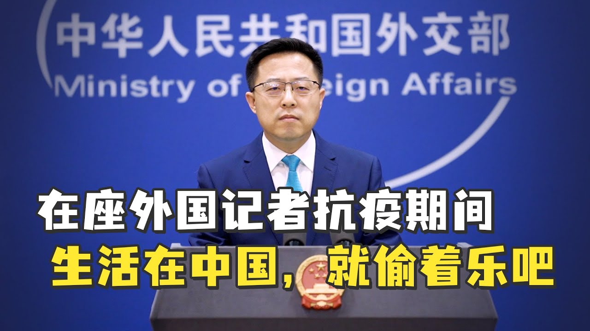
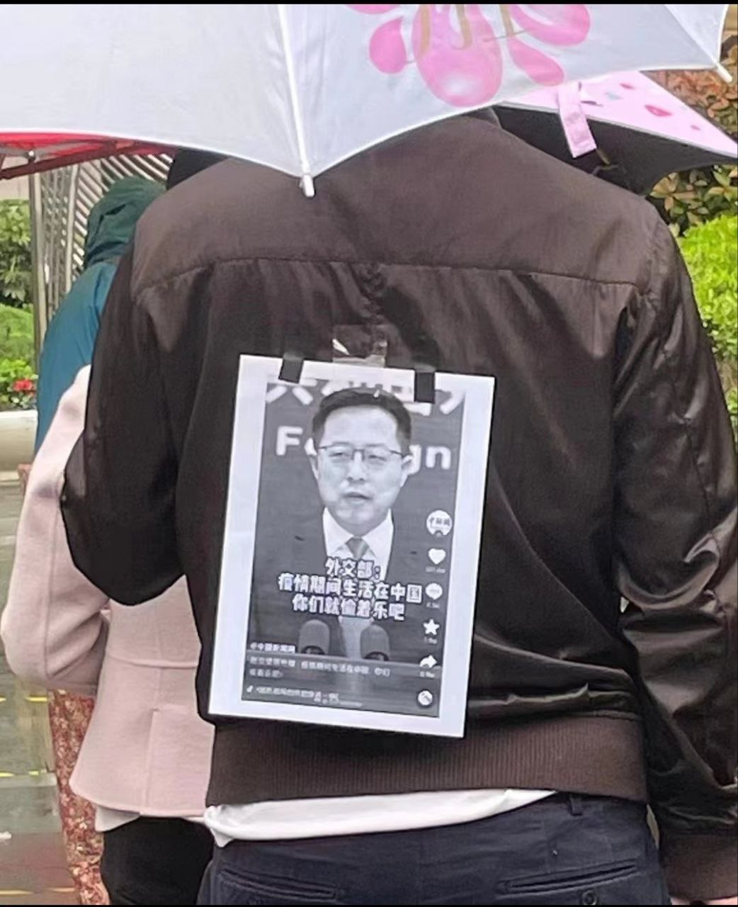
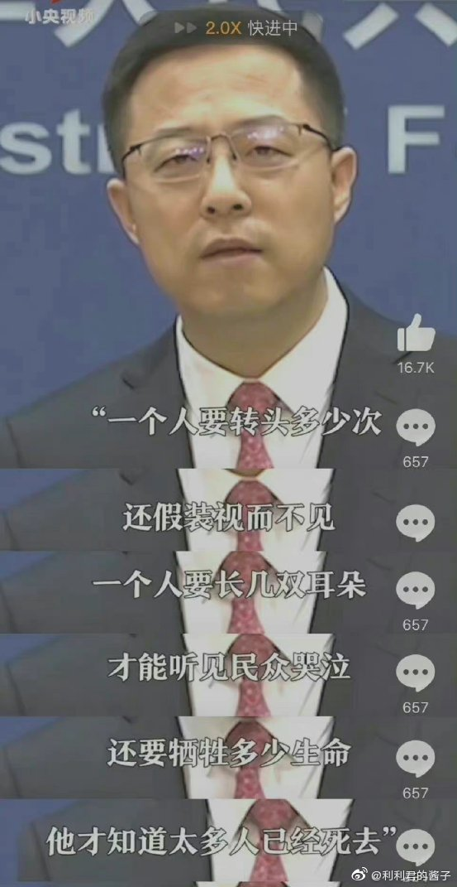

# 外交部发言人赵立坚发言合集

## “中国人民就是中国共产党的‘铜墙铁壁’”——赵立坚

2020年8月27日，赵立坚在记者会上回应美国国务卿蓬佩奥的言论被央广网转到微博：“中国共产党与中国人民鱼水情深，血肉相连，中国人民就是中国共产党的‘铜墙铁壁’，谁都别想打破。”

网民纷纷在留言区说，“国家难道不是保护人民的铜墙铁壁！现在怎么成了人民是国家的铜墙铁壁！”“我们又没枪没炮的哪里能当得了你们的铜墙铁壁呦，把我们的血肉筑成我们新的长城？？”“我们什么时候成盾牌了”“我就是血肉之躯，不是水泥灌的啊，怎么拿我们当铜墙铁壁了？”“个人认为，中国人民应该在里面，是被保护的。”
 “什么意思？要我们做肉盾？”“这话说反了吧…”“冒昧问一下：假如有人不想当铜墙铁壁，他还是人民吗？”

## 赵立坚用叙利亚照片指美国在阿富汗“一炸一路”，遭原作者打脸 [原文链接](https://chinadigitaltimes.net/chinese/676267.html)

## 赵立坚指美国删除乌克兰生物实验室信息  遭BBC记者拆穿 [消息来源](https://www.worldjournal.com/wj/story/121468/6167324?zh-cn)

俄罗斯入侵乌克兰，中国外交部发言人赵立坚日前配合俄方，质疑美国在乌国设生物实验室拟打生化战，反使中方遭全球质疑。赵立坚14日更声称美方已删除相关消息，但当场被BBC记者拆穿。

赵立坚8日首先利用中国外交部例行记者会散布这一说法的，14日再度作出相同表示。根据中国外交部官网，他在回答新华社记者提问时说，面对俄罗斯在乌克兰发现的文档、图片、实物等证据，“美国驻乌克兰使馆在其网站上删除所有相关文档，是想要隐藏什么？”

随后，英国广播公司（BBC）记者询问赵立坚：“你刚才提到，美方在其网站上删除生物实验室相关文档。我看了一下，文档似乎都还在。外交部是否浏览过美国驻乌克兰使馆网站？因为文档似乎都还在。”

赵立坚先是回答：“你是说这些文档没有被删除吗？”

BBC记者接着说：“我看到的是，网站上文档都还在。你可以自己看一下。我可以把网站链接给你。文档似乎都还在。”

此时，赵立坚却连忙声称“我看到的消息跟你不同”。BBC记者追问：“你说你掌握的消息不同是什么意思？可以解释一下吗？“

赵立坚则坚称，“根据我掌握的消息，关于这些生物实验室的有关文档已经被美国驻乌克兰使馆删除”；BBC记者继续追问：“你是否愿意再去看一下美国驻乌克兰使馆网站，看看文档是否还在？”

面对连番追问，赵立坚只回答，“我刚才已经表明了中方的立场。”

## ”美国情报就是个笑话“ --赵立坚

## 在做外国记者抗疫情期间：生活在中国，你们就偷着乐吧

## “一个人要转头多少次，还假装视而不见；一个人要长几双耳朵，才能听见民众哭泣；还要牺牲多少生命，他才知道太多人已经死去？” --赵立坚

[此次上海疫情期间记录在案的次生伤害](https://github.com/The-Run-Philosophy-Organization/run/blob/main/新冠疫情相关/记录在案的次生伤害/README.md)
