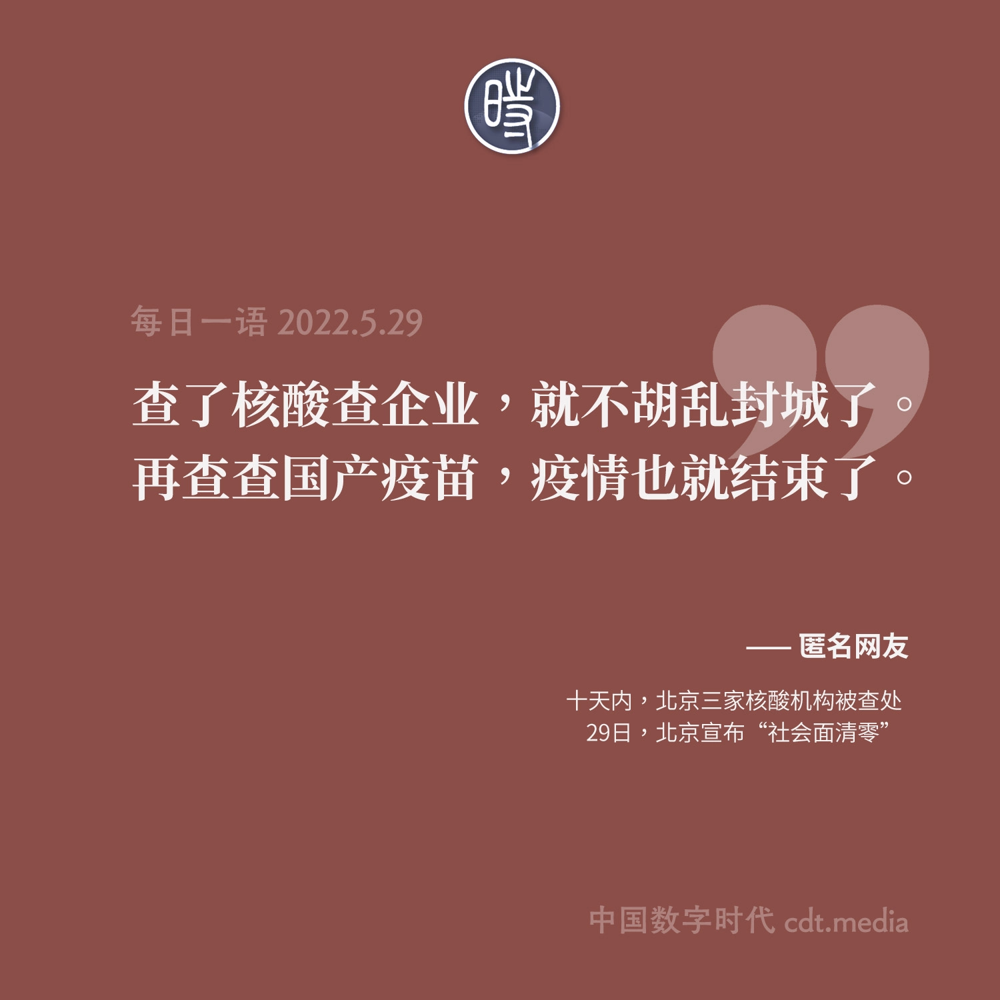

# 中国清零防疫政策相关

[梁建章：和李稻葵商榷防疫政策的生命账](http://opinion.caixin.com/2022-05-16/101885563.html) [WebBackMachine 备份](https://web.archive.org/web/*/https://opinion.caixin.com/2022-05-16/101885563.html) [CDT 备份](https://chinadigitaltimes.net/chinese/681611.html)

[薛云奎｜上海封控成本考](https://mp.weixin.qq.com/s/Sml-G6VWJTdtVq2NPbDvyg) [Archive 备份](https://archive.ph/KnA43) [CDT 备份](https://chinadigitaltimes.net/chinese/681945.html)

[基本常识｜医保基金保卫战](https://mp.weixin.qq.com/s/4vwJZh-uGh1nERiUek-A1w) [Archive 备份](https://archive.ph/itptt) [CDT 备份](https://chinadigitaltimes.net/chinese/682149.html)

[NOWNESS 现在｜如果，我的生活只剩下必要](https://mp.weixin.qq.com/s/EvenYZ45sKghTIh9Tye4Fg) [Archive 备份](https://archive.ph/R1Bb7) [CDT 备份](https://chinadigitaltimes.net/chinese/681594.html)

[基本常识｜永久方舱医院，15 分钟核酸圈，健康码，我们的 2023](https://mp.weixin.qq.com/s/9gSMG5y7UvhNrNW0uhFB5Q) [Archive 备份](https://archive.ph/ULi59) [CDT 备份](https://chinadigitaltimes.net/chinese/681470.html)

[星球商业评论｜要允许一些人先跑起来](https://mp.weixin.qq.com/s/GhzBzwnCUOOD_50UA_bwdQ) [Archive 备份](https://archive.ph/4IAEa) [CDT 备份](https://chinadigitaltimes.net/chinese/681572.html)

[六度 Lab｜防疫、行动与常识：关于清零与共存的澄清](https://mp.weixin.qq.com/s/mnSsRGGOJDKfOfDwfZZmKg) [Archive 备份](https://archive.ph/IuPv6) [CDT 备份](https://chinadigitaltimes.net/chinese/681858.html)

[后海二哥｜核酸检测真特么是一门好生意！](https://mp.weixin.qq.com/s/EjleeiFROZyEkCvM4OCZNA) [Archive 备份](https://archive.ph/zJFyt) [CDT 备份](https://chinadigitaltimes.net/chinese/681845.html)

[八点健闻｜百亿核酸产业大跃进：暴富之后，没有未来](https://mp.weixin.qq.com/s/oEM5wCM48rSBUyUgYIIM2w) [Archive 备份](https://archive.ph/0xxhL) [CDT 备份](https://chinadigitaltimes.net/chinese/681710.html)

[深蓝观｜医保财政谁买单争议背后：核酸检测企业收不到回款，靠借债千万生存](https://mp.weixin.qq.com/s/WPGzEok7GeDoSJ9iN7RGZQ) [Archive 备份](https://archive.ph/lR3mC) [CDT 备份](https://chinadigitaltimes.net/chinese/682254.html)

## 过度防疫

[读宋史的赵大胖｜不为荒谬做辩护，是最起码的正义](https://mp.weixin.qq.com/s/xGgpUldEjm-PEepXd0ILRw) [Archive 备份](https://archive.ph/0Rr4E) [CDT 备份](https://chinadigitaltimes.net/chinese/682146.html)

[蔚为大观｜防范区的荒诞与现实](https://mp.weixin.qq.com/s/JFvSF2XCm34U89qIc9TRkA) [Archive 备份](https://archive.ph/ivVIk) [CDT 备份](https://chinadigitaltimes.net/chinese/680679.html)

[i 看见｜当种地成为罪过](https://mp.weixin.qq.com/s/E2zIjETkqK6iGabsNA99mw) [Archive 备份](https://archive.ph/4qDYI) [CDT 备份](https://chinadigitaltimes.net/chinese/680747.html)

[【立此存照】在限制他人自由的道路上永远都能推陈出新](https://chinadigitaltimes.net/chinese/682139.html)

[【图说天朝】自沙漠核酸后，南极核酸也来了](https://chinadigitaltimes.net/chinese/682242.html)

[【网络民议】逝者也需提供核酸检测证明？网友：非必要不逝世](https://chinadigitaltimes.net/chinese/682071.html)
