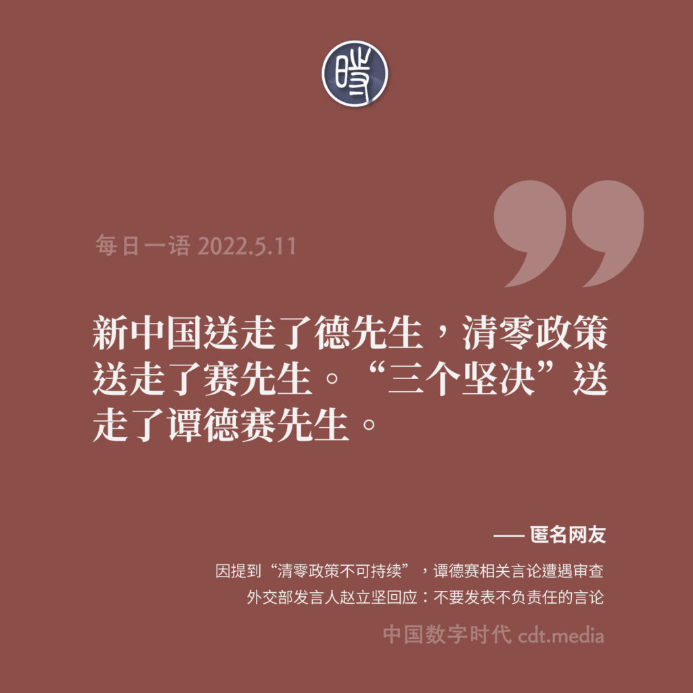

# 国际组织相关

## 国际组织对清零防疫政策的批判

[世卫组织：清零防疫政策不可持续](https://news.un.org/zh/story/2022/05/1102932)

## 国内平台对相关内容的审查

[联合国网站存在违法信息](videos/联合国网站存在违法信息.mp4)

## 参考

[中国数字时代 【网络民议】谁说中国到了该改变动态清零政策的时候？！](https://chinadigitaltimes.net/chinese/681131.html)
