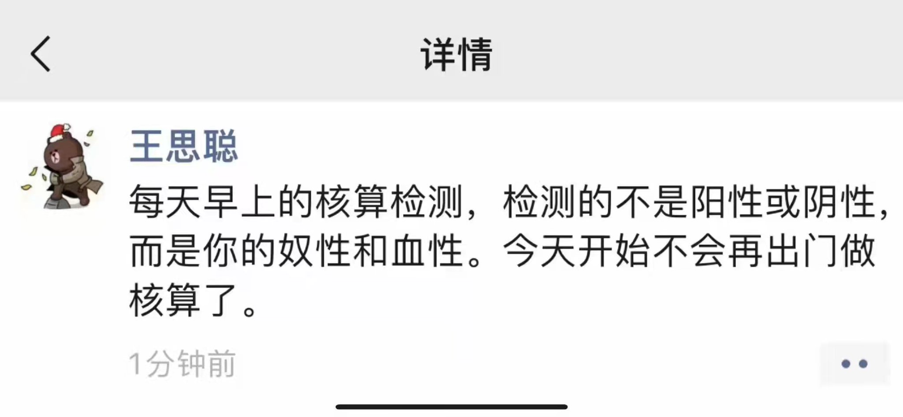
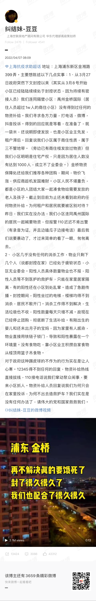
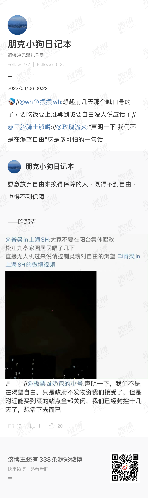
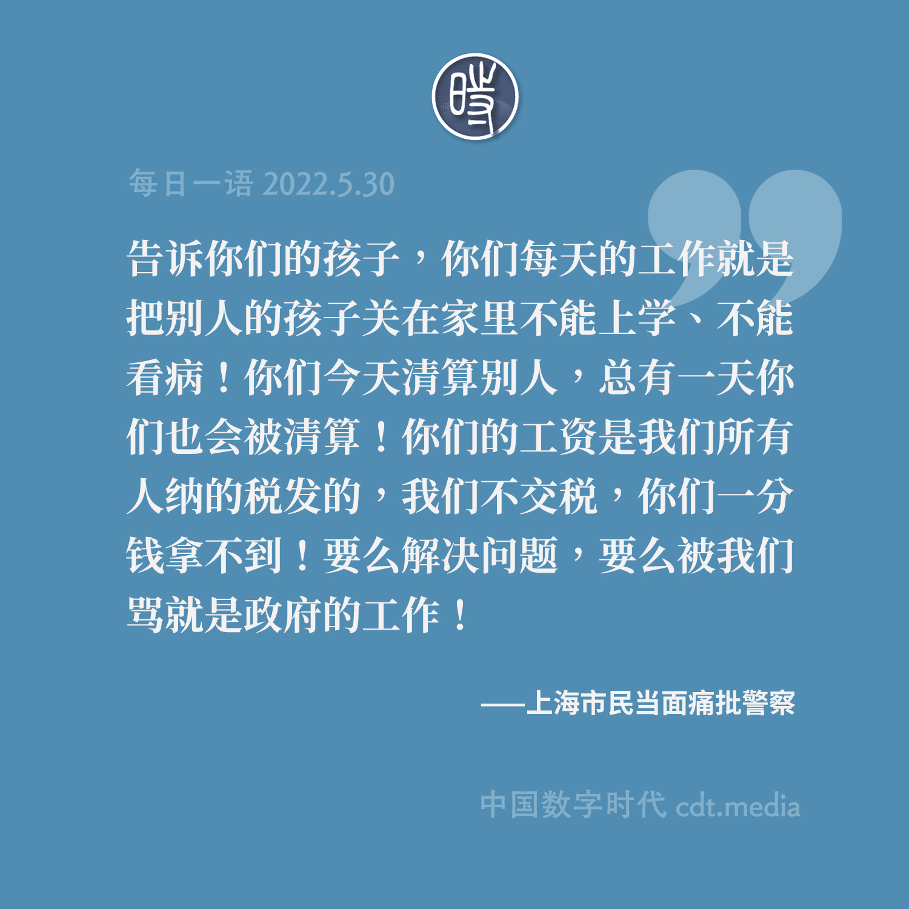

# 居民抗议

## 王思聪说自己不测核酸了

## 浦东金桥居民诉说快要饿死

<video src="浦东金桥再不解决真的要饿死了.mp4"></video>

## 九亭穿着防化服人员与居民在小区门口对峙

<video src="九亭.mp4"></video>

## 无人机广播：“控制灵魂对自由的渴望”

<video src="无人机.控制灵魂对自由的渴望.mp4"></video>

## 德国人怒怼居委会

[德国人与居委会的录音](德国人与居委会的录音.mp4)

[德国人与居委会的录音听后感](德国人与居委会的录音听后感.md)

## 上海疾控中心工作人员与两名美国女子通话

[上海疾控中心工作人员与两名美国女子“冷静妹”和“暴躁姐”的通话](https://www.youtube.com/watch?v=mJyQD43wkoM)

[【CDTV】上海疾控人员参演的最佳语言类节目《Are u there?No!》](https://chinadigitaltimes.net/chinese/681182.html)

## 朝阳群众拒绝“硬隔离”

[朝阳群众拒绝“硬隔离”，要求在法律框架下自我管理](https://www.youtube.com/watch?v=Mvdl8KLFqII) [CDT总结](https://chinadigitaltimes.net/chinese/681254.html)

## 上海一位被封70天后的老先生的感叹

[上海一位被封70天后的老先生：“让我们受苦的不是Delta, 不是Omicron，是人！”](https://www.youtube.com/watch?v=Ak0DrWPxYTg)

>每一位感同身受的人，让我们把这一切记录下来，告诉我们的下一代，这一幕不要再重现了。
>
>让我们受苦的不是Delta, 不是Omicron，是人！人！
>
> 千万不要忘记，这些人啊，就可以人把人搞得人不像人！
>
> 告诉下一代：我们要怜悯人，我们要爱我们的人！

## 上海市民与封锁小区的警察抗争

[【CDTV】“人民至上！权利至上！不可以践踏我们的人权！”——上海市民与封锁小区的警察抗争](https://chinadigitaltimes.net/chinese/682332.html)

[6月6日，上海长乐路市民抗争完整视频](https://www.youtube.com/watch?v=NJVOBcqhAfE)

>[上海市民痛批警察：你们今天清算别人，总有一天你们也会被清算！](https://www.youtube.com/watch?v=WA7FlJQ7y4k)
>
>[5月28日，上海汤臣一品小区居民自行解封，与警察对峙](https://www.youtube.com/watch?v=3WRuJJkw4oI)

## 微信公众号相关文章

[微板报｜封就是封，何必造那么多新词呢](https://mp.weixin.qq.com/s/gmcDqYOxJfeXvASg4Q6jzA) [CDT备份链接](https://chinadigitaltimes.net/chinese/679789.html)

[人格志｜上海孕妇低价买鸡蛋分邻居被逼写保证书：权力幻觉导致人性异变](https://mp.weixin.qq.com/s/tg53xSinCoyrGTlmMVg59w) [CDT备份链接](https://chinadigitaltimes.net/chinese/681092.html)

[山中木白｜今天，上海的魔幻又被刷新](https://mp.weixin.qq.com/s/e21T_ShuB2uktYjXvU-FtQ) [CDT备份链接](https://chinadigitaltimes.net/chinese/680952.html)

[哥轮布碎碎报｜连清川：我们到底走出了什么？](https://mp.weixin.qq.com/s/g9ENuLmqqRwrtN7o1lF83w) [CDT备份链接](https://chinadigitaltimes.net/chinese/682452.html)
