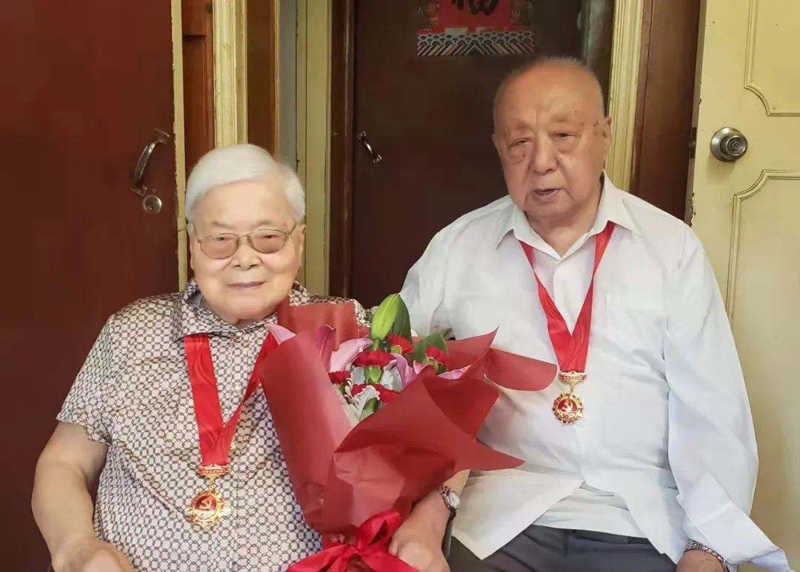

# 华东理工93岁教授夫妇的求救

我父亲吕世杰，今年93岁；母亲徐惠安，今年90岁，退休前分别是华东理工教授和华师大政工干部。现与保姆马翠香一起居住于华东师大一村。我也住在华师大一村，离他们不远。父亲身体还算一般，母亲却因股骨骨折痊愈后基本卧床，不能行走，且患有严重的支气管炎以及抑郁症。想不到，颐养天年的老人却被感染上了新冠病毒。

4月11日，母亲与小马有了咳嗽、浑身无力等症状。我怀疑她感染了新冠。本来已封在家多日，怎么会染上的？我想可能是被上门送抗原材料的阳性楼组长传染上的。说明一下，父母两人没有打过疫苗，小马接种两次。

12日早上，母亲抗原自测为二杠，为此，我向居委会作了报备。下午，母亲说吃了药以后症状减轻了，感觉有力气了。但下午抗原自测结果，父亲、小马都是一杠。

13日上午，父母及小马做了核酸检测，当天没有结果反馈。

14日早上，父亲有了症状，主要是咳嗽、喉咙痛，他吃了药。

15日上午，我接到普陀区疾控中心电话，被告知母亲为阳性，父亲、小马没在阳性名单中。我要求让母亲居家隔离，回答说这要报备居委会。我当即做了报备。此前我了解到的政策是，65岁以上老人不送方舱，可以在家隔离。

当日，父亲症状也减轻了，只是喉咙还有些沙哑。下午三人抗原自测为二杠。小马症状也就是咳嗽。

16日，小马接到区疾控中心电话：三人均为阳性。

17日，三人无事。当天自测，小马变成了一条杠。

18日上午，长风街道疾控办给我来电，通知说要来将我父母及小马转运走。我找到居委会书记，说本来说好居家隔离，现在政策怎么说变就变。他说，上面新政策是不管年龄大小，华师大一村阳性者一律转运走。

下午3时许，片警来电，说今天阳性要拉走，全部安排进入桃浦社区医院，不可能进方舱。何时来转运车，不清楚。我微信联系了居委会书记，告知我母亲卧病在床，又有严重的支气管炎，在家长期吸氧，而方舱医院根本没有吸氧设备，怎么能走？！

晚7时45分，居委会书记来电说车子到了，要我们做好准备。我致电已经入睡的父亲，告诉了上述信息，让做好准备。他们理好了一些必备之物。

晚8时30分，书记来电问：他们准备好了吗？我说：我下午不是微信跟你说了吗？我妈不能转运走。他说因为忙，微信没有看。今晚就不走了，不过需要重新走流程向上报备，明天再解决吧。听他这么一说，我就通知父母他们重新入睡。

哪料23点35分，转运工作人员来电对我说，现在他必须拉人走！还说车上有人来背我母亲下楼上车。我拒绝了！今晚不能走！

今日（19日）0时，居委会一工作人员对我说必须走。我再次解释，并表示愿意配合，但要求安排白天转运。

0点30分，居委会书记来电，同样表示了要马上转运的意思。我说：抗疫政策原则是“人民至上，生命至上”，也应该“以人为本”。你们今日（说的是18日）要完成的转运指标已经过期，怎么就非要马上而不能等白天再执行呢？再说，几天来，他们症状已朝好的方向发展了。13日后你们也没安排给他们做核酸检测，应该再做一次，确认为阳性后再运转不迟！但没人理睬我的解释与抗争。

深夜1点15分，强制执行转运。15分钟后，上车、发车。这是一辆面包车。

父亲、母亲和保姆小马就这样被强行转运走了！由于被拉走得急，母亲的抗抑郁药都没来得及带上！

据父亲告知，他们被转运至华东师大四附中转运中心。那里条件和《折腾一个94岁的老人，于心何忍？》这篇控诉文章中披露的地方（桃浦护理医院）差不多，甚至更差。举一个例子，那里厕位都是蹲位，这叫像我母亲那样不能自理的老人怎么如厕！

一天来，华东师大、华师大一村居委会、片警、街道和12345联系后，答复说，争取将父母亲送入定点医院，但无果。目前准备送他们去普陀区方舱医院。政策不是让老人进定点医院，而是进条件差得多的区级方舱医院吗？请问：这是什么逻辑！这就是我们所标榜的“尊老爱老”传统吗？

我现在更忧心忡忡的是，我母亲支气管严重，需要吸氧，而区级方舱医院有这方面的设备吗？如此折腾，她的支气管病可能随时急性发作，这不是要了她的命吗？！

我的父母亲都是入党50多年的老党员，一辈子热爱党、热爱国家，忠诚善良，谁能想，到头来却收得这般回报！这个让他们为之奋斗、钟爱了一生的国家及其政策执行者们，为什么不顾人道、人情、人理，无视有严重基础疾病而且年逾九旬老人，一刀切地执行名为“救人”、实有害人之嫌的抗疫措施？国家抗疫政策的一粒“灰”，落到我们亲人头上的却是一座不堪忍受的巨山，真真令我们寒心彻骨、没齿难忘！

父亲、母亲遭受非人道对待，对他们今后的隔离日子我没有理由不担心！我恳请、我呼吁，让我的父母尽快转入条件规范的定点医院！
