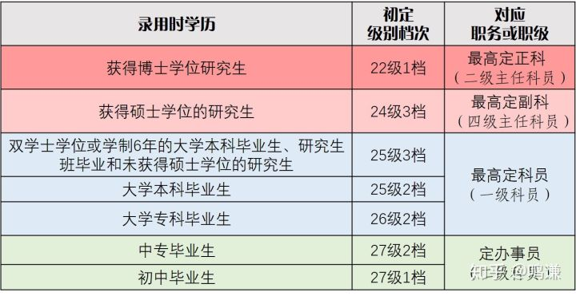

# 润学的相反面——衙学第一篇：公务员范围、职位、级别与工资

作者 Twitter: 赛先生的小迷弟 @TruthOfFinance

> 相比润学来说，我们同样要介绍留在中国体制内的情况。加入体制内，或者可以称之为衙学，学习和了解衙学，更能体现如何通过批判性思维更深刻的了解润学这一哲学思想。

了解衙学，第一点就是深刻认识到在中国的状况是：党政军民学，东西南北中，党是领导一切的。

现在我们就可以介绍所谓的何为体制内了？公务员、事业单位（含公立医院）、央企国企、军队系统、学校。

其中公务员系统是体制内的核心，在事业单位、央企国企、军队系统和学校的职务职级都可以参照公务员体系换成相依职位。所以我们在下面着重介绍公务员体系。2019 年 6 月 1 日，新修订的《中华人民共和国公务员法》和新出台的《公务员职务与职级并行规定》同步生效。

1.公务员范围一图流

2.公务员职位一图流

3.公务员级别一图流

这里面要指出两点，在 2019 年 6 月 1 日之前，公务员级别是划分为 15 个级别，现在更加细分为 27 个级别。但是中组部的文件中同样明确指出，公务员级别原则上跟党内职务并不挂钩，公务员级别高，可能是因为工作年限长，并不代表其在党内职务更高。

4.级别工资
2006 年 1 月公务员法初次实施时，同年 6 月又出台了一个《公务员工资制度改革方案》把每一级又分了若干个档次。每一级每一档确定一个固定的工资标准，即「级别工资」。

方案规定，级别与档次各自独立晋升，每 2 年晋升一个档次，每 5 年晋升一个级别，即通常所说的「晋级晋档」。

一图流新公务员定档

有些人可能看到这里引用的公务员级别工资标准是 2006 年的，我为何不引用最新的 2019 年的工资标准呢？答案是中组部在 2019 年仍然引用的是 2006 年的工资标准。所以说在理论上公务员的基本工资仍然是按照 2006 年的标准进行发放。

让我们在这里计算一下正国级岗位的工资。比如说习近平总书记 2007 年当上政治局常委，属于正国级公务员。他 2007 年的基础工资应该是 3020 元/月，迄今为止 15 年过去了，他目前的基本工资应该涨到了 5400 元/月左右。

当然这个基本工资是 5400 元/月是稍显寒酸了，而且并不符合实际情况，虽然说按照之前 06 年级别工资标准是这么计算的，但是实际上公务员的基本工资确实加了。根据最新可查询的工资标准，正国级领导人的基本工资起薪是 7835 元/月，这样换算下来，习近平总书记的基本工资应该是 14100/月左右。

近年来，有且仅有前政治局常委，全国政协主席俞正声在 2013 年公布过自己的工资为 11000 元/月。考虑到俞正声主席仅担任了一届 5 年的正国级领导人，所以推算出现在习近平总书记的基本工资是 14100/月左右是比较靠谱的。

虽然基本工资只是一部分，公务员的收入还有津贴、补贴和奖金，并且医保都是单位买单，但不得不说中国领导人的工资收入还是非常少的。香港特首林正月娥的年薪为 57 万美元，最新汇率换算是 370 万人民币的年薪，月薪接近 31 万人民币。香港特区为准国级行政单位，香港特首除曾荫权以外无一退休后都享受的是副国级待遇。香港特首的工资列全球第二高，仅次于高薪养廉的新加坡总理李显龙（年薪为 160 万美元），高于全球第三的现任美国总统拜登（40 万美元）

为何而润？按照 2022 年加州最低工资标准，在加州工作的最低工作时薪是 15 元/小时，按照每周工作 5 天，每天 8 小时，每月 30 天算，加州最低工资为 2571 元/月，换算成人民币是 16714 元/月。是的，你没有看错，加州任何一个有工作的人月收入都高过了中国的正国级领导人。
当然，由于 2000 人民币大于 3000 美元的陈平不等式的存在，中国 14100 元/月的收入是要大于 21150 美元/月，所以说中国正国级领导人基本工资的幸福感是加州员工的幸福感的 8 倍以上。我相信这也是励志加入体制的各位同胞前进的动力之一。
而且中国的医保和公务员待遇（含退休）也是中国特色之一，这也是驱动各位同胞倾心衙门工作的另一大动力，之后我将继续介绍中国公务员的待遇（含退休）和医保。
