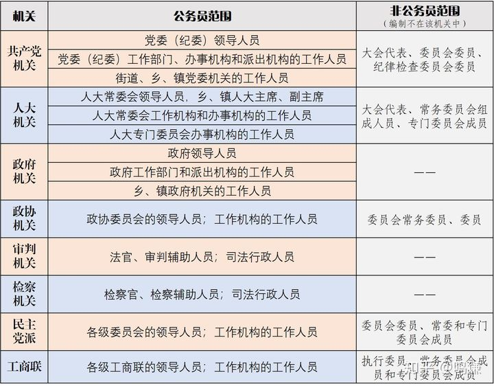
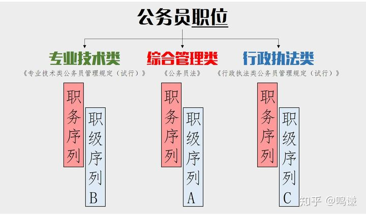
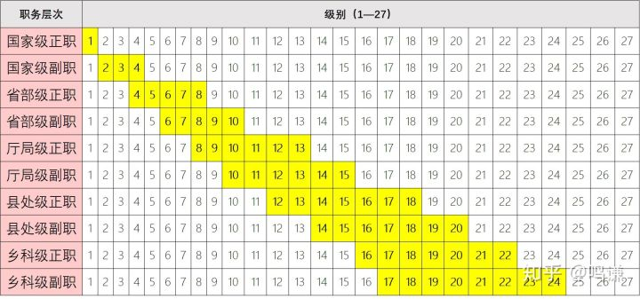
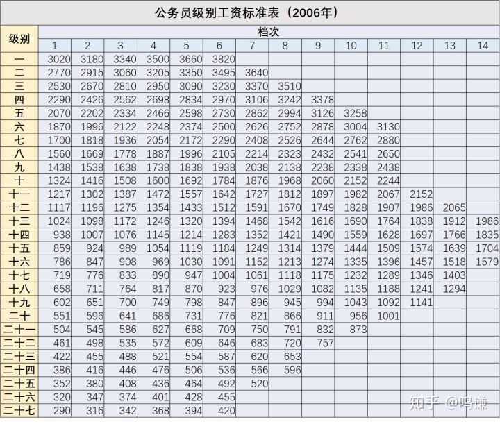

# 润学的相反面——衙学第一篇：公务员范围、职位、级别与工资

> 相比润学来说，我们同样要介绍留在中国体制内的情况。加入体制内，或者可以称之为衙学，学习和了解衙学，更能体现如何通过批判性思维更深刻的了解润学这一哲学思想。

了解衙学，第一点就是深刻认识到在中国的状况是：党政军民学，东西南北中，党是领导一切的。

现在我们就可以介绍所谓的何为体制内了？公务员、事业单位（含公立医院）、央企国企、军队系统、学校。

其中公务员系统是体制内的核心，在事业单位、央企国企、军队系统和学校的职务职级都可以参照公务员体系换成相依职位。所以我们在下面着重介绍公务员体系。2019年6月1日，新修订的《中华人民共和国公务员法》和新出台的《公务员职务与职级并行规定》同步生效。

1.公务员范围一图流

2.公务员职位一图流

3.公务员级别一图流

这里面要指出两点，在2019年6月1日之前，公务员级别是划分为15个级别，现在更加细分为27个级别。但是中组部的文件中同样明确指出，公务员级别原则上跟党内职务并不挂钩，公务员级别高，可能是因为工作年限长，并不代表其在党内职务更高。

4.级别工资
2006年1月公务员法初次实施时，同年6月又出台了一个《公务员工资制度改革方案》把每一级又分了若干个档次。每一级每一档确定一个固定的工资标准，即「级别工资」。

