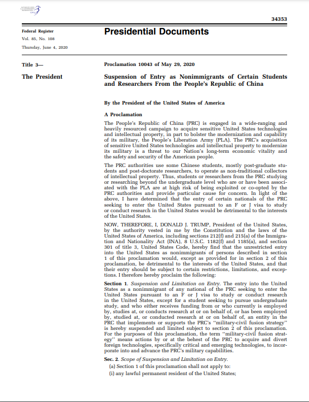
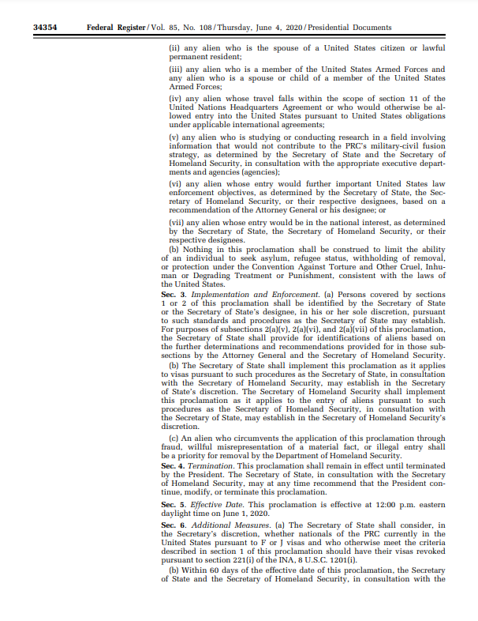
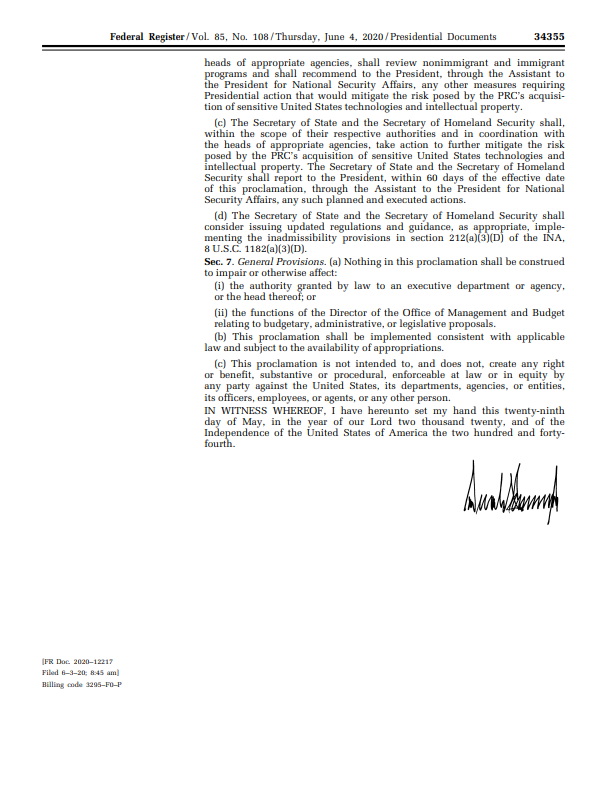

# 美国第10043号总统令

2020年6月3日，美国前总统特朗普签署了第10043号总统令，以国家安全为名，禁止特定学生和学者获得F/J 签证。
名义上，这份总统令限制帮助实施军民融合计划的实体；但实际上，它扼杀的却是大量无辜学生的求学之路。

- 首先，禁令对实施军民融合计划的实体定义不明。
禁令本身没有指明“实施或帮助实施军民融合计划”的实体清单，而是要求国土安全部做出进一步的解释。
而实际操作上，签证官错误地将这些“机构”认定为特定的几所理工科学校。
这些理工科学校，
包括北京航空航天大学、北京理工大学、哈尔滨工业大学、哈尔滨工程大学、西北工业大学、南京航空航天大学、南京理工大学、北京邮电大学及其附属的独立院校等，
承担的各种科研和项目与中国其他顶尖的高校并无二致。

- 其次，禁令毫无根据地扩大了影响范围，并有进一步扩大的趋势。
依据总统令的禁止范围：任何在被认定为实施过军民融合计划的机构“工作，或者学习过”，
“在此机构或代表此机构研究过”的学生和学者均无法获得赴美从事本科以上的研究或学习的签证。在实际面签中，
所有在这些学校有过学习经历或是受国家留学基金委(CSC)资助的同学，
若是想要赴美学习STEM(科学，技术，工程，数学)专业，无论本硕博，无论已经毕业工作多少年，都会被一刀切地拒签。
并且由于美国学校对于STEM专业的定义十分宽泛，已经有多位本以为是攻读商科甚至艺术类专业的同学被10043拒签。

- [10043wiki](https://en.wikipedia.org/wiki/Proclamation_10043)
- 许多受影响学生自发成立了一个组织抵抗10043禁令，[具体进展见此](https://www.10043.org/)
- [10043pdf文件](Proclamation_10043.pdf)

