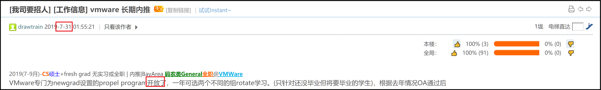
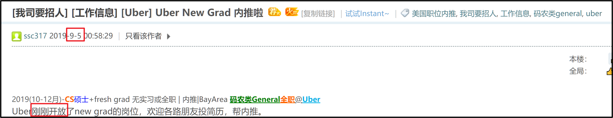
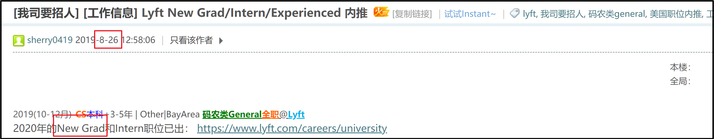
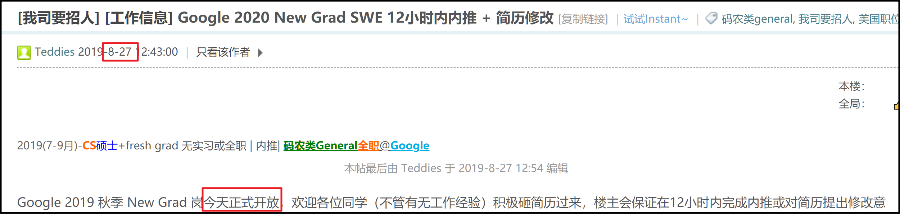
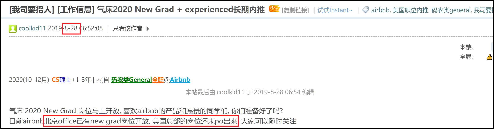
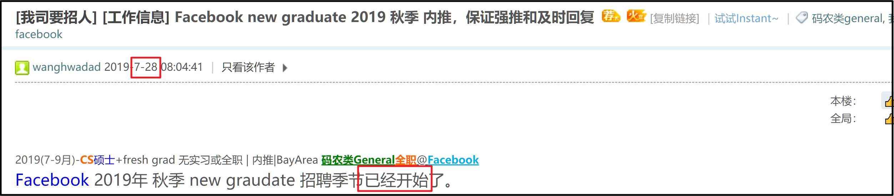
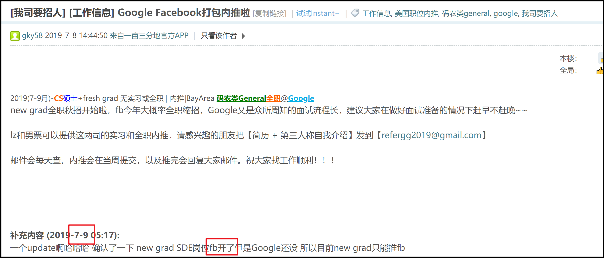
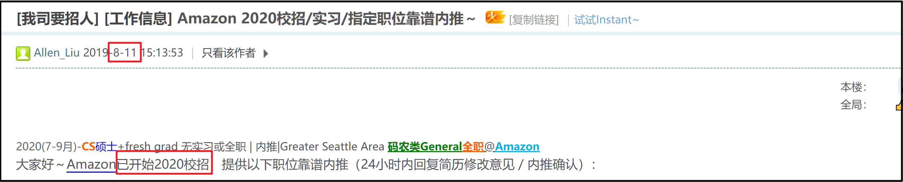
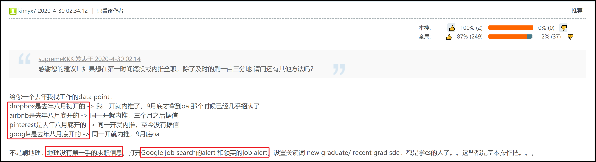
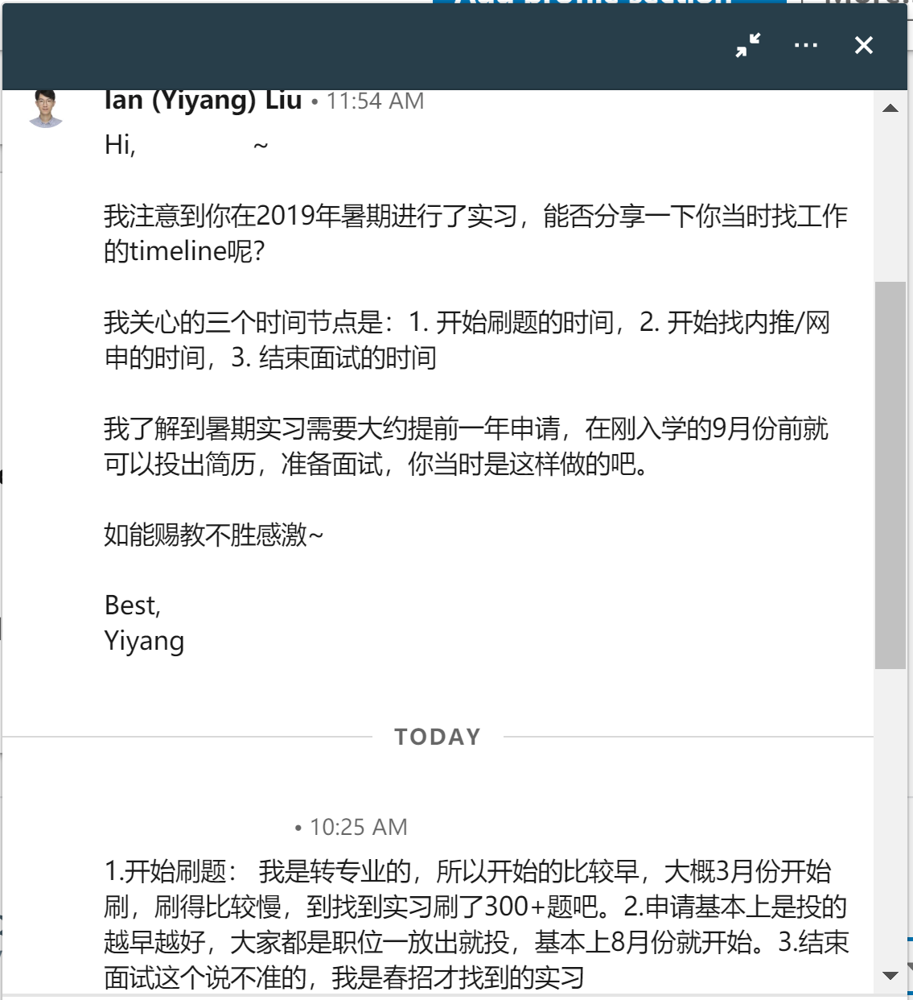

# 硕士秋招SDE找工时间线总结

## 原文链接在此： [原文链接](https://github.com/yiyangiliu/US-MS-CS-Student-Find-A-Job/blob/master/README.md)

## 1. 找实习/工作常识

“The people who fail to plan is planning to fail.” - Benjamin Franklin

一般公司7月份到12月是秋招时间，7月岗位内推大规模放出，内推/网申后一周/一月排面试，什么时候结束看面试进度。

> <b>引用一下地里的帖子</b>：<https://archive.ph/0OCT9>
>
>说说我还有印象的几个公司18年秋招初期的情况。
>
>7月初fb的new grad职位放出，七月底地里已经有大量内推new grad的帖子，同时已经有同学去onsite完拿到offer。
>
>7月20号左右vmware propel（专门给new grad的职位）放出，9月开始发新oa的数量和hr联系效率急速下降。
>
>g家new grad职位也是在七月底放出来的。8月中旬开始起地里开始出现大量new grad面经。
>
>亚麻8月8号放出new grad职位，记得很清楚，当天晚上地里大量内推贴，8.30号亚麻发出第一批oa，deadline是9月15号左右。
>
>当然也不是说你11月开始找就找不到，能早就早。不管是在实习还是干嘛，消息灵通点并且能随时投入战斗就行了。
>
>> 

<b>我的补充</b>：19年大约在<b>8月</b>放出New Grad岗位

>>
>>
>>请自行搜索"New Grad" + "内推" + "岗位 开放" 等关键词 + "site:1point3acres.com"，必要时使用google的search tools来restrict time.
>>
>> **Vmware**: 19年7月底 <https://web.archive.org/web/20220525152452/https://www.1point3acres.com/bbs/thread-540378-1-1.html>
>>
>> 
>>
>> **Uber**: 19年9月初 <https://web.archive.org/web/20220525152628/https://www.1point3acres.com/bbs/thread-547399-1-1.html>
>>
>> 
>>
>> **Lyft**: 19年8月末 <https://web.archive.org/web/20220525152632/https://www.1point3acres.com/bbs/thread-545351-1-1.html>
>>
>>
>>
>> **GG**: 19年8月末 <https://web.archive.org/web/20220525152728/https://www.1point3acres.com/bbs/thread-545594-1-1.html>
>>
>> 
>>
>> **Airbnb**: 19年8月末 <https://web.archive.org/web/20220525152837/https://www.1point3acres.com/bbs/thread-545761-1-1.html>
>>
>> 
>>
>>**FB**: 19年7月末 <https://web.archive.org/web/20220525153005/https://www.1point3acres.com/bbs/thread-539903-1-1.html>
>>
>> 
>>
>>PS: 此大佬在18年也发过一个fb招聘的帖子，下面的补充内容从8-3延续到10-22，能看到**随着时间的发展秋招的实时进度**，非常精彩！: <https://archive.ph/aZ2SV>
>>
>> **FB** update: 2019年7月8号就已经开始了 <https://archive.ph/Pxmwl>
>>
>> 
>>
>> **Amazon**: 19年8月初/中旬 <https://archive.ph/EN1k3>
>>
>>  

>>
>> 
 
<b>另外一位用户的补充</b>：https://www.1point3acres.com/bbs/thread-631642-1-1.html 

>>
>>
>> 给你一个去年（2019年）我找工作的data point：
>>
>> dropbox是去年八月初开的 -> 我一开就内推了，9月底才拿到oa 那个时候已经几乎招满了
>>
>> airbnb是去年八月底开的 -> 同一开就内推，三个月之后据信
>>
>> pinterest是去年八月底开的 -> 同一开就内推，至今没有据信
>>
>> google是去年八月底开的 -> 同一开就内推，9月底oa
>>
>>不是刷地理，地理没有第一手的求职信息。打开Google job search的alert 和领英的job alert，设置关键词 new graduate/ recent grad sde，都是学cs的人了。。这些都是基本操作把。。。
>>
>> 

>>
>> 
 
<b>Linkedin朋友真实经历</b>（入学第一个暑假在amazon intern）

>>
>> 1.开始刷题的时间：
>>
>> * 开始刷题： 我是转专业的，所以开始的比较早，大概**3月份**开始刷，刷得比较慢，到找到实习刷了300+题吧。
>>
>> * 注：这里的`三月份`结合语境看应该是秋招前的三月份，也就是暑期实习前**一年零二个月**的`三月份`
>>
>> 2.开始找内推/网申的时间：
>>
>> * 申请基本上是投的越早越好，大家都是职位一放出就投，基本上**8月份**就开始。
>>
>> 3.结束面试的时间：
>>
>> * 结束面试这个说不准的，我是春招才找到的实习
>>
>> 
>>

此时找的实习是一年以后的实习。比如我想在**22年5-8月**实习，那么就要提前差不多一年**21年7月底**linkedin上四处加人/地里求内推

而找实习是有面试要求的，开始刷leetcode可能要更早，大约在**5月**就可以准备了。

**意味着**：你1月份申请美国大学，4月份拿到offer，5月份开始刷题，7月中旬你本科大学毕业，**大学毕业的时候就是你可以开始找北美科技公司员工内推的时候**。真实。

那些刚刚Master入学9/10月份就拿到明年intern offer的同学就是这么干的。

**北美hr认知度排序**: 美国知名企业实习 ＞≈ 美国有名企业实习 ＞≈ 中国/印度/.../新加坡知名企业实习 ＞＞ 学校RA/TA

## 2. Timeline：以21fall，2年项目为例

“不要说那么多理论，我就想看例子” - audience

### 21年

* 8月 - 12月 上课

### 22年

* 1月 - 5月 上课

* 5月 - 8月 **intern**

* 8月 - 12月 上课

### 23年

* 1月 - 5月 上课

* 5月后 毕业 **full-time**

注：详细时间可以参考[此校历](https://web.archive.org/web/20210222015002/https://academics.usc.edu/calendar/academic-calendar-2021-2022/) ，不同学校有不同规定。

经同学提醒，Viteribi graduate student的academic calendar在这里：<https://viterbigrad.usc.edu>

一次实习，一次全职，好像很完美。
但是这个过程是不完整的，
只有工作，没有体现出找工作的过程
参考价值不高。

## 3. 添加找工作过程的 Timeline：以21fall，两年项目为例

21年

* *5月 刷题*

* *8月 投简历，拿面试，拿明年暑期实习（21年秋招）*

* 8月 - 12月 上课

22年

* 1月 - 5月 上课

* 5月 - 8月 **intern**

* *8月 投简历，拿面试，拿明年暑期全职（22年秋招）*

* 8月 - 12月 上课

23年

* 1月 - 5月 上课

* 5月后 毕业 **full-time**

### **总结**

记住黄金准则：**“赶秋招”**

找工作这件事是 **极度季节性(extremely seasonal)** 的.

错过了某个特定的事件节点，那么即使再努力也没有用。

所以即使来美不打算找工作，或者没想好找不找工作，我也建议你**对找工作的时间节点了然于胸**，这也是本文写作的目的。

因为什么都不了解的话某时候突然想开始找工作了，那时候很很很很（省略n个很）有可能**已经晚了**。

### **情景分析**

假设A是一个CS大校（cmu/ucsd/usc/neu）的刚入学的学生，开学后很朴素地想**先上一学期课**体验体验美国生活，找工作什么的以后再说。11月份A突然发现同学在朋友圈晒出了intern offer，然后A怦然心动，开始着手找工作，搜集找工信息+刷题，但是因为没有规划过，还没刷过leetcode几道题。

A这种情况大概率是很难找到工作的，不论到了11月份大公司已经**经过3个月招人**还有多少坑位，就算面试的准备，刷找工作最低最低（省略n个最低）限度的，150道leetcode题，一天5道都需要1个月。这个时候零基础开始已经**有点晚了**。

如果A看过这篇文章，那么A可能就不会做出找工作的决定了。这就是这篇文章存在的意义：可能不能给**做什么**的动力，但是能给**不做什么**的原因。

今年的covid19是一个极端的例子可以说明“极度季节性”：

往年秋招后知后觉地错过了还可以安慰自己“还有春招，不过是难度大点，职位少点”

今年春招 2020年2、3月，所有公司都freeze hiring，今年暑期实习的人全部是去年秋招上岸的。

如果去年秋招没上岸，那么自己再努力，刷题再多再熟练，head count没有了就是没有了。

## 4. 添加找工作过程的 Timeline：以21spring，两年项目为例

21年

* *1月 开始投简历，面国内5月开始的暑期实习*

* 1月 - 5月 上课

* 5月 - 8月 **中国intern**

> 注：此时intern因为没上满**1学年**的课，不能使用**CPT**，不能在美国实习，只能找中国实习

* 8月

    ** 投简历，拿面试，拿明年暑期实习（21年秋招）*

    ** 投简历，拿面试，拿明年毕业后全职（21年秋招）*

> 也就是最理想情况下，你要在这段时间内**找两份工**
>
> 此时也可以只找一份工，只找明年5-8月实习而不找明年12月后全职，或者只找明年12月后全职而不找5-8月实习，只需要承担相应的风险，见下

* 8月 - 12月 上课

22年

* 1月 - 5月 上课

* 5月 - 8月 **intern**

> 此时可以用**CPT**在美国intern（每周20小时以上的工作）
>
> 注意：如果你去年选择找全职而不找实习，那么这时你就没有实习了，所以**你在美国的整个过程都没有用到CPT**，这可能是一种浪费。

* *8月 找全职（optional）（22年秋招）*

> 注意：如果你去年选择找实习而不找全职，那么这时你就没有全职了，所以，你需要**参加22年秋招**并且**一定**要找到全职工作，否则你可能陷入**毕业没有工作**的尴尬。

* 8月 - 12月 上课

* 12月后 毕业 **full-time**

> 注意：如果你去年选择找实习而不找全职，并且，你8月-12月**参加了22年秋招**并且**没有**找到全职工作，那么你就陷入了**毕业没有工作**的尴尬。如果毕业后90天的缓冲期没有找到工作，你将会被**强制离开美国**。你如果不想，那就重新申请一个ms维持f1身份。还有一种半非法的可以留在美国的方式，大家应该知道是什么，我就不公开提及了。

## 5. 找工作情况每年都在变

“Remember the Golden Rule: Those who have the gold make the rules.” - American Proverb
