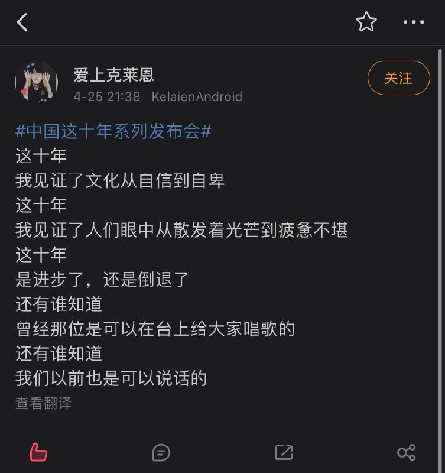

# 目录

[我理解为什么有人会留在国内](我理解为什么有人会留在国内.md)

[当代互联网大厂的“岁静人”](当代互联网大厂的“岁静人”.md)

[美丽新世界](美丽新世界.md)

[我的棱镜故事](棱镜.md)

[润文解字](润文解字.md)

[为了更好的润，我心中的润学](为了更好的润，我心中的润学.md)

[湾区的华人工程师们是否觉得自己被大材小用了](湾区的华人工程师们是否觉得自己被大材小用了.md)

[全世界可口可乐到底是不是一个味道?](全世界可口可乐到底是不是一个味道.md)

[润学伦理与国际主义精神](润学伦理与国际主义精神.md)

[上海是预示未来一百年的大河](上海是预示未来一百年的大河.md)

[西方媒体是怎样给西方人洗脑的](西方媒体是怎样给西方人洗脑的.md)

[政治体制改革总体设想](政治体制改革总体设想.md)

[理性润，辩证润](理性润，辩证润.md)

[决定定居他国且不可能回国是什么样的心态](决定定居他国且不可能回国是什么样的心态.md)

[近代中国落后，清朝作为异族统治王朝是不是主要原因](近代中国落后，清朝作为异族统治王朝是不是主要原因.md)

[上海解封后会出现大量沪漂慢慢离开上海吗](上海解封后会出现大量沪漂慢慢离开上海吗.md)

[美国人的自由到底是什么自由](美国人的自由到底是什么自由.md)

[我现在明白为啥要润了](我现在明白为啥要润了.md)

[如何评价人民日报谈凌晨三点的迪也不是没蹦过](如何评价人民日报谈凌晨三点的迪也不是没蹦过.md)

[聊聊“润”](聊聊“润”.md)

[一个失去理智的司机有多危险](一个失去理智的司机有多危险.md)

[张爱玲逃港记](张爱玲逃港记.md)

[纪念张爱玲诞辰100周年](纪念张爱玲诞辰100周年.md)

