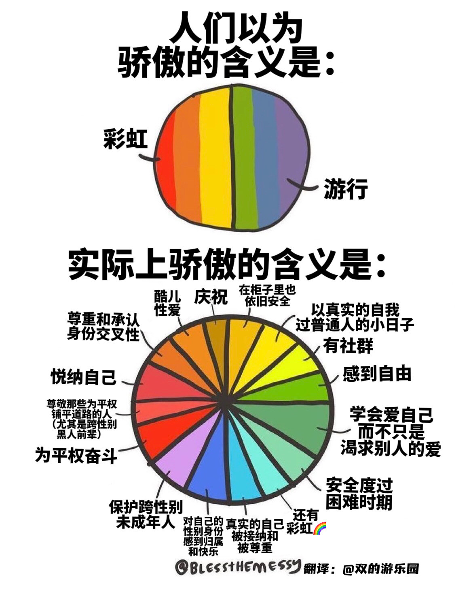

# 中国的性少数群体

## [”主流却只用了一条马赛克就抹去了他是谁“](https://chinadigitaltimes.net/chinese/680929.html)

>美食博主“一食纪”日前在视频中出柜后失联，而部分媒体在报道该新闻时将他视频中所写的“我是gay”一行字打上了马赛克。5月5日晚间，b站up主“一食纪”发布一条名为《谢谢，再见》的视频，一些粉丝担心他轻生，并与警方取得联系。b站官方表示正在通过多种渠道尝试联系“一食纪”。6日，山东临沂警方回应称正在调查中。
>
>微博博主@北国佳人李春姬：他用生命来向世界换取真实的自己不必躲躲藏藏的一瞬 主流却只用了一条马赛克就抹去了他是谁

## 同语｜《中国LGBT相关司法案例研究报告》报告全文发布

[原微信公众号链接已被404](https://mp.weixin.qq.com/s/gvrvit6O3_8PREDqAwZtyg) [Archive备份链接](https://archive.ph/xUkjp) [CDT备份](https://chinadigitaltimes.net/chinese/675987.html)

## 中国数字时代

[【立此存照】希望有一天彩虹也能上镜头，而不是“微博秒删”](https://chinadigitaltimes.net/chinese/681474.html) 