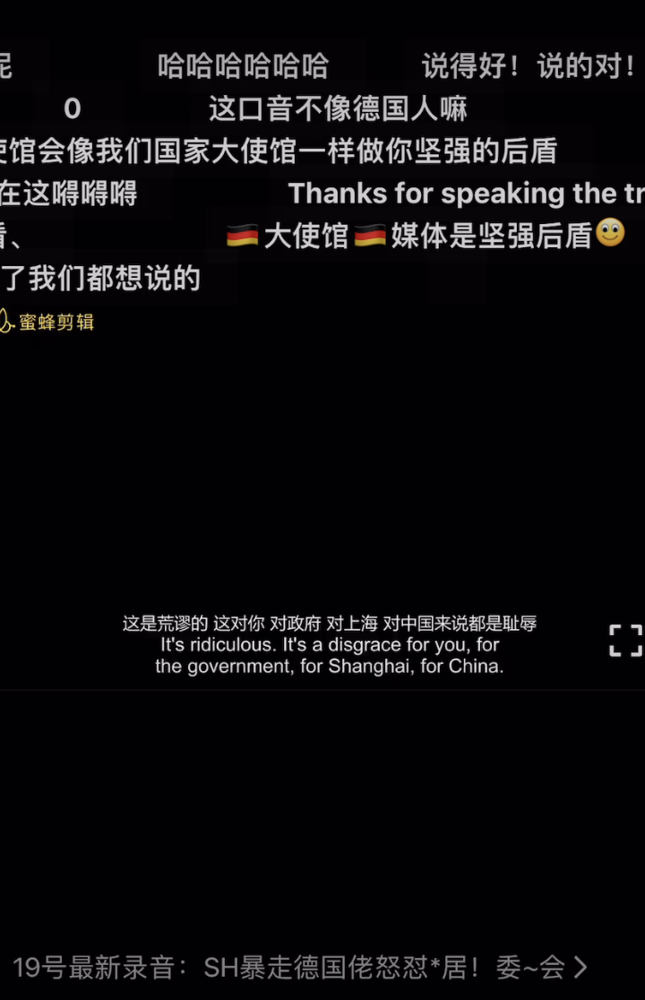

# 全世界可口可乐到底是不是一个味道

过去20年飞速的经济、科技的发展，确实掩盖了很多问题。外宣内宣确实有一套，新四大发明，高铁，bat全球扩张，今日头条快手美团，各大投资机构独霸华尔街。。。我都差点被骗，认为全世界一团糟，风景这边独好了。

虚假的面具也只有在真正的危机中才会得以揭开。以前，问题的暴露都是零散的，零星的，一个星期就忘记了。

现在，大家算是明白，在这个全国最发达最法制政务服务最高效的地方，普通人的生活是个什么样子了

缺乏监督，缺乏质疑，缺乏质询，一味地服从，一味的让步，最后是个什么样子。

政府的本质就是人民权利的让渡，对让渡后的权利就是要警惕，就是要监管，甚至要自卫，你才会有尊严，你才可能活的像个人。

这个世界文明200年前就搞清楚的事情，咱们中国人小学课本都不教，还以为自己真的是天选之国，天选之民，体质很特殊，可口可乐可以不是一个味道？

现在醒了吗？如果不是出于基本的尊重，我都不愿意称还活在大陆的这些所谓的人民为现代社会的“人”。可能比清朝的“人”差不了太多。

他们的尊严毕竟，连外国人的丁丁都不如。

这件事已经成为全球笑话了。全世界这次也彻底理解了中国是什么样子。下次被人笑话，还真的别怪别人“辱华”。

人家有这个勇气帮你辱华(参考[德国人与居委会的录音](https://github.com/The-Run-Philosophy-Organization/run/blob/main/新冠疫情相关/居民抗议/德国人与居委会的录音听后感.md))算是帮你出了口气，你脊梁骨弯了站不起来，全世界其他国家的人脊梁骨可还是直的。
