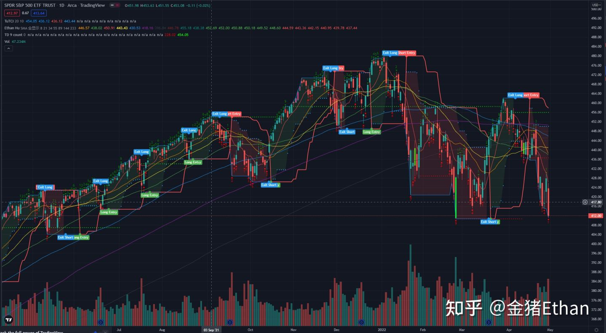
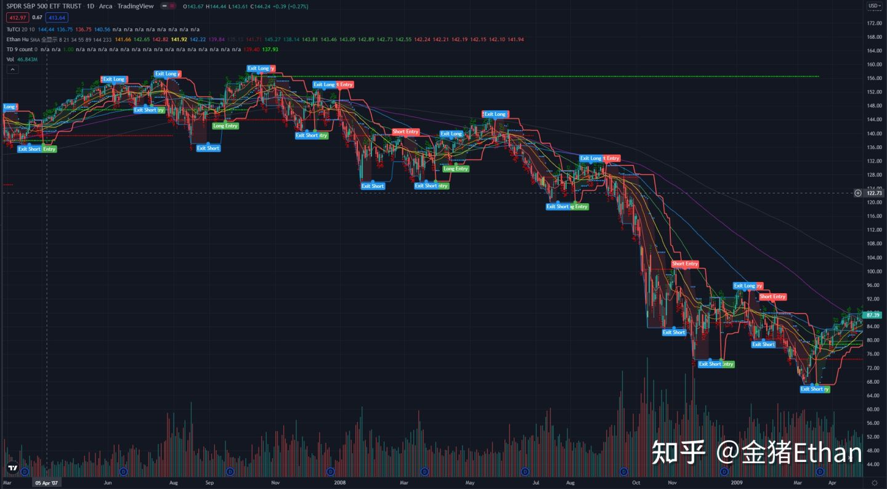
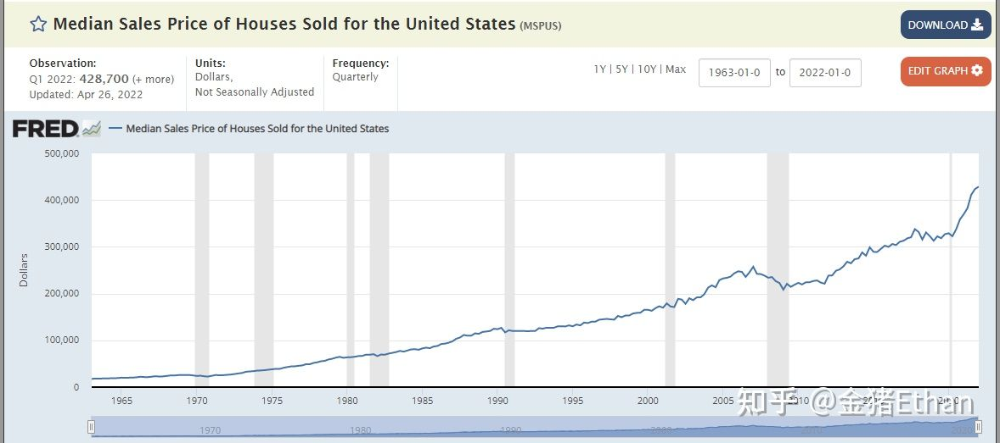
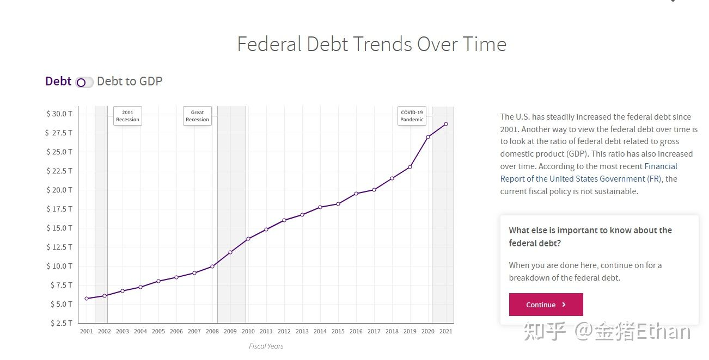
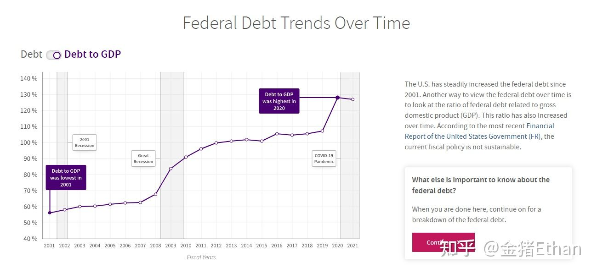
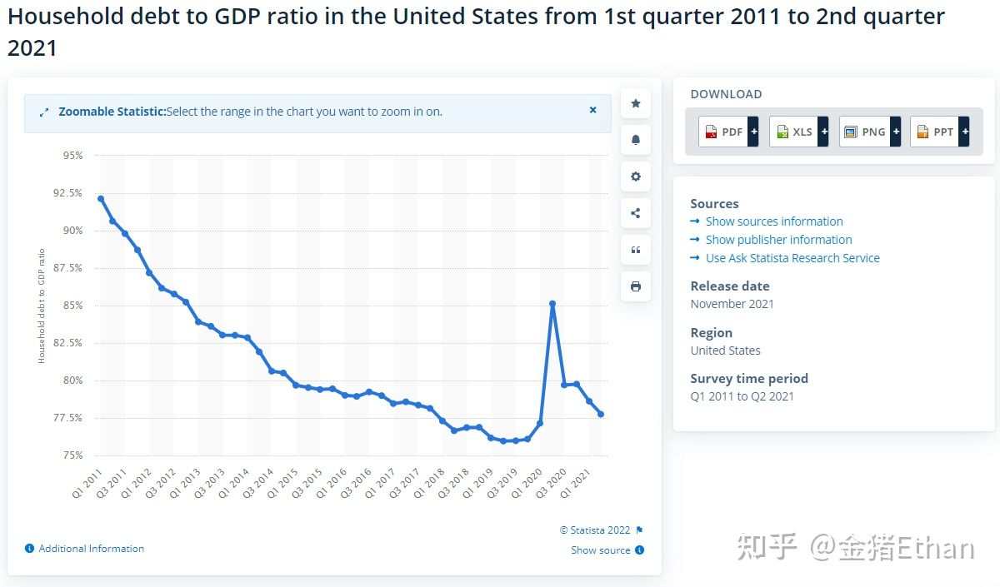
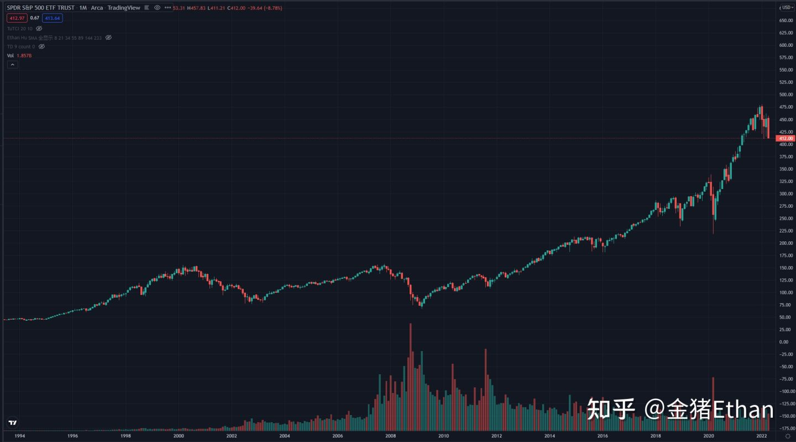

# 理性润，辩证润

> 原文地址：我们正在重现 08 年金融危机过程中吗？ - 金猪 Ethan 的文章 - 知乎
>
> <https://zhuanlan.zhihu.com/p/507951188>

润固然是一种人生的选择方式，但同时谨记事物都有两面性，做出选择即意味着承担风险，押大押小，买定离手。生死有命，富贵在天。润美也不是解决生活所有问题的万灵药，依我拙见，润美最大之好处对于普通人来说，便是多了一种选择的机会，多了一些可能性，人生如有大难将至，不至于山穷水尽，穷途末路。

接下来用一篇短文来讨论一下美国当下是否也面临着危机与风险，要知道 08 年金融危机扫过，无数投资者资产归零，流离失所，丢了工作，没了收入，食不果腹，人生重启。这是个不得不重视的潜在危机，因为看到文章的你想必已经有了润美计划，若是辛苦两三年，成功润美，赶上危机，岂不可惜哉？
正所谓：

人生无定着 世事歹按算

反身的 chance 有抑无

落涂八字命 随人好额散

够力的 back 有抑无

有地 有天 有星 有日月

有破厝 有田路 有草仔花

有目 有耳 有鼻 有舌

有这身情义 有知己

如梦幻 如泡影 如露亦如电

如梦幻 如泡影 如露亦如电

无地 无天 无星 无日月

无厝 无田路 无草仔花

无看兮 无听兮 无鼻兮 无啖兮

无空思梦想 无代志

歕风一喙烟 lighter 火随化

烟头烟屎 有抑无

烟味粉味 有抑无

本文也是抛砖引玉，一家之言，文中观点，仅凭参考。

今天是美国时间 2022 年 4 月 30 日，美国股市过去一个月创下了 2008 年以来单月最差走势。如下图所示：

标普 500 已经跌回去年同期水平，下图为 2008-2009 年整体走势：

若是经济危机重现，那今天的价格只能算是暴跌的开始。08-09 年，标普 500 经历了 50% 的回调，而截止今天标普 500 从高点仅下跌 15%。在这样的背景下，值得思考一个问题，我们正在重蹈 2008 年的覆辙吗？

首先，什么是金融危机，2008 年的美国次贷危机根源于房地产市场泡沫和大量新型的金融衍生品工具，已经有无数人深层次地分析了次级贷款。这是一个层次的原因，继续深究，房产泡沫和金融衍生品的根源是什么？是债务问题，很好理解，因为大量的人通过借贷，提高杠杆，购买了原本无力承担的资产，房也好，金融产品也好。因此 08 年的房地产泡沫导致的金融危机本质也是一次债务危机。那么今天的美国，处在债务危机中或是债务危机边缘吗？

很不幸，我认为是的。首先是房地产：

这是美国已售房屋价格中位数走势图，从 2020 新冠爆发以来，房屋中位数从 32 万美金涨到了今天的 42 万美金。

其次是联邦负债水平，

以上是联邦负债绝对数值走势图，下图是负债相对 GDP 走势图：

数据真实反映了当下美国联邦政府的债务水平。

再看居民负债与 GDP 水平走势图：

新冠后这个比例有上升的趋势。

从上图中可以看到，经历了 08 年次贷危机后，美国并没有吸取教训，反而发现了无限印钞，出卖信用这样一劳永逸的做法，在这过去的 14 年中，美国的国际，国内的借款总额继续增长。

大家一起加杠杆，源源不断的资金流入，产生了资产价格繁荣的泡沫。一旦后续没有新的资金流入，就是雪崩式的崩塌。（金融危机为什么会发生？拆解金融危机的真相|瑞银资产管理）

债务问题永远是金融危机中的核心问题。

新冠印钞机更是造就了如同火箭升空一般的指数上升趋势。美国经济学家明斯基提出过一个模型，他认为：金融危机其实是因为信用创造机构的固有缺陷使其无法避免周期性危机。与破坏式创新相同，美国的发展和世界的发展相同，都是在经历了破坏与崩溃后才能积累起下一次腾飞的力量。想象一下双脚起跳的过程，需要蹲下一段时间才能更好地弹起。

如果继续关注过往银行危机前后的房价变化便会发现，1977 年西班牙危机、1987 年挪威危机、1991 年芬兰和瑞典危机、1992 年的日本危机，每一次银行危机发生前都出现了房价大涨，危机之后当年的房地产市场大幅下降，并维持几年的跌幅。

既然金融危机表现出来的债务危机、通货膨胀危机、银行危机、货币危机其实都是一样的，那么我们就可以建立一个经济预警机制，关注的核心就是放在国内外债务违约、银行危机、通胀危机、货币危机，这几个具体现象上。

纵观 1900 年到 2008 年的金融危机会发现，无论是国家层面的阿根廷经济危机，还是区域层面的亚洲金融危机，或是全球层面的石油危机、次贷危机，都会发出这些信号。而当众多信号都出问题的时候，我们就知道，风险将要来临。（金融危机为什么会发生？拆解金融危机的真相|瑞银资产管理）

债务问题：很大，银行问题：稍大，通胀危机：超级大，货币危机：很大，房地产价格：史上最高，金融资产价格：史上最高。

所有的信号都非常糟糕，结果也很不妙。

但另一方面，如果我们看 08 年触底后发生了什么，可以看到标普 500 指数在一年之内翻倍，这是我们需要耐心等待的机会。无论如何，当下的资产价格还是过高了。仅作者个人观点，我会考虑减少持仓，等待真正能够创造历史的交易机会来临。
