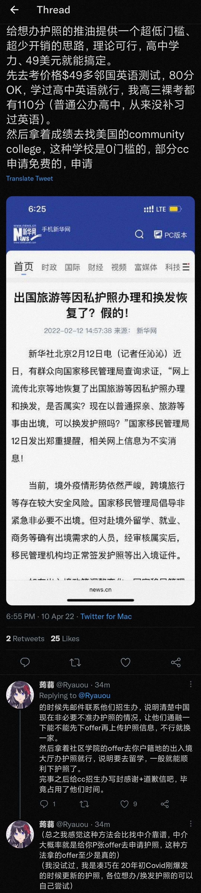

# 目录

## 疫情期间如何获得护照

> 作者：[贝极星](https://www.zhihu.com/people/gang-tie-59)
>
> 来源：[现在全国各地护照都不能办理了吗？ - 贝极星的回答 - 知乎](https://www.zhihu.com/question/478792506/answer/2444226493)

润学润学，你也得首先润出去啊。护照办不了，那基本就是锁死润得道路了。

响应国家要求，非必要非紧急护照不办，但是很多朋友不知道自己到底必不必要，紧急不急。这儿我就给大家介绍几个必要，紧急得情况。

### 留学

留学offer是最稳当得，基本稳定办护照。除了正常的留学，还有什么途径呢？日本语言学校，美国college这些，花费比较低的留学选择。比如下图：

当然不是一定要日本语言学校，美国college，世界上有一百多个国家中无数学校，你自己找个便宜稳定快速的留学offer就行

### 考试

考试，需要出境或者护照号码的考试，是可以办护照的。但是这个方法不稳定，有消息称需要护照号码的考试，有可能办了护照给你扣住。考试本身也可以拒绝。具体考试类型很多。

比如[这些](https://www.neea.edu.cn/html1/category/1705/2957-1.htm)

当然还有很多，需要你们自己去寻找，我感觉我说的很详细了。

### 工作和其他情况

这个非常麻烦，虽然原则上可以办护照，但是容易被刁难。没有办法搞到足够信息的，我说一个办法，比如吧，现在有些境外的学术会议，你去注册一个，拿邀请函。你要知道学术会议频率很高，找个时间刚好的。而且逼格很高，不容易被拒绝。

当然，具体情况来说还是要看工作人员，我也是给大家提供一下路子。
