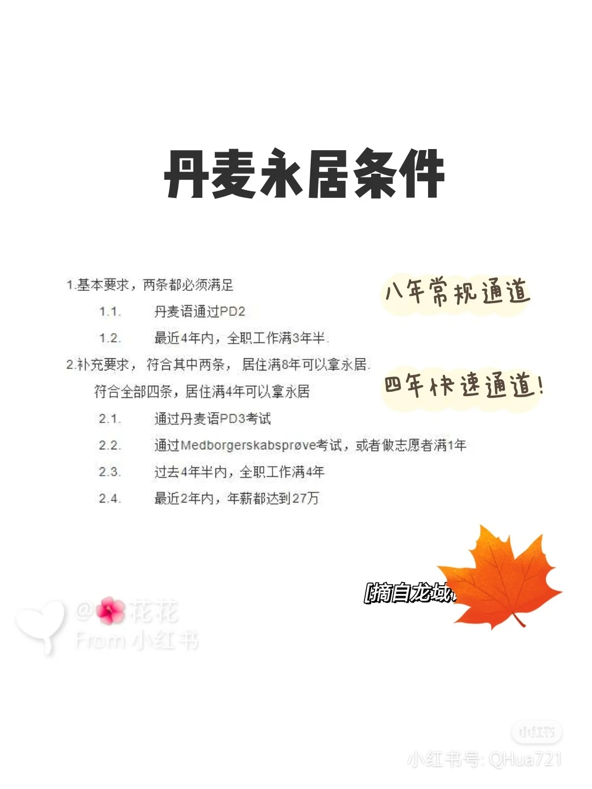

# GDP排名前40的国家

作者：大锤
链接：<https://www.zhihu.com/question/278925862/answer/2430343377>
来源：知乎
著作权归作者所有。商业转载请联系作者获得授权，非商业转载请注明出处。

原作者：[大锤](https://www.zhihu.com/people/zhang-ding-yuan-77)
本人补充了一些内容

1.卢森堡（人均GDP 12.2740万美元）圈中点：合法的、连续不间断的居住五年。个人解释：比如你在卢森堡读研两年+工作三年，即可申请永居。成本信息：卢森堡只有一所大学，卢森堡大学，2003年才成立，很有潜力，大部分专业都是免费的，一年的生活费大概8000欧元。如下：老实讲，卢森堡的读书费用真的便宜（主要卢森堡政府是土豪）没想到，这么高收入的国家，留学生的生活成本也不高啊。

***

2.新加坡（人均GDP 10.2742万美元）摘自：邹先生：新加坡永居申请都有哪些条件和评定因素呢？圈重点：普通人一般通过读书+留下工作，或直接求职，拿到EP后半年以上可以申请。对申请人的评估主要考虑其薪资、资质、工作经、工作性质及其他因素。新加坡的学费如下图（本科）：新加坡学费（硕士）如下图：博士的话，学费3万RMB，另外有全奖。新加坡生活成本，真的算低的，一年10万RMB妥妥的够。

***

3.爱尔兰（人均GDP 9.9239万美元）圈重点：合法的、连续的居住五年即可申请永居。爱尔兰学费如下：本科：1~5.5万欧/年，而研究生则1~3.5万欧/年。留学生在爱尔兰大概每月花万把块RMB翡翠岛国

***

4.卡塔尔（人均GDP 9.7万美元）暂缺

***

5.瑞士（人均GDP 7.588万美元）圈重点：中国是Non-EU，因此中国人在瑞士，需要以B签证连续生活10年才可以申请永居。个人点评：我其实是劝退的，10年时间成本太高了，中间可能发生很多事情，建议去欧盟其他国家拿PR，然后入籍，然后去瑞士，更加保险。瑞士留学的学费：本科硕士每年400~3700欧，你可以认为它不要钱，就是收个注册费；博士生也是仅注册费，没有学费，并且岗位制的博士生在瑞士，每年的年收入在30万RMB以上，最高可达到60万RMB。关于留学生在瑞士的生活成本，请参考此文：<https://www.educations.com/study-guides/europe/study-in-switzerland/student-accommodation-4249>

***

6.挪威（人均GDP 6.9万美元）持有挪威居留卡三年及其他条件，就可以申请永居了，其他条件内容很多，网页在这里：[Want to apply: Permanent residence permit](https://www.udi.no/en/want-to-apply/permanent-residence/permanent-residence-permit)挪威留学是免费的。留学生在挪威的生活成本如下：大概一年12~15万RMB样子吧。北欧大部分好风景都在挪威

***

7.丑国（人均GDP 6.8万美元）我都懒得写它。

***

8.文莱（人均GDP 6.4万美元）暂缺（文莱护照可以免签中国大陆哦）。

***

9.圣马力诺（6.1万美元）暂缺

***

10.丹麦（6.1万美元）要求很多，列几个重要的：在丹麦合法居留8年通过丹麦语二级考试审核你材料时，你过去的四年中至少3年半为全职工作或自雇。个人点评：如果年纪太大的朋友不建议去丹麦，它不仅仅是时间长，要求还多，风险较大。如果特别喜欢丹麦，可以像去曲线去瑞士的方案一样，先去其他欧盟国家。普通人家，移民这事儿必须一击即中，不要去丹麦冒风险。

## 补充：丹麦永居最快4年，常规8年

***

11.荷兰（人均GDP 6.0）荷兰还是比丹麦要友好得多，总体就是合法居住五年，而且可以给家人一起办了。荷兰的学费：本科大概4~10万RMB（不贵耶），硕士贵一些：5.5~14万RMB。荷兰留学的生活费：5500~8300RMB每个月（好像也还行啊）。

***

12.阿联酋（人均GDP 5.9万美元）暂缺

***

13.冰岛（人均GDP 5.8万美元）“As a general rule an applicant must have had a residence permit in Iceland for four (4) years, i.e. on the basis of work requiring expert knowledge, to have the right to a permanent residence permit.“解读一下：持有冰岛居留卡在冰岛工作4年（看样子中间最好不要换工作），就可以申请冰岛永居了。冰岛留学成本如下（冰岛的公立大学不收学费）：冰岛大学不收学费，只有注册费75000冰岛克朗也就是3700RMB元。其他大学应该差不多的。生活成本：大概一年10万。

***

14.奥地利（人均GDP 5.8万美元）解读一下：不间断、合法的居住在奥地利五年，稳定工作或自雇（就是让你持续交税啦），无犯罪、德语达到B1. 个人点评：对咱中国人而言，拿奥地利PR的难度也就是德语了。留学成本：3千到2万3千欧，也就是人民币在2万~16万（看起来还行啊）。特别注明：奥地利是有岗位制读博的国家，他们的岗位制博士生的工资不低的（一般为2900欧），甚至有的课题组还给年终奖。生活成本：留学生在奥地利一个月大概花1000欧，听起来很好啊。

***

15.德国

德国的永居条件，列得挺多，但你细细看，好像并不是很难，有些材料，你按它要求好好做就行了。德国是不收学费的（大部分州都是）。留学生在德国一般每月花850欧（人民币限行汇率下是6000块不到，很可以啊）。
***

16.瑞典（5.55万美元的人均GDP）本人在瑞典，所以比较熟，总体瑞典在缩进，目前的要求是：过去的7年中在瑞典工作超过4年财力上可以支持自己和家人在审核你的材料时，你的劳动合同的剩余时间大于18个月。学费：瑞典的学费大概8万克朗每年，不同专业、不同学校略有出入。生活费：这个差距很大，非常看你住的房子以及你的生活方式，我个人居住在哥德堡的学生宿舍（一室一厅一厨一卫一阳台一储物间），自己做饭，夫妻二人在哥德堡一年总体不超过15万RMB。其实还可以更省，但是生活品质要保证。

***

17.澳大利亚（人均GDP 5.5万美元）热门国家，帖子多的是，此处不再赘述，总体上普通人通过工作拿PR非常非常难，不建议抗风险能力小的人去。

***

18.比利时（人均GDP 5.4万美元）解读一下：在比利时居住五年可以申请永居（似乎没有提到合法居住）。比利时一年的学费也就是3万RMB（真的好便宜）。留学生在比利时的生活成本每月7000人民币样子，也真的不贵。

***

19.芬兰（人均GDP 5.2万美元）连续持有A签证4年即可申请。今年的新法案（特别的彩蛋大礼包）：留学生也给type a签证。也就是说读研两年+工作两年，即可申请芬兰永居。大概也就是10万每年的学费。人均每月六七千RMB的生活费，也真的还可以。个人点评：这么看，芬兰很香！

***

20.加拿大（人均GDP 5.17美元）没见过哪个去加拿大拿不到PR的，总体就是容易，如何拿PR部分就不展开说了，帖子多的是。从数据上看，在加拿大留学，也不都贵，有的专业有的年纪，甚至可以7200加币拿下，也就是3.6万RMB每年，我觉得很便宜了。然后研究生的话，比本科便宜。

生活成本，估计跟城市、跟个人生活习惯的不同而差距巨大。具体可以参考[这篇](https://studyabroad.shiksha.com/cost-of-living-in-canada-for-international-students-articlepage-544)
