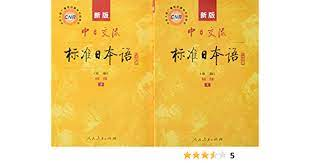
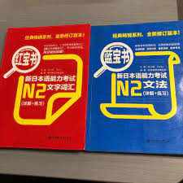

# 日本攻略

## 一. 简介

### 1.1 序

对于程序员来说，日本是一个非常容易来的国家，签证比五眼等国家的好拿，而且对人的要求也很低，并不需要你的日语有多么溜，只要能正常交流，把工作做出来，来日本还是很容易的。

下面笔者会根据自己的经历和在日本的所见所闻来帮助大家理清一下，程序员应该怎么到日本？

请注意，此篇文档是给那些认为自己条件不怎么好的人准备的，如果你是大神，略过即可

### 1.2 日本对于鼠人

几乎可以确定的是，日本是最适合鼠人润出来的国家。

在多数发达国家，都需要通过留学-就业的方式才能留，其中留学又要氪之以重金，纵使能拿到奖学金，光房租费，生活费就吓的鼠人鼠躯一震。难道在这种情况下，鼠人就没法润？

有的，我认为鼠人应该把目光转向日本。

有些人认为日本不值得润，我认为这部分人可能阶级已经近乎于中产，如果阶级离中产尚有距离，那么是不合时宜地具备了不该拥有的中产思想。

索多玛的核心问题在于户籍-房产-社会资源的三位一体高度联动，这是每一个底层鼠人身上不可摆脱的“三座大山”。

润到日本，鼠人失去的只有锁链，他们获得的将是整个世界（能够正常地作为人而生活）。

## 二. 怎么来日本

### 2.1 日本IT综述

在具体展开说明之前，笔者想先给大家一个关于日本IT产业总体的概况，各位需先自行斟酌能不能接受这样的行业，再考虑要不要来日本(其实如果自身条件不咋地的话，也没得挑啦)。

日本外包很多，很多人来日本都是选择中国人老板在这边开的外包公司工作，这些个老板会帮大家办理好签证，然后等你人到了日本，派你出去面试工作的现场，如果面试OK，那么就进入项目组工作，项目一旦结束，那么就需要面试新的现场。

如果表现优异，是有可能一直呆在一个现场里面不出来的，当然也能自己去面试非外包的公司，这些都是可以的。但是来日本，大概率要通过中国人开的外包公司。

### 2.2 学历/语言/专业要求

#### 2.2.0 一些重要的软技能

- 自学能力
- 跳出原来的思维障碍的能力
- 信息检索能力
- 较为敏锐地明辨是非的能力
- 勇气

综合概括起来，需要的就是**理性思考+自学能力+勇气**。

这些软技能，在任何润学的实践中都是缺一不可的。 这也是为什么，很多人有润之初心，却没有克忠。

我仍然认为进行一个润的实践的过程是人全面提高的过程，是真正的提高人，并且能在结果上造成解放人。

何乐而不润？

#### 2.2.1 公司的要求

就笔者见过的一些例子里面，以下是最低最低的要求

- 如果是刚毕业的学生或者不是程序员想转的
  - 大专学历
  - 非计算机相关专业(是的，你没有看错，非计算机相关专业)
  - 日语N2(其实没有也行，但是强烈建议考下来N2再过来，如果日语不过关，来这边也是没工作)
  - 最好30岁以下
  - 国内把java学一学，能写出业务代码即可

- 如果是有经验的程序员
  - 日语N2(其实没有也行，但是强烈建议考下来N2再过来，如果日语不过关，来这边也是没工作)

#### 2.2.2 签证的要求，以及一切常见的误解

常见的误解是本科不限制专业，专科限制专业。这种说法网上各路中介都这么说，不足信。要以官方文件为基准。

因为是通过[技人国签证](https://www.moj.go.jp/isa/applications/status/gijinkoku.html)过来的，也要符合签证上的需求，因为大多数run友都不涉及国际业务，我这里简单说说技术，和人文的情况

> 一 申請人が自然科学又は人文科学の分野に属する技術又は知識を必要とする業務に従事しようとする場合は，従事しようとす
> る業務について，次のいずれかに該当し，これに必要な技術又は知識を修得していること。ただし，申請人が情報処理に関する
> 技術又は知識を要する業務に従事しようとする場合で，法務大臣が告示をもって定める情報処理技術に関する試験に合格し又
> は法務大臣が告示をもって定める情報処理技術に関する資格を有しているときは，この限りでない。
>
> イ 当該技術若しくは知識に関連する科目を専攻して大学を卒業し，又はこれと同等以上の教育を受けたこと。
>
> ロ 当該技術又は知識に関連する科目を専攻して本邦の専修学校の専門課程を修了（当該修了に関し法務大臣が告示をもっ
> て定める要件に該当する場合に限る。）したこと。
>
> ハ 十年以上の実務経験（大学，高等専門学校，高等学校，中等教育学校の後期課程又は専修学校の専門課程において当該
> 技術又は知識に関連する科目を専攻した期間を含む。）を有すること。

如果要通过工签的形式去到日本，原则上至少要符合上面三条的其中一条。

大家请注意，所谓的工签，也就是技人国签证，原则上是要相关专业的大学毕业的。 相关专业很好理解，那么大学呢？

从工签获批的事例来看， 专科或许也被认为是“大学”。 但是实际上，这个大学指的是可以获得全日制学士学位的大学。

> 一般来说大学指的是有可以获得学士学位大学。在日本没有全日制的专科这种学历，它和日本的专门学校不同，和日本的短期大学近似。在实际的申请过程中，全日制大专确实有通过的例子，但是从实际的申请案例来看，使用全日制大专来申请技人国的过程中，多数被追加了工作履历的证明材料。从而证明多数情况下大专学历是不被认可的，当然也和签证审查官的裁量有关。
>
> 作者：日本行政书士夏目
> 链接：<https://www.zhihu.com/question/535736765/answer/2513131106>
> 来源：知乎
> 著作权归作者所有。商业转载请联系作者获得授权，非商业转载请注明出处。

当然，如果有足够多的经验，比如说符合上面第三点的10年经验，那么即使你不是相关专业，也不是大学毕业的，理论上也能通过签证的申请。

除此之外，如果曾经在日本有过专门学校相关专业毕业的经历，毕业有一个专门士的学位，那么也可以获得签证，就是上面的第二条了。

综上，虽然公司给offer的要求比较低，但是根据文件来看，通过工签的要求比拿到offer会更高一些。 **大家一定要通过官方渠道获取一手消息，不然可能存在很大的信息差直接能把人给干碎。**

#### 2.2.3 软考

还是原来的文件。

> ただし，申請人が情報処理に関する技術又は知識を要する業務に従事しようとする場合で，法務大臣が告示をもって定める情報処理技術に関する試験に合格し又は法務大臣が告示をもって定める情報処理技術に関する資格を有しているときは，この限りでない。

不是上面的要求不满足就没有办法拿到工签，是有特例的。这些特例在[https://www.moj.go.jp/isa/laws/nyukan_hourei_h09.html](https://www.moj.go.jp/isa/laws/nyukan_hourei_h09.html)中被公示。

也就是说，如果你获得了如下的一些被认可的考试的证书，那么也是有希望通过签证的，即使在你学历不符合规定的情况下（比如国内的全日制大专）：

|                        日本承认的证书                        |       对应索多玛的证书       |
| :----------------------------------------------------------: | :--------------------------: |
|              系統分析師（システム・アナリスト）              |     软考高级：系统分析师     |
| 信息系統項目管理師（インフォメーション・システム・プロジェクト・マネージャ） | 软考高级：信息系统项目管理师 |
|           系統架構設計師（システム・アーキテクト）           |   软考高级：系统架构设计师   |
|            網絡工程師（ネットワーク・エンジニア）            |     软考中级：网络工程师     |
|    数据庫系統工程師（データベース・システム・エンジニア）    |  软考中级：数据库系统工程师  |
|           軟件設計師（ソフトウェア設計エンジニア）           |     软考中级：软件设计师     |
|                     程序員（プログラマ）                     |       软考初级：程序员       |

#### 2.2.4 总结，如何使自己满足要求

还能转专业的尽量专业转到科班或者相关的。转不了的可以考一个自考本的学历，计算机，2.5年到手学士学位（非全日制）。这个可能用处不大，但是已经决定转码的非科班学生不妨整一个，不会有坏处。

已经毕业的不管是科班的还是非科班的都要去找计算机方面的工作，每一份工作都要有一个证明，比如离职证明，来证明你工作过。

不管是不是科班毕业，也不管是本科出身还是专科出身，统统去考一个软考初级程序员证来。

### 2.3 怎么外包找公司

笔者推荐一款叫做Ujob的App，上面全是一些在日的中国外包公司，大家可以在上面和一些老板直接聊，找一些能够帮你办理签证的公司。

在找公司之前，笔者强烈建议把日语好好学一学，好好的准备一下日语的自我介绍以及简单问答。

### 2.4 注意事项

**如果公司要求你上交你的毕业证，或者JLPT能力考试证明，请务必不要上交原件，上交复印件即可。** 存在这种案例，原件操在公司手里，公司挟天子以令诸侯的。这种情况对跳槽，常规离职都非常不利。

很多外包公司其实都挺坑的，笔者来日本的前两年被坑的很惨，欺负人的都是些国人。但是笔者希望大家能够皮实一些，遇到不公的事，尽量扛过去。

毕竟你在日本受到再多的欺负，也不可能要了你的命，但你留在国内，如果你在的城市出现了像上海那样的超级LockDown，你可能命都保不住，在日本，至少你的生命安全还是有保障的。

## 三. 永驻以及入籍

### 3.1 关于永驻

第一手资料：[日本入管局](https://www.moj.go.jp/isa/applications/procedures/16-4.html)

#### 3.1.1 混日子办法

需要在日本居住10年，期间不能有任何犯罪记录，不能有失信行为，比如盗刷信用卡之类的事，要足额缴纳保险和年金，总之要遵守公序良俗做一个守法的人。

#### 3.1.2 最快拿永驻的办法——高度人才签证

高度人才签证是2017年推出的新政策，一定程度上说明了日本人才的紧缺，建议能走这个签证的都可以走这个签证，是目前最快的拿日本永驻的途径。

第一手资料：[入管局入口](https://www.moj.go.jp/isa/applications/procedures/nyuukokukanri07_00131.html)

高度人才签证走的是打分制。我搜集了两张打分表，由于版权问题，这里只能贴出URL给大家一个传送门了。

[官方打分表（日本语）](https://www.moj.go.jp/isa/content/930003140.pdf)

[野间打分表（中日对照）](https://lawoffice-yokoyama.com/highskill/pointtable_cn/)

如果拿到了高度人才签证，那么只需要在拿到高度人才签证后，在日本工作生活三年或者一年即可申请，其中70分-79分者原则上是3年，80分以上则只需要理论上的一年就可以拿到永驻资格。

### 3.2 关于归化（入籍）

需要在日本工作生活5年，期间好好缴税，交保险年金，不要犯罪，即可申请。

归化并没有想象的那么简单。有一些关于归化的误区务必被避免：

[https://kitayamaoffice.jp/archives/blog_post/blog_post-238](https://kitayamaoffice.jp/archives/blog_post/blog_post-238)

## 四. 关于日语学习

### 4.1 应付考试

日本语能力考试（JLPT）总共分为5个等级，N1最高N5最低。各位如果想要来日本工作生活，至少需要考到N2。

日语的考试，笔者个人认为不难，按照下面的做法来准备和复习的话，过个N2还是轻轻松松的。我会附上用到的所有参考书

1. 光速刷完标准日本语初级和中级的所有知识点
2. 复习日语红宝书和蓝宝书，这两本书一本是词汇，一本是语法，笔者推荐一天2个单元，10天复习完一次，一直到考试之前都持续复习
3. 最近的10套真题做3遍，而且一定要卡着时间表来做，一定要模拟真实的考试场景，不然没效果

参考教材：  
**标准日本语**  

**红宝书蓝宝书**  

最近的10套真题（无图）

### 4.2 口语练习

各位需要找一部日剧来进行影子跟读的练习，剧中的角色说一句，暂停视频，自己跟着说一句，遇到不会的单词记到笔记本上，第二天的时候重复记忆。

并不推荐看很多日剧，各位要做的是把一部日剧看上很多遍，去模仿角色的发音，节奏甚至是表情，笔者推荐一部剧至少要看10遍。

下附笔者学习日语口语的时候用到的日剧

**四重奏**  

**无法成为野兽的我们**  

**半泽直树**  

