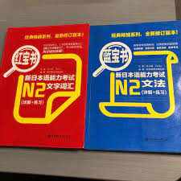

# 日本攻略

## 一. 简介

对于程序员来说，日本是一个非常容易来的国家，签证比五眼等国家的好拿，而且对人的要求也很低，并不需要你的日语有多么溜，只要能正常交流，把工作做出来，来日本还是很容易的。

下面笔者会根据自己的经历和在日本的所见所闻来帮助大家理清一下，程序员应该怎么到日本？

**请注意，此篇文档是给那些认为自己条件不怎么好的人准备的，如果你是大神，略过即可**

## 二. 怎么来日本

### 2.1 日本IT综述
在具体展开说明之前，笔者想先给大家一个关于日本IT产业总体的概况，各位需先自行斟酌能不能接受这样的行业，再考虑要不要来日本(其实如果自身条件不咋地的话，也没得挑啦)。

日本外包很多，很多人来日本都是选择中国人老板在这边开的外包公司工作，这些个老板会帮大家办理好签证，然后等你人到了日本，派你出去面试工作的现场，如果面试OK，那么就进入项目组工作，项目一旦结束，那么就需要面试新的现场。

如果表现优异，是有可能一直呆在一个现场里面不出来的，当然也能自己去面试非外包的公司，这些都是可以的。但是来日本，大概率要通过中国人开的外包公司。

### 2.2 学历/语言/专业要求

就笔者见过的一些例子里面，以下是最低最低的要求

- 如果是刚毕业的学生或者不是程序员想转的
  - 大专学历
  - 非计算机相关专业(是的，你没有看错，非计算机相关专业)
  - 日语N2(其实没有也行，但是强烈建议考下来N2再过来，如果日语不过关，来这边也是没工作)
  - 最好30岁以下
  - 国内把java学一学，能写出业务代码即可

- 如果是有经验的程序员
  - 日语N2(其实没有也行，但是强烈建议考下来N2再过来，如果日语不过关，来这边也是没工作)

### 2.3 怎么外包找公司

笔者推荐一款叫做Ujob的App，上面全是一些在日的中国外包公司，大家可以在上面和一些老板直接聊，找一些能够帮你办理签证的公司。

在找公司之前，笔者强烈建议把日语好好学一学，好好的准备一下日语的自我介绍以及简单问答。

### 2.4 注意事项
很多外包公司其实都挺坑的，笔者来日本的前两年被坑的很惨，欺负人的都是些国人。但是笔者希望大家能够皮实一些，遇到不公的事，尽量扛过去。

毕竟你在日本受到再多的欺负，也不可能要了你的命，但你留在国内，如果你在的城市出现了像上海那样的超级LockDown，你可能命都保不住，在日本，至少你的生命安全还是有保障的。

## 三. 永驻以及入籍

### 3.1 关于永驻
需要在日本居住10年，期间不能有任何犯罪记录，不能有失信行为，比如盗刷信用卡之类的事，要足额缴纳保险和年金，总之要遵守公序良俗做一个守法的人。

如果拿到了高度人才签证，那么只需要在拿到高度人才签证后，在日本工作生活三年即可申请

### 3.2 关于入籍
需要在日本工作生活5年，期间好好缴税，交保险年金，不要犯罪，即可申请。

## 四. 关于日语学习

### 4.1 应付考试
日本语能力考试（JLPT）总共分为5个等级，N1最高N5最低。各位如果想要来日本工作生活，至少需要考到N2。

日语的考试，笔者个人认为不难，按照下面的做法来准备和复习的话，过个N2还是轻轻松松的。我会附上用到的所有参考书

1. 光速刷完标准日本语初级和中级的所有知识点
2. 复习日语红宝书和蓝宝书，这两本书一本是词汇，一本是语法，笔者推荐一天2个单元，10天复习完一次，一直到考试之前都持续复习
3. 最近的10套真题做3遍，而且一定要卡着时间表来做，一定要模拟真实的考试场景，不然没效果

参考教材：  
**标准日本语**  

**红宝书蓝宝书**  

**最近的10套真题（无图）**

### 4.2 口语练习
各位需要找一部日剧来进行影子跟读的练习，剧中的角色说一句，暂停视频，自己跟着说一句，遇到不会的单词记到笔记本上，第二天的时候重复记忆。

并不推荐看很多日剧，各位要做的是把一部日剧看上很多遍，去模仿角色的发音，节奏甚至是表情，笔者推荐一部剧至少要看10遍。

下附笔者学习日语口语的时候用到的日剧

**四重奏**  

**无法成为野兽的我们**  

**半泽直树**  
