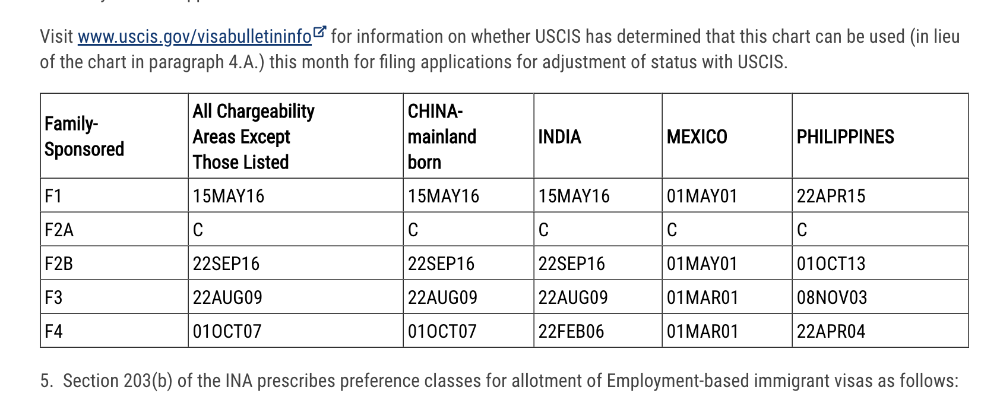
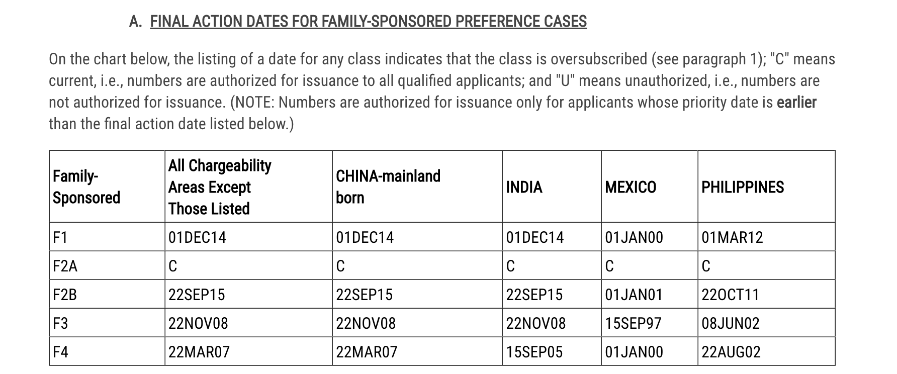

# 文科或不好找程序员工作的女生如何润美国，附婚后绿卡问题

> 这篇文章实际上也适合打算润去任何国家的人

我认为，考虑到男女比例的差距（美国西海岸湾区的男生基本上不可能找到女朋友），以及女生在润这方面存在的客观困难（比如专业，比如工作，比如学校和年纪等），
一个合理的市场配置，就是提供一个平台，让这样理解到润的根源并且急迫需要润的女生找到一个真正爱自己，和自己相爱的男生，然后结婚。

这样可以一举解决

- 具有润思想，受到开明教育的女生单凭自己的条件或许难以润出国
- 男生在国外事业有成但是找不到女朋友，难以成家立业
- 壮大海外华人社群，扩大海外热爱自由思想与思维，求真求实，哲学/科学/人文与自然学科专家群体人数

的重大问题，既帮助了女生，也帮助了男生；既促进了亚洲人男大当婚、女大当嫁，成家立业的价值观；又符合美国或者说国外家人、亲情、pro-family帮助家人拿到绿卡的价值观

当然，前提是不可违法，不可以假结婚为手段，以移民为目的，骗取对方国家移民署的信任。把这么一个有利于家庭，有利于个人的移民手段搞烂搞臭搞黄。这是万万不可取，也是本repo严肃反对的。

现在的问题是，哪里能有这么一个公平、平等、合法、合理的平台，帮助适龄并且三观都符合（例如：都愿意付出自己的一生离开至上而下、布尔什维克主义的大清王朝）的男女找到彼此呢？

希望大家踊跃建议，本文未完待续。谢谢

## 关于婚后绿卡的问题

这里主要分两种情况讨论

- 对方的绿卡申请已经进入485阶段

如果是485阶段（也就是抽签抽到了h1b，并且拿到140之后进入的调整身份阶段），配偶可以一起co-file 485搭上车而跳过h1b, 140的部分，这个阶段，配偶不需要找到工作。一旦配偶的485批准，配偶双方的绿卡将会统一发出。

- 对方已经拿到绿卡

婚配对方如果已经拿到绿卡，那么只需要按照美国移民局关于family based 移民类别申请绿卡即可，这一类别叫F2A，**Second preference (F2A) - spouses and children (unmarried and under 21 years of age) of lawful permanent residents**，顾名思义，是美国移民局为永久居民的配偶或者没有结婚且21岁以下的子女专设的移民绿卡。

现阶段，该签证在中国大陆的排期为current，也就是**没有排期**。申请并且加快处理的话，可在几个月内拿到combo card，也即合法居住并且工作的临时ead卡；等到审批结束可以在1-2年内拿到绿卡，具体处理速度取决于你申请绿卡的所在地。

2022年5月份的F2A排期列表如下： <https://travel.state.gov/content/travel/en/legal/visa-law0/visa-bulletin/2022/visa-bulletin-for-may-2022.html>

