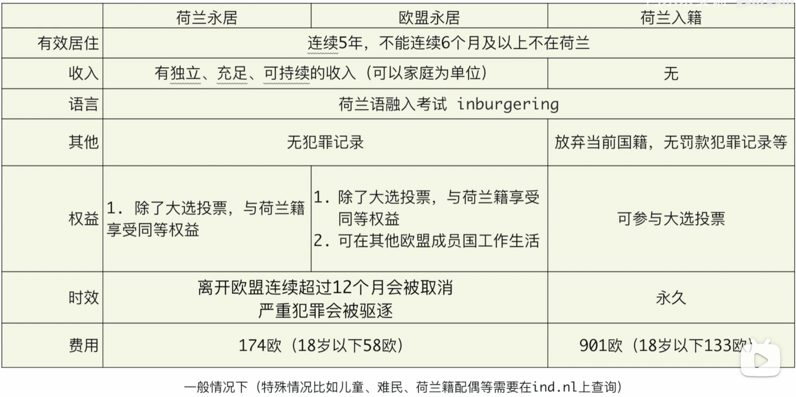

# 荷兰

## 优势

- 不需要学习额外语言，荷兰是除英国语母语国家外英语普及率第一的国家，与政府、超市、老年人等沟通都可以用英语
- 福利

## 劣势

- 税率高，到手少

## 流程（程序员）

1. [高技术移民](https://ind.nl/en/work/working_in_the_Netherlands/Pages/Highly-skilled-migrant.aspx)：需要雇主雇佣你，对薪资有[要求](https://ind.nl/en/Pages/required-amounts-income-requirement.aspx#Application_for_residence_permit_highly_skilled_migrant_and_European_Blue_Card)，2022年 30岁以下至少​€3,549每月，30岁以上至少 €5,670每月
2. 5年之后申请荷兰永居/欧盟永居或入籍荷兰。永居或入籍后不用雇主担保，可自由选择工作或失业。

## 参考

- [荷兰的高技术移民| 荷兰程序员收入和国内比高么](https://www.bilibili.com/video/BV1Ut4y1v776)
- [在荷兰工作多久可以拿永居、护照？日常工作生活需不要学习荷兰语｜荷兰移民 2020](https://www.bilibili.com/video/BV1Dk4y1B7bv)

## 有用的资料

- 荷兰移民官网：<https://ind.nl/en/Pages/default.aspx>
- 高技术移民签证：<https://ind.nl/en/work/working_in_the_Netherlands/Pages/Highly-skilled-migrant.aspx>
- 融入考试相关问题：<https://ind.nl/Paginas/Inburgering-in-Nederland.aspx>
- EFEPI国家英语熟练度排名：<https://liuxue.ef.com.cn/epi/>
- 亨氏护照指数：<https://www.henleypassportindex.com/passport>
