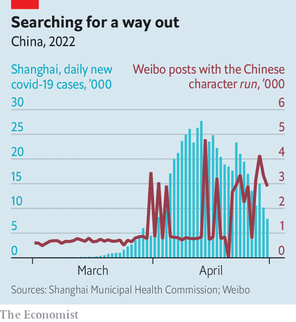

# China’s young elite are considering moving abroad

> 经济学人文章：《中国的年轻精英正在考虑移民润出国》
>
> 原文地址 <https://www.economist.com/china/2022/05/05/chinas-young-elite-are-considering-moving-abroad>

Online searches for words related to emigrating have spiked

Late last month China’s central propaganda department announced a new campaign:
“The Strong Nation’s Rejuvenation Has Me”. The goal of this odd-sounding effort
is to rally red spirit before the Communist Party’s 20th congress later this
year, when Xi Jinping hopes to secure a third term as party chief. But a
different kind of rejuvenation is trending online, that of “run philosophy”, a
coded way of talking about emigration. Instead of using a character that
suggests running away from China, which would antagonise state censors, netizens
have been using one that sounds like the English word “run”, but means something
different: run (moist).

Most of Shanghai’s 25m residents have been locked in their homes for more than a
month in order to stem an outbreak of covid-19 in the city. Case numbers are
dropping there, but rising in Beijing, the capital, which is doing mass testing
and imposing targeted lockdowns. Business leaders worry about the economic
impact of China’s covid controls. Many foreigners are leaving—and, according to
online search trends, China’s young and educated elite are thinking about doing
the same.

On WeChat, a popular messaging app, searches for “immigration” increased more
than fourfold between early and mid-April. Users of Weibo, China’s version of
Twitter, published more than 78,000 posts with the run character in March and
April (see chart). Spikes in their frequency coincided with traumatic events in
Shanghai, such as when an asthma patient was refused medical treatment and died,
or when videos of infected children separated from their parents spread online.

“It’s like an alarm bell has gone off,” says Miranda Wang, a young Chinese
video-producer who moved to Shanghai after studying in Britain. The Chinese
metropolis used to feel like a global city, similar to London, she says. But
after more than 50 days of lockdown, Ms Wang has begun researching ways to
leave. “Now we realise, Shanghai is still China’s Shanghai,” she says. “No
matter how much money, education or international access you have, you cannot
escape the authorities.”

Chinese internet users have crowdsourced a repository of run-philosophy readings
on GitHub, a platform for open-source coding and rare refuge from censorship in
China. There they discuss why to run, where to run and how to run, archiving
stories of successful emigration to various countries. To run is not to seek
pleasure or profit, one essay states, but to escape a country that is speeding
in the wrong direction. “Surely a sheep that has been hurt by beating can try to
flee?” it asks. “Therein lies the truth of run.”

But to run is easier said than done. Flights out of China are few and expensive.
America has tightened visa restrictions on Chinese students over exaggerated
fears of spying. In the name of pandemic prevention, China is also making it
harder for citizens to move around. Since 2020 the National Immigration
Administration has stopped issuing travel documents for “non-essential reasons”.
The agency handed out 335,000 passports in the first half of 2021, only 2% of
the number issued over the same period in 2019. The authorities in one city,
Leiyang, have been confiscating citizens’ passports to prevent travel. “We’ll
return them after the pandemic is over,” says a public-security official.

Would-be emigrants know that they are in the minority. A young finance worker in
Beijing says her peers “see no future” in China. But most Chinese, especially
older generations, are “numb”, she says. Ms Wang fears that leaving would mean
losing touch with her parents. “Calm your heart,” her mother scolds her on
WeChat. “Fill it with home, parents and motherland, find a steady job and you’ll
be fine.”

A white-collar worker in Shanghai used to take his freedom for granted. It was
“something to chat about over a pint”, he says. Now, stuck at home and lacking
food, he fears being taken to an isolation centre if he tests positive for
covid. Yet in China, he laments, memories are short. People will forget about
the chaos in Shanghai; the government will maintain its strict covid controls.
Such despair is why some Chinese are looking to run.

## 中文版本翻译

（中国国内）与移民相关的在线搜索量激增。

上个月末，中国中宣部宣布了一项新的运动：《强国有我》。
这种听起来很奇怪的奋斗目标是在今年晚些时候中共二十大之前凝聚红色精神，
届时习近平希望获得**第三个党总书记任期**。但另一种复兴正在网上流行，
即“润之哲学”，一种谈论移民的哲理。网民们没有使用一个暗示逃离中国的字样，
这会激怒网管，而是使用一个听起来像英文单词“run”但意思不同的字样：润（亦可称作“闰”）。

上海 2500 万居民中的大多数人已被锁在家中一个多月，以阻止该市爆发 covid-19。
那里的病例数正在下降，但在首都北京却在上升，北京正在进行大规模检测并实施有针对性的封锁。
商界领袖担心中国的新冠疫情控制对经济的影响。许多外国人正在离开——根据在线搜索趋势，
中国年轻且受过教育的精英也在考虑这样做。

在流行的消息应用微信上，4 月初至中旬期间，“移民”的搜索量增加了四倍多。中国版 Twitter ，
即“微博”的用户在 3 月和 4 月发布了超过 78,000 条带有润字样的帖子（见图表）。
他们的频率飙升与上海的创伤事件同时发生，例如当一名哮喘患者被拒绝治疗并死亡时，
或者当受感染儿童与父母分离的视频在网上传播时。

“这就像是敲响了警钟，”在英国学习后移居上海的年轻中国视频制作人 Miranda Wang 说。
她说，这座中国大都市过去给人的感觉就像一个全球化的城市，类似于伦敦。但经过 50 多天的封锁后，
王女士开始研究离开的方法。 “现在我们意识到，上海仍然是中国的上海，”她说。
“无论你拥有多少金钱、教育或国际机会，你都**无法逃脱当局的制裁**。”

中国互联网用户在 GitHub 上众包了一个运行哲学读物的存储库，这是一个开源编码平台，
在中国是一个罕见的免受审查的避难所。他们在那里讨论为什么要润，润到哪里以及如何润，
将成功移民到各个国家的故事存档。一篇文章指出，润不是为了寻求快乐或利益，
而是为了逃离一个朝错误方向加速的国家。 “肯定是被打伤的羊可以润吗？”它问。 “这就是润的真相。”

但润说起来容易做起来难。离开中国的航班很少而且价格昂贵。由于过度担心间谍活动，
美国收紧了对中国学生的签证限制。以防疫的名义，中国也让公民出行更加困难。
自 2020 年以来，国家移民管理局已因“非必要原因”停止签发旅行证件。
该机构在 2021 年上半年发放了 335,000 份护照，仅为 2019 年同期发放数量的 2%。
耒阳市当局一直在没收公民的护照以阻止旅行。一位公安官员说：“大流行结束后，我们将把它们归还。”

潜在的移民知道他们是少数。北京一位年轻的金融工作者说，她的同行在中国“看不到未来”。
但她说，大多数中国人，尤其是老一辈，都“麻木”（译者注：不是“赢麻”）了。
王女士担心离开意味着与父母失去联系。
“冷静点，”她妈妈在微信上骂她。 “把家、父母和祖国填满，找到一份稳定的工作，你会没事的。”

上海的一位白领曾经认为他的自由是理所当然的。他说，这是“信口拈来的茶余饭后谈资”。
现在，他被困在家里，缺乏食物，他担心如果他的新冠病毒检测呈阳性，就会被带到隔离中心。
然而在中国，他感叹，记忆是短暂的。
人们会忘记上海的混乱；政府将保持其严格的新冠病毒检测、戒严。
这种绝望是一些中国人想要“润”的原因。

（完）
