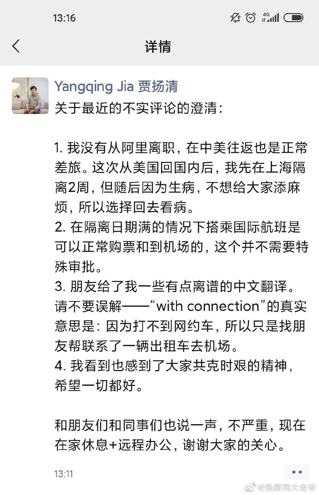

# 下午察：如何理解网络流行语“润”？

> 转载自联合早报，原文链接：[下午察：如何理解网络流行语“润”？](https://www.zaobao.com.sg/realtime/china/story20220422-1265443)

这几天，中国社交媒体上频频出现“润了”这个词，网民的用法千奇百怪，乍看之下不知所云：

“我已经在和家人们考虑润了。”“当润则润，润了后悔一时不润后悔一辈子。”“我还挺怕万一我真润了也会变成看不起这里的受害者的人。”“干完这个月真的润了……”

甚至还出现关于“润学”的网上社区，分享关于“润”的种种。该社群称，其存在是要解决“为什么润，润去哪里，怎么润”三大问题。

## 究竟什么是“润”？

从网民这些评论看来，可以推测“润了”隐约与某种挣脱、抽离的举动相关。综合各路媒体平台的解释，原来“润”的汉语拼音“rùn”与英文单词“run”一样，即跑的意思。在网民的用法中，多有跑路、开溜之意，多指移民海外。

此外，由于“润”在汉语中含“使有光泽”（润色）、“利益”（利润）等意，“过得滋润”在一些地方口语中也有“过得舒适”之意，因此“润了”就有“跑去更好的地方”这一深层含义。

关于“润”的梗在中国问答社区知乎上被广泛讨论与关注，“网络用语‘润’是什么意思，有哪些引申用法？”这则话题至今已被阅览近500万次。

一些知乎用户给出了令人啼笑皆非的另类解释。有用户说，中国连锁超市巨头华润万家就是“指中国人华人移民到外国各个国家”。还有人引杜甫名句“润物细无声”，认为这是指“真正能润的人都偷偷润，不出声”。也有网民指港星周润发名字的寓意是“周围的人都润出去发财了”。

还有网民归纳，目前中国青年的三个选择就是“卷（内卷）、躺（躺平）、润”。

事实上，“润”的讨论去年就有不少，这几天又火起来，多半与中国抗疫过程中，关于移民的讨论升温有关。

## 从上海“润了”？

上海长达数周的封控措施，引发乱象频频、民怨四起，一些小区甚至出现了居民与警察的冲突事件。打开微博，关于上海人想“润了”的内容有不少。

用户“fumi-kon”今天（22日）说：“上海人经此一役很多该想润了。”网民“鸿不鸣”前天称：“我认识的上海客户，好多早润了，但凡家里有条件的能润就润，不是自己润就是孩子润。”网民“Thewaysofseeing”称：“上海疫情冲击最大的是中产。富人早看清楚润了……一旦你在封城期间生个病，你就会希望自己能和跑到美国看病的阿里高管一样。”

该网民所指的“阿里高管”是阿里巴巴技术副总裁贾扬清。微信公众号“小声比比”17日在题为“阿里副总裁从上海润了？他本人可不是这么说”一文中称，贾扬清上周在面簿分享“靠关系”从上海飞到美国的经历，引发质疑后澄清自己去美国是“去看病”，而所谓“关系”是自己打不到网约车，所以找朋友帮忙联系了一辆出租车去机场。

但不少网民对贾扬清的澄清并不买账，批评他是深夜逃离上海的精致利己主义者。贾扬清在面簿的相关贴文已删除，但网上还能找到网民的截屏。

德国之音昨天报道称，对于部分上海富人和中产家庭来说，高压的清零政策，令他们决定移民他方，用行动表态。报道引述《金融时报》一项对十多家中国移民顾问公司的调研，这些企业称，最近接到的移民查询大增。

据腾讯网报道，微信所提供的“微信指数”显示，4月3日中国官方宣布“严格坚持社会面清零不动摇”后，当天关于“移民”的整体搜索指数上升440%。

百度数据资料也显示，中国搜索“移民”热度方面，排名前十的省市分别是上海、江苏、广东、北京、山东、浙江、安徽、福建、辽宁、河南，按月环比增幅前五名的地区分别是上海、天津、广东、江苏、陕西、香港。而上海自今年2月以来的“移民”搜寻量一直位居中国榜首。

百度公布的3月28日至4月3日一周移民关键词条搜索数据显示，有关“移居加拿大条件”的搜索量激增到峰值，环比上涨2846%。其次是有关“出国哪里好”搜索量，环比上涨2455%。

不过，“移民搜索潮”的相关报道传出后，各大平台已经不再提供该关键词的指数和趋势搜寻。

## 膜拜“跑路天后”张爱玲

关于从上海“润”的讨论竟也延伸到上海出生的著名已故女作家张爱玲，有网民在微博贴出张爱玲的照片，配文是：“拜拜祖师爷（跑路天后）”。也有网民写道：“张爱玲，保佑我们能够成功润！”“南无张爱玲女神，保佑我早点润！”

也有网民将张爱玲名言“出名要趁早”改为“出逃要趁早”“润要趁早”等。

时事评论家长平前天在德国之声网撰文称，先知先觉的张爱玲于1952年7月以“继续因抗战而中止的港大学业”为由，申请赴港，随后迁居美国。“与她背景相似、留在大陆的作家苏青、关露、周瘦鹃等人，大多没有躲过残酷的政治迫害。”

不过，也有中国网民指，张爱玲1995年9月8日在美国洛杉矶寓所死后一个星期才被发现，说明“润了之后过得更惨了”。

## 关于“润”的其他用法与解释

当然，“润”这个网络语的运用也不限于移民。在网上搜索，也能找到关于跳槽离职等话题。

值得一提的是，“润”还有另一种解释。由于“run”在英文中是多义词，知乎用户“J4vix”就指“润”有“经营、管理”的意思，“所以在知乎上经常看到‘润北欧’‘润北美’的说法，意思是经营北欧，管理北美，具体来说就是作为中国人，带领北欧北美走向光辉的社会主义，未来的天下必将是赤旗的世界”。

不过，这种解释似乎不被网民接受，不少网民留言调侃：“官方级理解”“一本正经的胡说八道”。

大部分网民还是将用“润”来形容逃跑。有少数网民也用“润之”一词。譬如：“从来没有这么想润之（是很冷的双关没错）”“想润是真的，想润之也是真的。”“一部分人想润，一部分人想润之”“听润之的话：润之。”

熟悉中国近代史、当代史的读者，大概要骂这些网民的玩笑出格了。
