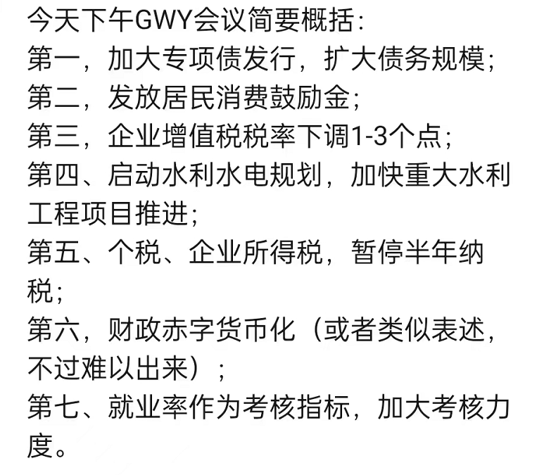

# 昨天的大会排在第五了

[小晖写字｜昨天的大会排在第五了](https://mp.weixin.qq.com/s/dZyQcVYjOpKnossm5fVDmw) [CDT备份](https://chinadigitaltimes.net/chinese/682169.html)

>根据发表时间来看，昨天是指 05/26/2022

昨天下午，开了个十万人大会，很多人的生活都会因为这场大会而被影响，甚至发生改变，也正因如此，很多网友都在密切关注这个会。

这一关注，网友们又发现了不少有意思的事情，于是我又想写出来，让大家看到。

有网友称之为十万人大会。

十万人是这么算出来的。

这是网友对昨天那个大会的概括总结。

这是昨晚大会的直播内容。

网友还总结出了本次大会的主要目标。

这个版本的总结更为精练。

这是来自基层网友的声音。

在就业这一块，已经有学生家长站出来予以证实了。

地产方面也很不乐观了，短短一年时间里，河南一个市的成交数量由2000直降到100，整整下降了二十倍。

还有网友从数据中得出这样一个结论。

各地财政收入也是暴跌，最惨的是温州，跌去了74%。

这个已经不能叫腰斩了，这应该是脖子埋进土里了，只留一个鼻孔还在出气了。

今天早上，有网友讲了这样一个段子，相当的形象了。

还有网友写了这样一个微小说。

还有网友发现了这个。

而且还不只一个网友发现了。

有网友在讲段子，也有网友在费尽口舌地讲道理。

真的是口水都说干了。

这原本应该成为绝大多数人都知晓的常识。

特别是这个常识，更应该成为我们社会的共识，并以此构成我们对外合作的底线。

作为一个普通写字者，我希望这个大会能够真正帮助到绝大多数民众，还经济以活力，还万民以信心，至少不用为生计发愁，这才是当下最重要的。

松口，松手，松绑，如果能做到这三点，我相信我们的经济一定能从谷底走出来，重新开始爬坡，这样大家的日子都会好过一点，口袋里的钱也会多一点，也有底气对家人好一点。

不说过得有多舒服悠闲，至少可以让普通人们不用为生活发愁，如果能做到这一点，那这个十万人大会就是成功的，就是能在历史上留下一笔，被后人记住的。
