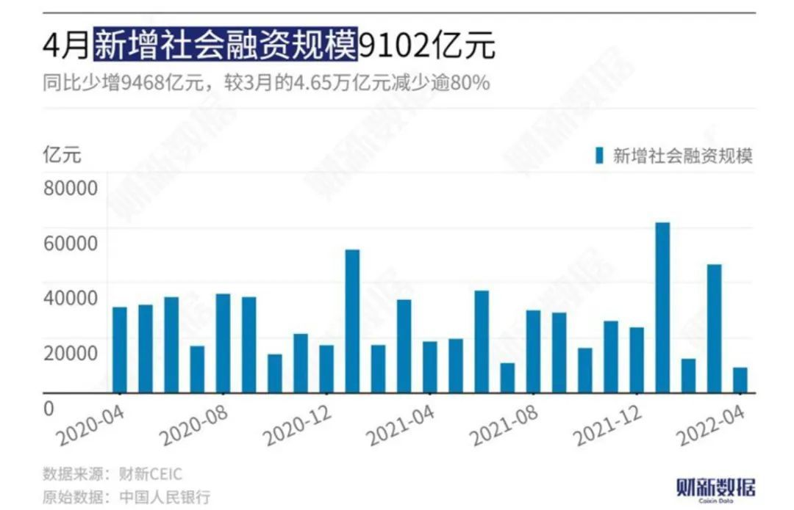
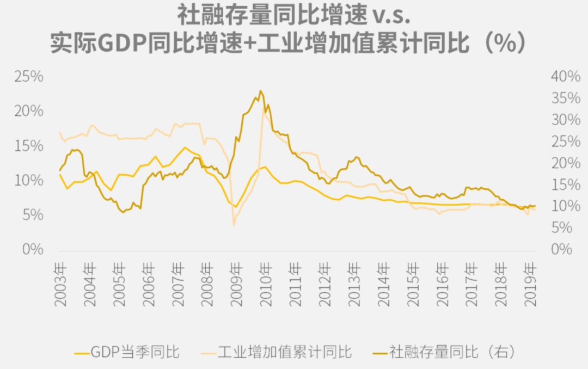

# 社融数据

## 起朱楼宴宾客｜有些数据无法“造假”

[微信公众号链接](https://mp.weixin.qq.com/s/w7kokKFru03_W5eiGC9fyg) [Archive备份](https://archive.ph/49QBW) [CDT备份链接](https://chinadigitaltimes.net/chinese/681339.html)

记得多年前，我还在体制内做市场研究的时候，曾经问过一位著名外资机构的经济学家，“关于中国经济，你最喜欢看什么数据？”

他几乎是脱口而出，“社融数据”。

再问他为什么，他狡黠的朝我眨了眨眼说，“因为这是为数不多的、能够高频观测的、且难以篡改的big data”。

哦，那是一个big data还不会被翻译成大数据的时代。他指的是这个数据足够宏观、足够全面，甚至能反映出中国在某一时间点上的经济面貌。

所以当2022年4月的社融数据在昨天被公诸于世时，对于从业人员来说，无异于平地起惊雷。

问了几个相熟的经济学者怎么看，大多的回答是：

“情理之中，意料之外。”

“想到差，没想到这么差。”

昨夜今晨看了很多机构对此发布的研究报告，语言大多是克制而隐忍的，一如这个时代的注脚。

只在个别字眼和语句上，才能够体会到屏幕前那些学者的痛心疾首。比如平安钟正生的“触冰”论，比如中金陈健恒的“独木支撑”论，再比如瑞银汪涛在整个后市研判中用的都是“xxxx，不过xxxx”的句式。

更多的朋友则只是沉默的在朋友圈转发人民银行官方的数据发布文。

因为在当下，不加一句评论，也是一种评论。

1

其实从社融数据的季节性规律来说，四月的数据比较弱属于情理之中，特别是在三月放出天量之后。

从上表可以看出，每一次社融天量之后，下个月的数据都会出现环比大幅下降。而在今年一季度有两个月的社融都创出新高之后，本就没有人对四月数据有太多的期待。

但还是没有想到，情况会如此的糟糕。

对于新增社融规模，财新公布的一致预期是2.12万亿，彭博公布的一致预期是2.2万亿，可最终的结果是8231亿。

而对于其中最核心的一个分项，也就是新增人民币贷款，之前的一致预期大概分布1.49万亿到1.53万亿之间，而最终的结果是6454亿。

由于对数据过多的延伸和解读可能会引来显而易见的结果，所以在本文中，我也只会就事论事的去讲这些数据自身的情况，同时对那些不太了解这些数据背后含义的朋友，做一些基础的解释工作。

2

在开始解释之前，先让我们回到文章开始的那个问题——为什么社融和贷款数据是业界公认的真实数据？

原因也很简单，因为社会融资总量是一个自下而上整合的数据项，而底层的金融机构放贷、股票和债券发行等等数据都是有迹可循的。

此外，金融行业的数据在各个行业中相对而言也最为公开透明，再加上这一系列数据按月发布已有十余年之久，因此早已成为很多机构跟踪中国经济情况的重要依据。

想要进行太多的数据美化和修饰，是一件比较困难的事情。

一般而言，社融和贷款数据是一个略微领先于经济增长的指标，比如2008年就比GDP领先小半年触底，而2010年又比GDP领先两个月见顶。因此很多人，特别是机构投资者，会把这几个金融数据看做是观察中国经济接下来走向的领先指标。

不过这些年来，随着实体经济借了太多的钱，实体赚钱的机会又没有以前那么多，因此融资对于经济的拉动效应有着非常明显的边际递减，对经济情况的预示作用也就没那么突出了。

因此，如今大家再来看社融数据，往往会拿放大镜拆开了看，看里面很多具体分项的变化，从而映射出中国经济的一些微观情况。

举个例子来说，社融数据主要可以分为表内贷款、表外融资、直接融资和其他融资四部分，这其中最重要的几个科目分别是表内贷款里的人民币贷款，表外融资里的委托贷款，另外就是这几年占比正在逐级扩大的直接融资。

由于中国经济依然是一个银行占大头的融资体系，因此在这其中，人民币贷款自然而然就成了大家关注的重中之重。

负责公布数据的人民银行也非常配合的，又将其拆解成了居民住房贷款、消费贷款、经营贷款，以及企业短期贷款、中长期贷款等等一系列分项。

从这一系列数据的起起伏伏中，研究者可以看到居民的行为在发生什么样的变化，而企业又在采取哪些行动应对市场形势。

例如在这个月的数据中，居民全面去杠杆的趋势就非常明显，因为无论是居民户房贷、非住房消费贷还是经营贷，均出现了负增长，其中个人按揭贷款更是出现了历史上第二次的“净偿还”。

>……住户贷款减少2170亿元，同比少增7453亿元。其中，住房贷款减少605亿元，同比少增4022亿元；不含住房贷款的消费贷款减少1044亿元，同比少增1861亿元；经营贷款减少521亿元，同比少增1569亿元。
>
>[中国人民银行2022年4月金融统计数据报告](http://www.pbc.gov.cn/goutongjiaoliu/113456/113469/4552416/index.html)

这不但反映出居民的购房和消费意愿大幅下滑，还反映出大多属于服务业的个人工商户、小微企业主正遭受明显的负面冲击。

其实，冰冻三尺非一日之寒。

三月的天量社融背后，住户的中长期贷款和短期贷款就已经出现了同比20%以上的下滑。

而到了这个月，就直接出现了断头铡。

3

而对于企业端，大家更多看的是所谓“信贷结构”。

一般来说，在企业的信贷结构中，中长期贷款比短期贷款更重要。因为中长期贷款意味着企业借来用于扩张生产和资本开支的钱，而短期贷款更可能是为了维持现金流，为了活命。

而在这个月，信贷结构出现了非常明显的恶化——短期贷款新增8089亿元，同比只减少了2.5%，而中长期贷款新增2652亿元，同比下降了60%，与2020年同期相比也下滑了50%多。

根据中金的研究报告，这一数据的新增绝对量是2017年以来的最低值，同比少增幅度更是有数据以来的相对高点，且还是在没有基数扰动的情况下。

“独木支撑”的是所谓票据融资，比前两年有明显增长。但票据融资指的是企业拿供应链上的“欠条”去银行贴现换成现金，除了资金空转和套利交易之外，也可能反映出的是企业现金流紧张，因为比起欠条，企业宁愿打折也要换成现金。

更令人深思的是，央行在答记者问中还特别解释道，“1-4月企业贷款利率为4.39%，同比下降0.25个百分点，保持在有统计记录以来的低位。”

央妈的初衷当然是为了说金融机构很好地贯彻了政府对于降低小微企业贷款利率的要求，但却从侧面反映出另一个问题，那就是——

利率这么低，大家还是不愿意借钱。

>4月份当月人民币贷款增长明显放缓，同比少增较多，反映出近期疫情对实体经济的影响进一步显现，叠加要素短缺、原材料等生产成本上涨等因素，企业尤其是中小微企业经营困难增多，有效融资需求明显下降。
>
>[中国人民银行有关负责人答记者问](http://www.pbc.gov.cn/rmyh/3963412/3963426/4552624/index.html)

4

除了社融数据，同批公布的另一个广受关注的金融数据当然是广义货币增长和狭义货币增长，也就是所谓的M2和M1。

从数据来看，这两个值表现得非常稳定，双双回升，其中M2同比增速上行0.8个百分点，重回10%以上。

市场普遍认为，这一方面体现了央行结存利润上缴财政形成的基础货币投放，另一方面则是4月底全面+定向降准的功劳。不少机构也因此喊出了政策向措施落地的“现在进行时”。

不过中金的研究则提供了另外一个视角。

它认为，M2的“异常上升”主因可能是居民去年同期进行的很多金融产品投资转化为了存款导致的。

因为如果去看3、4月份合计的居民存款规模，会发现明显高于去年同期水平，这很难解释为居民工资多发或者支出锐减，因此大概率是去年同期在理财和基金类的金融投资变成了今年的存款。由于存款可以清晰地反映在M2里，而金融投资比较难，因此这一次的M2出现了显著的上升。

但这就带来了一个问题。

如果M2的上升不是政策发力的结果，而是类似理财转移之类的短期因素，那么就意味着到目前为止的货币和财政政策发力，并没有对冲掉居民和企业同时去杠杆带来的负面影响。

如果政府认为目前的政策力度已经足够避免“明斯基时刻”，恐怕会功亏一篑。

5

最后必须说的是，尽管金融数据不容易“造假”，但如何解读却可以见仁见智。

悲观的人看到的是万马齐喑，而乐观的人看到的却可能是央妈有了更多理由放水，甚至监管也有了更多的理由放松。

比如前四个月金融数据中委托贷款与信托贷款规模的“微微抬头”，似乎就在暗示着，金融监管的实施力度正在悄然松动。

祸兮福所倚。
