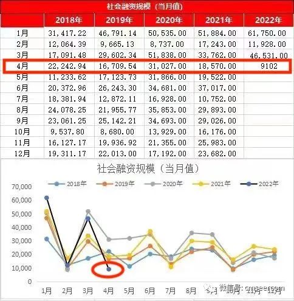
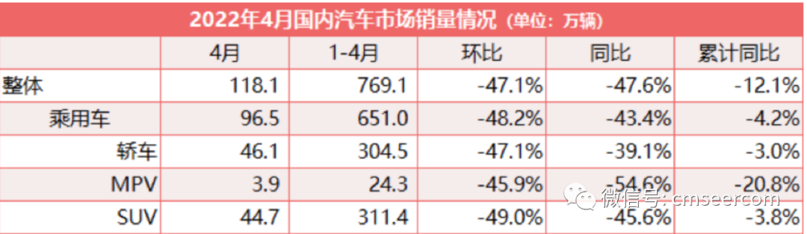

# 2022年4月金融数据

> [原文链接](https://mp.weixin.qq.com/s/1BtaWmYtl6usa_jkkbYloA) [Archive备份](https://archive.ph/iqy9p)

疫情影响太严重了，4月份我国金融数据打回原形，全面坍塌！

1、社融增量较去年同期下降51%。

核心问题是，无论政策怎么刺激，就是没有需求！

2、新增人民币贷款比3月份减少2.48万亿，降幅79%；比去年同期减少0.83万亿，降幅56%！

企业已经躺平了，给他们贷款都不要，他们都没想着扩张规模，只想着裁员度过寒冬。

3、份居民贷款新增-2170亿元，同比多减7453亿元。

其中居民住房贷款有史以来第二次减少，且减少幅度扩大，为605亿元，同比少增规模高达4022亿元。

居民也躺平了，既不买车，也不买房。

## 社融腰斩 核心是：没有需求

4月份，社会融资规模增量为9102亿元，比上年同期少9468亿元，较去年同期腰斩。

其中，对实体经济发放的人民币贷款增加3616亿元，同比少增9224亿元。

我看到一个银行的人说，自己做贷款业务，最近一直给企业打电话，贷点款吧，利率优惠，而企业那边反馈，根本不需要，现在的存货还没卖出去呢，没打算扩大生产。

遥想当年，多少人排着队找他贷款啊，再对比一下现在就感叹，自己从业十几年，从来没有像今天这么卑微过。

我们之前文章[《残酷的悖论：只有炒房才能拯救楼市 才能拯救中国经济！》](https://www.163.com/dy/article/H4U1LAOR0539HG14.html)中解释过，一季度经济增长全靠政府拉动，社融里面政府债券占比超过50%。

而地方政府专项债发行大都集中在一季度，这个高峰期过后，后面的政府融资需求也下来了。

做个对比，3月份政府债券净融资规模7052亿元，4月份净融资3912亿元，降幅44.5%，接近腰斩。

因此，从硬核数据看，金融数据3月份就全面坍塌了，但是就靠政府债券、短期融资，以及票据融资支撑。

现在，撑不住了，4月份的金融数据就坍塌了。

金融数据坍塌说明什么？

尽管我们出台了很多刺激经济的政策，但是实体经济仍然没有需求，死气沉沉。

这个是预期之中的事情。

因为我们的经济体量实在太大了，单靠基建是无法支撑经济增长的，无论怎么折腾都是这样。

## 企业躺平：给钱不要，就要裁员

4月份新增人民币贷款6454亿元，3月份为31254亿，去年同期为1.47万亿。

也就是说，4月新增人民币贷款比3月份减少2.48万亿，降幅79%；比去年同期减少0.83万亿，降幅56%！

其中，中长期占比31.7%，较上月下降23个百分点，较去年同期下降47个百分点，为近几年最低。

对比一下，最近几年中长期贷款占比的平均数是78%，4月份的数据太差了。

长期贷款萎缩，就说明企业不看好未来发展，不愿意扩大生产和规模。

回到现实世界也确实是这样，现在只有核酸检测和疫苗行业红火，一个公司的区域总奖金都能超过3000万。

除此之外，其他行业差不多都躺平了，别说扩大生产了，都在缩小规模和裁员。

看几个新闻：

1、据东财统计，截止4月30日，A股共有4650家企业公布了员工变动人数，其中1697家企业进行了不同程度的裁员，裁员总数为91万。

要知道，上市企业差不多都是优质龙头企业，他们还大幅裁员，可见全社会“灵活就业人口”规模有多大。

2、之前还调侃，今年1000多万高校毕业生找工作的时候会发现，老板们都消失了，他们可怎么办呀？

现在出台政策了，国务院办公厅发布了[《关于进一步做好高校毕业生等青年就业创业工作的通知》](http://www.gov.cn/zhengce/content/2022-05/13/content_5690111.htm)。

政策具有惯性和滞后性，当一个政策出台的时候，就说明这个问题已经相当严峻了。

这个政策有效果吗？有，但是不大。

大环境好的时候，有经验有资源的人创业还都是九死一生，现在大环境这样子，刚出校门的大学生创业，他爸妈会同意么？

另外，文件里提到的补贴，以及税收优惠政策，力度太小，根本不足以吸引到企业家扩大规模。

只有一种情况这个数据会非常好看，那就是政策有漏洞可钻，有补贴可骗。

## 居民躺平：不买车、不买房

4月份居民贷款新增-2170亿元，同比多减7453亿元。其中，住房贷款减少605亿元，同比少增4022亿元；

不含住房贷款的消费贷款减少1044亿元，同比少增1861亿元；经营贷款减少521亿元，同比少增1569亿元。

先看居民消费，中国居民收入是K型，绝大部分民众的消费已经相当疲软了，因此消费贷款骤降在预期之中。

从结构上看，居民消费贷更差，这里面不少信用卡贷款和其他短期贷款，这些贷款越多，说明经济形势越不好。

而真正优质的消费贷（汽车消费贷款）更惨。

看数据：

>中汽协数据显示，4月，国内汽车产销分别完成120.5万辆和118.1万辆，环比分别下降46.2%和47.1%，同比分别下降46.1%和47.6%。

汽车产销量双双“腰斩”，为近十年来同期月度新低。

所以，近期有人呼吁重启“汽车下乡”政策，以刺激汽车消费。

我认为，这个政策的效果也不大，因为经过之前的政策刺激，农村过去几十年压抑的汽车消费潜能已经集中释放过了，剩下的需求都很鸡肋。

再看居民住房贷款。

2月份，居民住房贷款减少459亿元，为2007年有统计数据以来首次负增长。

3月份，情况有所缓和，但是居民住房贷款仍然同比少增2500亿。

4月份，居民住房贷款有史以来第二次减少，且减少幅度扩大，为605亿元，同比少增规模高达4022亿元。

这说明什么？

无论是降低首付、解除限购、降低贷款利率等等，无论政策怎么刺激，居民就是不买房了！

看几个新闻：

5月12日，[融创中国公告](https://www.sunac.com.cn/upload/file/2022-05-12/e9968cd3-6f68-47c7-af2a-2a52b9ba43f0.pdf)，无法支付4笔陆续到期的美元债利息，合计金额超7亿人民币。

这意味着，融创正式违约！

对比一下，融创总资产1.2万亿人民币，现在居然连7亿的利息都无法支付，说明账上确实没钱了。

目前，全国龙头房企中，恒大彻底倒下，融创也正式违约，碧桂园负面消息不断，只剩万科暂时没事儿。

普通民众如何看楼市呢？看开发商。

只要开发商还在不断爆雷，房地产的下行趋势就没有扭转。

还有，千万别被开发商拿地行为给迷惑了，他们拿地不一定看好未来市场，也有可能是用这块地来融资，以确保活命。

告诫大家，别被杂乱的信息误导了，什么开发商怎么炒作概念，“挑选”数据鼓吹，全国各个城市和个别楼盘当典型等等。

只有居民贷款数据是诚实的：大家不买房了！

这才4月份，二季度才刚刚开始，困难的日子还没有到头。
